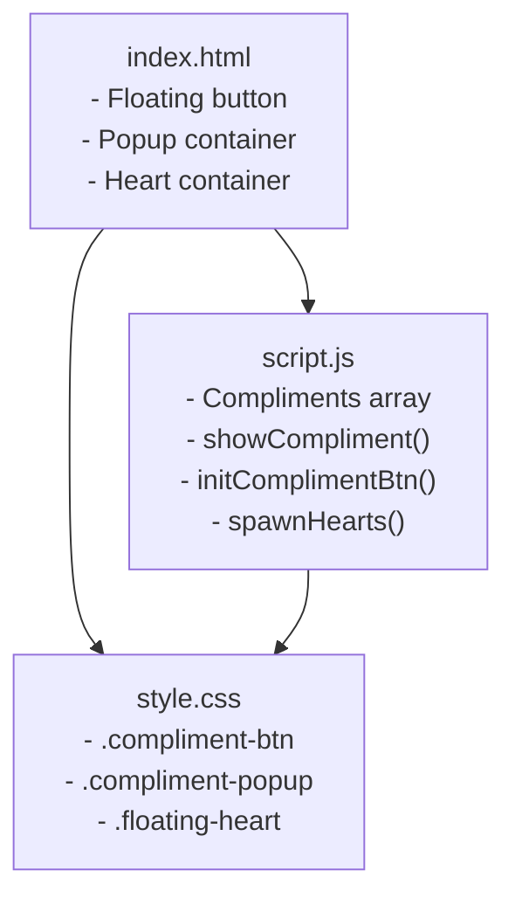
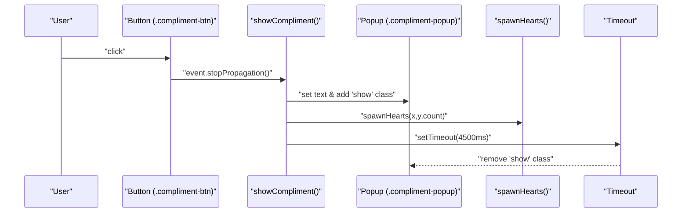
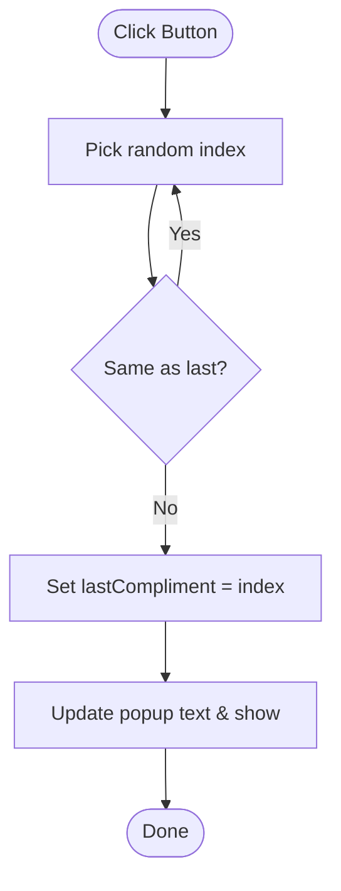
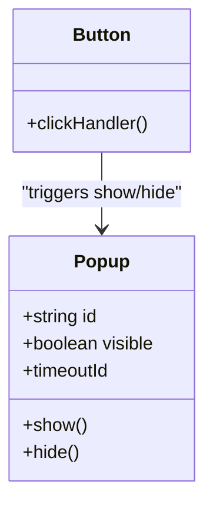
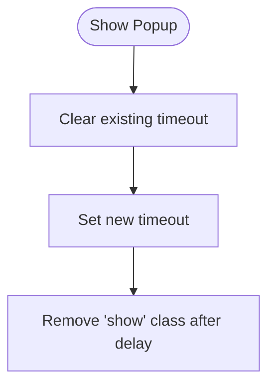
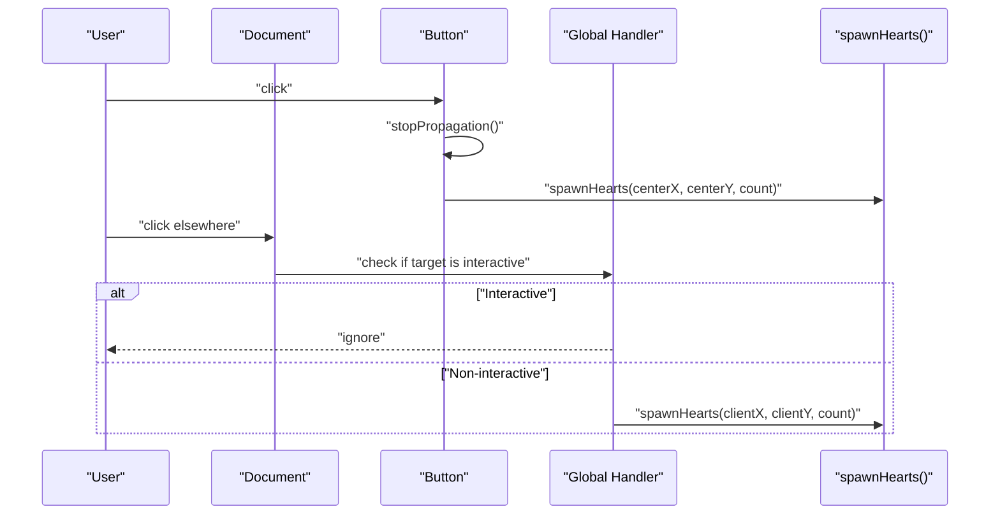
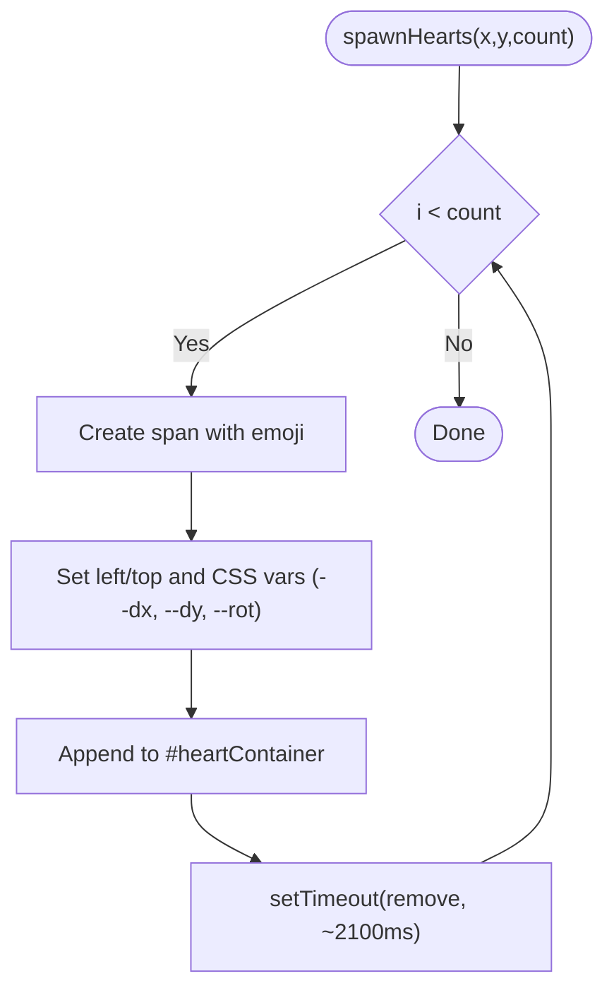
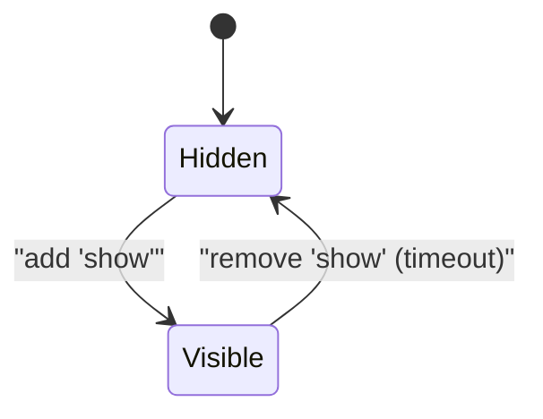
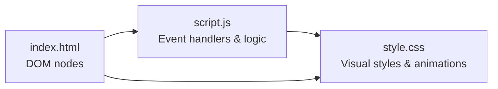

# Compliment System

<cite>
**Referenced Files in This Document**
- [index.html](file://index.html)
- [script.js](file://script.js)
- [style.css](file://style.css)
</cite>

## Table of Contents
1. [Introduction](#introduction)
2. [Project Structure](#project-structure)
3. [Core Components](#core-components)
4. [Architecture Overview](#architecture-overview)
5. [Detailed Component Analysis](#detailed-component-analysis)
6. [Dependency Analysis](#dependency-analysis)
7. [Performance Considerations](#performance-considerations)
8. [Troubleshooting Guide](#troubleshooting-guide)
9. [Conclusion](#conclusion)
10. [Appendices](#appendices)

## Introduction
This document explains the floating compliment button and popup notification system. It covers:
- The compliments array with romantic messages
- Random selection algorithm that avoids repeating the same message consecutively
- Popup positioning, appearance/disappearance animations, and automatic timeout dismissal
- Event handling for button clicks and global click heart bursts
- CSS animations for the floating button, popup, and heart particles
- Practical examples for extending the system (adding new compliments, customizing styles, adjusting timing)
- Performance considerations for frequent DOM manipulation and memory cleanup

## Project Structure
The compliment system spans three files:
- HTML defines the floating button, popup container, and a dedicated container for heart burst elements.
- JavaScript implements the compliment logic, random selection, event listeners, and heart spawning.
- CSS styles the floating button, popup, and heart animations.

**Diagram sources**
- [index.html:186-202](file://index.html#L186-L202)
- [script.js:299-382](file://script.js#L299-L382)
- [style.css:770-940](file://style.css#L770-L940)

**Section sources**
- [index.html:186-202](file://index.html#L186-L202)
- [script.js:299-382](file://script.js#L299-L382)
- [style.css:770-940](file://style.css#L770-L940)

## Core Components
- Compliments data: An array of romantic messages used to populate the popup.
- Random selection: Picks a random index while avoiding the last shown message to prevent immediate repeats.
- Popup UI: A fixed-position glassmorphic card that appears above the button with smooth transitions and auto-dismisses after a delay.
- Button interaction: Clicking the button triggers the popup and spawns heart particles from the button’s center.
- Global heart burst: Clicking anywhere on the page (excluding interactive elements) spawns small heart bursts at the cursor location.
- CSS animations: Button pulse, popup entrance/exit, and heart float animations.

**Section sources**
- [script.js:300-338](file://script.js#L300-L338)
- [script.js:340-382](file://script.js#L340-L382)
- [style.css:770-940](file://style.css#L770-L940)

## Architecture Overview
The system is event-driven:
- On page load, initialization attaches event listeners and sets up timers.
- User clicks the floating button:
  - Prevents event bubbling
  - Shows a randomly selected compliment
  - Spawns heart particles from the button’s bounding box center
  - Starts an auto-dismiss timer for the popup
- Global click handler spawns hearts at click coordinates unless the target is an interactive element.

**Diagram sources**
- [script.js:322-348](file://script.js#L322-L348)
- [script.js:353-374](file://script.js#L353-L374)
- [style.css:853-886](file://style.css#L853-L886)

## Detailed Component Analysis

### Compliments Array and Random Selection
- Data: A curated list of romantic compliments stored in a constant array.
- Algorithm:
  - Generate a random index within the array bounds.
  - If the generated index equals the last shown compliment, regenerate until different.
  - Store the chosen index to avoid immediate repetition on the next click.
- Complexity: O(1) average time per selection; worst-case loop depends on array size but remains negligible for typical sizes.

**Diagram sources**
- [script.js:300-328](file://script.js#L300-L328)

**Section sources**
- [script.js:300-328](file://script.js#L300-L328)

### Popup Positioning and Animation
- Positioning: Fixed placement near the bottom-right corner, above the button, with responsive adjustments for smaller screens.
- Appearance: Adding the "show" class transitions opacity and transform to reveal the popup smoothly.
- Disappearance: Removing the "show" class reverses the transition; an automatic timeout removes the class after a set duration.
- Styling: Glassmorphism background, subtle border, backdrop blur, and soft shadows.

**Diagram sources**
- [script.js:322-338](file://script.js#L322-L338)
- [style.css:853-886](file://style.css#L853-L886)

**Section sources**
- [script.js:322-338](file://script.js#L322-L338)
- [style.css:853-886](file://style.css#L853-L886)

### Automatic Timeout Dismissal
- Mechanism: Each time the popup is shown, any previous timeout is cleared to avoid premature hiding.
- Duration: A fixed delay hides the popup automatically.
- Implementation detail: The timeout ID is stored directly on the popup element for easy access.

**Diagram sources**
- [script.js:322-338](file://script.js#L322-L338)

**Section sources**
- [script.js:322-338](file://script.js#L322-L338)

### Event Handling: Button Click and Heart Burst
- Button click:
  - Stops propagation to avoid triggering the global click handler.
  - Calls the function to display a compliment.
  - Computes the button’s center using getBoundingClientRect and spawns hearts there.
- Global click:
  - Listens to document clicks.
  - Skips interactive targets (buttons, links, gallery items, promises, lightbox, compliment controls).
  - Spawns hearts at the click coordinates.

**Diagram sources**
- [script.js:340-382](file://script.js#L340-L382)

**Section sources**
- [script.js:340-382](file://script.js#L340-L382)

### Heart Burst Spawning and Cleanup
- Creation: For each heart, create a span with a random emoji, set initial position and CSS variables for animation offsets, append to a shared container.
- Animation: CSS keyframes animate translation, scaling, rotation, and fade-out.
- Cleanup: Each heart is removed from the DOM after its animation completes via a timeout.

**Diagram sources**
- [script.js:353-374](file://script.js#L353-L374)
- [style.css:919-940](file://style.css#L919-L940)

**Section sources**
- [script.js:353-374](file://script.js#L353-L374)
- [style.css:919-940](file://style.css#L919-L940)

### CSS Animations for Button and Popup
- Button:
  - Gradient background, glass effect, hover scale, active press, and a pulsing ring animation to draw attention.
- Popup:
  - Hidden by default with opacity 0 and slight translate/scale.
  - When "show" is added, transitions to fully visible with spring-like easing.
  - Responsive layout adjusts width and positioning on small screens.

**Diagram sources**
- [style.css:770-850](file://style.css#L770-L850)
- [style.css:853-886](file://style.css#L853-L886)

**Section sources**
- [style.css:770-850](file://style.css#L770-L850)
- [style.css:853-886](file://style.css#L853-L886)

## Dependency Analysis
- HTML provides structural anchors:
  - Button with id for event binding
  - Popup container and text node for content updates
  - Heart container for dynamic elements
- JavaScript binds events and manipulates DOM:
  - Reads button dimensions for heart origin
  - Updates popup text and classes
  - Manages timeouts and temporary elements
- CSS styles all visual aspects and animations:
  - Positions and transitions for button and popup
  - Keyframe animations for heart floats

**Diagram sources**
- [index.html:186-202](file://index.html#L186-L202)
- [script.js:322-382](file://script.js#L322-L382)
- [style.css:770-940](file://style.css#L770-L940)

**Section sources**
- [index.html:186-202](file://index.html#L186-L202)
- [script.js:322-382](file://script.js#L322-L382)
- [style.css:770-940](file://style.css#L770-L940)

## Performance Considerations
- DOM Manipulation:
  - Heart elements are created and removed frequently. Ensure they are detached promptly after animation completion to avoid memory leaks.
  - Avoid excessive reflows by batching style changes where possible; here, each heart uses CSS variables for transforms to minimize layout thrashing.
- Memory Management:
  - Temporary heart spans are removed via setTimeout; verify removal occurs reliably even if the user navigates away or closes the tab.
  - Clear any lingering timeouts when the popup is dismissed early to prevent orphaned callbacks.
- Animation Efficiency:
  - Use CSS transforms and opacity for animations to leverage GPU acceleration.
  - Limit concurrent animated elements; cap heart counts per burst to maintain smoothness.
- Event Delegation:
  - Global click listener checks for interactive elements before spawning hearts; keep this check efficient to avoid unnecessary work on high-frequency interactions.

[No sources needed since this section provides general guidance]

## Troubleshooting Guide
- Popup does not appear:
  - Verify the button has the correct id and the popup container exists in the DOM.
  - Ensure the "show" class is being added and CSS transitions are enabled.
- Popup disappears too quickly or not at all:
  - Check the timeout duration and ensure previous timeouts are cleared before setting a new one.
- Hearts do not spawn:
  - Confirm the heart container exists and the global click handler excludes interactive elements correctly.
  - Validate that CSS animations are defined and not overridden by other styles.
- Performance issues on low-end devices:
  - Reduce the number of hearts spawned per click.
  - Shorten animation durations or reduce particle effects elsewhere on the page.

**Section sources**
- [script.js:322-382](file://script.js#L322-L382)
- [style.css:853-940](file://style.css#L853-L940)

## Conclusion
The compliment system combines a simple yet elegant UI with robust event handling and smooth animations. It delivers delightful micro-interactions through a floating button, contextual popup notifications, and playful heart bursts. With clear extension points for adding new compliments, styling, and timing, it can be easily customized to fit various contexts while maintaining performance and usability.

[No sources needed since this section summarizes without analyzing specific files]

## Appendices

### How to Add New Compliments
- Locate the compliments array and append a new string entry.
- No additional code changes are required; the random selection will include the new message.

**Section sources**
- [script.js:300-319](file://script.js#L300-L319)

### Customize Popup Styling
- Adjust colors, borders, shadows, and font sizes in the popup styles.
- Modify transition timings to change how fast the popup appears or disappears.
- Update responsive rules for mobile layouts if needed.

**Section sources**
- [style.css:853-908](file://style.css#L853-L908)

### Modify Animation Timing
- Change the popup’s transition duration and easing in the popup styles.
- Adjust the heart animation duration and keyframes to alter speed and motion.
- Tune the button pulse animation interval and scale values.

**Section sources**
- [style.css:853-886](file://style.css#L853-L886)
- [style.css:919-940](file://style.css#L919-L940)
- [style.css:838-850](file://style.css#L838-L850)

### Integrate with Other Interactive Elements
- To trigger compliments from other actions (e.g., completing a task), call the same function that shows the popup and optionally spawn hearts at the relevant element’s coordinates.
- Ensure you stop event propagation if integrating with nested interactive components to avoid unintended side effects.

**Section sources**
- [script.js:322-348](file://script.js#L322-L348)
- [script.js:353-374](file://script.js#L353-L374)