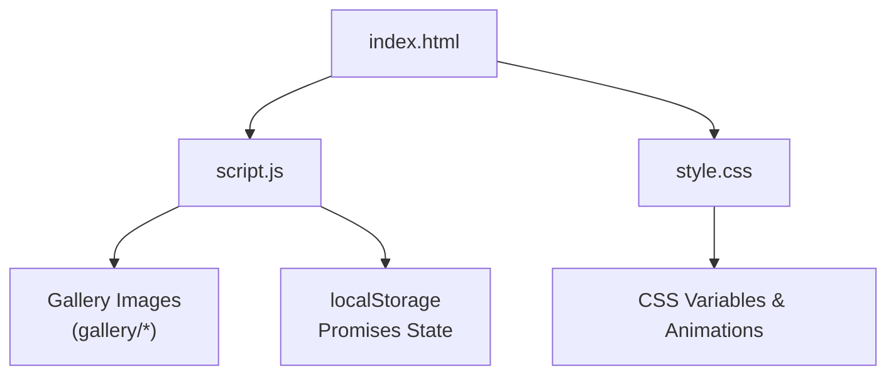
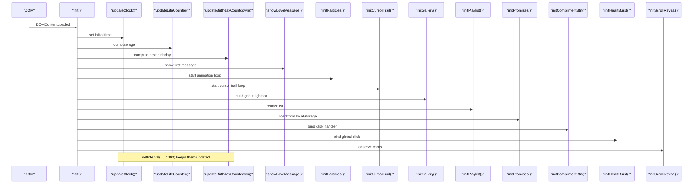
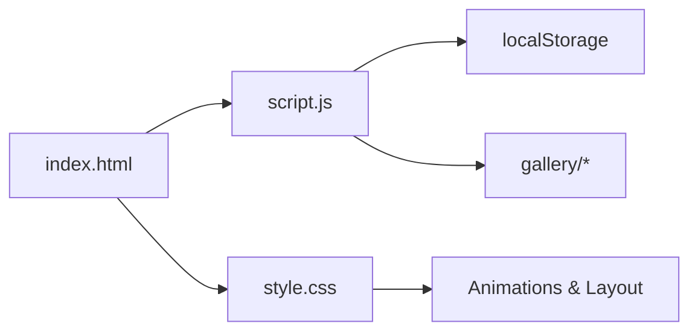

# Core Features

<cite>
**Referenced Files in This Document**
- [index.html](file://index.html)
- [script.js](file://script.js)
- [style.css](file://style.css)
- [README.txt](file://gallery/README.txt)
</cite>

## Table of Contents
1. [Introduction](#introduction)
2. [Project Structure](#project-structure)
3. [Core Components](#core-components)
4. [Architecture Overview](#architecture-overview)
5. [Detailed Component Analysis](#detailed-component-analysis)
6. [Dependency Analysis](#dependency-analysis)
7. [Performance Considerations](#performance-considerations)
8. [Troubleshooting Guide](#troubleshooting-guide)
9. [Conclusion](#conclusion)
10. [Appendices](#appendices)

## Introduction
Bellisima is a romantic, interactive single-page experience built with HTML, CSS, and vanilla JavaScript. It features real-time updates (live clock, life counter, birthday countdown), an interactive gallery with lightbox, rotating love messages, a reasons grid with illustrated cards, a curated playlist section, a promises tracker with progress, a compliment system with popup notifications, and visual effects including particle systems, cursor trails, and heart bursts. The codebase is designed to be easy to customize: personal data, messages, images, and styling are centralized for quick edits.

## Project Structure
The project is organized into three core files plus a gallery folder:
- index.html: Defines the page layout, sections, and UI elements for all features.
- script.js: Implements all logic, state management, animations, and interactions.
- style.css: Provides responsive design, glassmorphism, animations, and visual polish.
- gallery/README.txt: Instructions for adding photos to the gallery.

**Diagram sources**
- [index.html:1-210](file://index.html#L1-L210)
- [script.js:1-694](file://script.js#L1-L694)
- [style.css:1-1113](file://style.css#L1-L1113)
- [README.txt:1-13](file://gallery/README.txt#L1-L13)

**Section sources**
- [index.html:1-210](file://index.html#L1-L210)
- [script.js:1-694](file://script.js#L1-L694)
- [style.css:1-1113](file://style.css#L1-L1113)
- [README.txt:1-13](file://gallery/README.txt#L1-L13)

## Core Components
- Real-time systems: live clock, life counter since birthday, birthday countdown.
- Interactive gallery with lightbox navigation and keyboard support.
- Rotating love messages with auto-cycle and dot indicators.
- Reasons grid with animated illustrated cards.
- Curated playlist section listing songs and reasons.
- Promises tracker with persistent progress via localStorage.
- Compliment system with floating button and popup notifications.
- Visual effects: background particles, cursor sparkle trail, heart bursts on click.

Each component is implemented with clear separation of concerns, minimal dependencies, and performance-conscious patterns such as requestAnimationFrame for animations and throttled DOM updates.

**Section sources**
- [script.js:55-151](file://script.js#L55-L151)
- [script.js:153-208](file://script.js#L153-L208)
- [script.js:211-281](file://script.js#L211-L281)
- [script.js:384-415](file://script.js#L384-L415)
- [script.js:417-499](file://script.js#L417-L499)
- [script.js:501-561](file://script.js#L501-L561)
- [script.js:563-658](file://script.js#L563-L658)
- [index.html:18-182](file://index.html#L18-L182)

## Architecture Overview
The application initializes on DOMContentLoaded, setting up timers, event listeners, and rendering functions. Visual effects run continuously using requestAnimationFrame; counters update every second; UI components render once and update incrementally.

**Diagram sources**
- [script.js:660-694](file://script.js#L660-L694)
- [script.js:55-151](file://script.js#L55-L151)
- [script.js:211-281](file://script.js#L211-L281)
- [script.js:501-561](file://script.js#L501-L561)
- [script.js:563-658](file://script.js#L563-L658)

## Detailed Component Analysis

### Live Clock and Date Display
- Updates current time in both header and footer every second.
- Uses 12-hour format with AM/PM and zero-padded minutes/seconds.
- Date display formats locale-aware date strings.

User interactions: none (auto-updating). Customization: adjust formatting or timezone behavior by modifying the date/time functions.

Performance: lightweight DOM updates inside a 1-second interval; negligible overhead.

Browser compatibility: standard Date API and toLocaleDateString widely supported.

**Section sources**
- [script.js:55-84](file://script.js#L55-L84)
- [index.html:21-29](file://index.html#L21-L29)

### Life Counter (Since Birthday)
- Computes years, months, days, hours, minutes, seconds since a configured birth date.
- Updates every second with smooth numeric transitions.

User interactions: none (auto-updating). Customization: change GRACE.birthday in configuration.

Performance: simple arithmetic per second; efficient.

Browser compatibility: uses basic Date math; compatible across modern browsers.

**Section sources**
- [script.js:2-8](file://script.js#L2-L8)
- [script.js:87-110](file://script.js#L87-L110)
- [index.html:33-45](file://index.html#L33-L45)

### Birthday Countdown
- Calculates days/hours/minutes/seconds until the next birthday.
- On the birthday, shows celebratory emojis and a special message.
- Displays contextual messages when the birthday is near.

User interactions: none (auto-updating). Customization: adjust birthdayMonth/birthdayDay in configuration.

Performance: one calculation per second; minimal cost.

Browser compatibility: standard Date operations.

**Section sources**
- [script.js:112-151](file://script.js#L112-L151)
- [index.html:47-58](file://index.html#L47-L58)

### Rotating Love Messages
- Auto-cycles through a curated array of messages with fade transitions.
- Dot indicators allow manual selection and reset the auto-cycle timer.

User interactions: click dots to jump to specific messages. Customization: edit the messages array and cycle interval.

Performance: opacity transitions via CSS; no heavy reflows.

Browser compatibility: CSS transitions and basic DOM manipulation.

**Section sources**
- [script.js:10-27](file://script.js#L10-L27)
- [script.js:153-193](file://script.js#L153-L193)
- [index.html:60-67](file://index.html#L60-L67)

### Reasons Grid with Illustrated Cards
- Dynamically renders reason cards with icons and text.
- Staggered animation delays for entrance effects.

User interactions: hover highlights; optional future expansion for clicks. Customization: edit the reasons array.

Performance: one-time DOM creation; CSS hover effects are GPU-accelerated where possible.

Browser compatibility: CSS transforms and transitions.

**Section sources**
- [script.js:29-37](file://script.js#L29-L37)
- [script.js:195-208](file://script.js#L195-L208)
- [index.html:69-73](file://index.html#L69-L73)

### Photo Gallery and Lightbox
- Renders a responsive grid of placeholders or images based on galleryData.
- Lightbox supports opening, closing, previous/next navigation, and keyboard controls (Escape, ArrowLeft, ArrowRight).
- Supports lazy loading for images and graceful fallback to placeholders.

User interactions: click items to open lightbox; use buttons or keys to navigate; backdrop click closes. Customization: add images to gallery folder and update galleryData entries with src paths.

Performance: lazy image loading; lightweight overlay toggling; no heavy libraries.

Browser compatibility: standard DOM APIs; works in all modern browsers.

**Section sources**
- [script.js:563-658](file://script.js#L563-L658)
- [index.html:75-145](file://index.html#L75-L145)
- [README.txt:1-13](file://gallery/README.txt#L1-L13)

### Curated Playlist Section
- Renders a list of songs with title, artist, and a short reason.
- Purely presentational; can be extended with audio playback later.

User interactions: none currently. Customization: edit playlistSongs array.

Performance: one-time DOM creation; no runtime overhead.

Browser compatibility: standard DOM and CSS.

**Section sources**
- [script.js:384-415](file://script.js#L384-L415)
- [index.html:161-167](file://index.html#L161-L167)

### Promises Tracker with Progress
- Displays a list of promises that users can check off.
- Persists checked state in localStorage under a dedicated key.
- Shows progress count and a dynamic progress bar.

User interactions: click promise items to toggle completion; triggers heart burst on completion. Customization: edit promises array and persistence key if desired.

Performance: minimal DOM updates on toggle; localStorage reads/writes are fast and infrequent.

Browser compatibility: localStorage widely supported; includes safe parsing with try/catch.

**Section sources**
- [script.js:417-499](file://script.js#L417-L499)
- [index.html:169-176](file://index.html#L169-L176)

### Compliment System with Popup Notifications
- Floating button displays random compliments with a popup that auto-hides after a timeout.
- Clicking the button spawns heart bursts from the button’s position.

User interactions: click the floating button to see a new compliment. Customization: edit compliments array and popup duration.

Performance: lightweight DOM class toggling and timeouts; no heavy calculations.

Browser compatibility: standard DOM events and CSS classes.

**Section sources**
- [script.js:299-348](file://script.js#L299-L348)
- [index.html:186-199](file://index.html#L186-L199)

### Visual Effects: Particle Systems, Cursor Trails, Heart Bursts
- Background particles: Canvas-based floating particles with glow and twinkle; responsive resize handling.
- Cursor sparkle trail: Canvas-based trail following mouse movement with fading particles and glow.
- Heart bursts: DOM-based emoji particles spawned on click or button press with randomized trajectories and rotation.

User interactions: cursor trail responds to mouse movement; heart bursts on general clicks (excluding interactive elements); button-triggered bursts on compliment button. Customization: adjust particle counts, colors, sizes, speeds, and thresholds.

Performance: requestAnimationFrame loops; particle counts capped relative to viewport size; trail length limited; efficient DOM cleanup for bursts.

Browser compatibility: Canvas API and CSS animations; supported in all modern browsers.

**Section sources**
- [script.js:211-281](file://script.js#L211-L281)
- [script.js:350-382](file://script.js#L350-L382)
- [script.js:501-561](file://script.js#L501-L561)
- [style.css:62-71](file://style.css#L62-L71)
- [style.css:762-768](file://style.css#L762-L768)

## Dependency Analysis
- script.js depends on DOM elements defined in index.html.
- style.css provides visual structure and animations used by both HTML and JS.
- Gallery images are optional assets referenced by script.js via galleryData.
- localStorage is used for promises persistence.

**Diagram sources**
- [index.html:1-210](file://index.html#L1-L210)
- [script.js:1-694](file://script.js#L1-L694)
- [style.css:1-1113](file://style.css#L1-L1113)
- [README.txt:1-13](file://gallery/README.txt#L1-L13)

**Section sources**
- [script.js:433-443](file://script.js#L433-L443)
- [script.js:563-602](file://script.js#L563-L602)

## Performance Considerations
- Animation loops: requestAnimationFrame used for particles and cursor trail to ensure smooth rendering and battery efficiency.
- Throttled updates: counters and clocks update at 1-second intervals to avoid excessive DOM writes.
- Responsive particle count: particle count scales with viewport area to maintain performance on smaller devices.
- Image optimization: gallery images use lazy loading; placeholders reduce initial payload.
- Minimal reflows: CSS transitions and transforms preferred over layout-affecting changes.
- LocalStorage usage: persisted only on user actions (promise toggles), not on every frame.

[No sources needed since this section provides general guidance]

## Troubleshooting Guide
- Timezone issues: If dates appear off, verify device timezone settings; the app uses local time via Date API.
- Missing images: Ensure gallery images exist and paths match galleryData entries; otherwise placeholders will display.
- Promises not persisting: Check browser storage permissions; localStorage must be enabled.
- Lightbox not closing: Try pressing Escape or clicking the backdrop; verify event listeners are attached.
- Performance drops: Reduce particle density or disable effects temporarily by commenting out initialization calls in init().

**Section sources**
- [script.js:660-694](file://script.js#L660-L694)
- [script.js:563-658](file://script.js#L563-L658)
- [script.js:433-443](file://script.js#L433-L443)

## Conclusion
Bellisima delivers a cohesive, romantic experience with modular, well-structured features. Each component is independently customizable and optimized for performance. The architecture separates concerns cleanly between HTML structure, CSS styling, and JavaScript logic, making it straightforward to extend functionality or adapt content.

[No sources needed since this section summarizes without analyzing specific files]

## Appendices

### How to Extend or Modify Key Features

- Add a new love message:
  - Edit the messages array and optionally adjust the rotation interval.
  - Reference: [script.js:10-27](file://script.js#L10-L27), [script.js:187-193](file://script.js#L187-L193)

- Change birthday details:
  - Update name, nickname, birthday date, month, and day in configuration.
  - Reference: [script.js:2-8](file://script.js#L2-L8)

- Add gallery images:
  - Place images in the gallery folder and update galleryData with src paths and captions.
  - Reference: [script.js:563-602](file://script.js#L563-L602), [README.txt:1-13](file://gallery/README.txt#L1-L13)

- Customize playlist:
  - Edit the playlistSongs array with titles, artists, and reasons.
  - Reference: [script.js:384-415](file://script.js#L384-L415)

- Add or remove promises:
  - Edit the promises array; checked states persist automatically.
  - Reference: [script.js:417-499](file://script.js#L417-L499)

- Adjust visual effects:
  - Modify particle counts, colors, sizes, and trail lengths in their respective functions.
  - Reference: [script.js:211-281](file://script.js#L211-L281), [script.js:501-561](file://script.js#L501-L561)

- Style customizations:
  - Use CSS variables for theme colors, fonts, and glass effects; adjust responsive breakpoints as needed.
  - Reference: [style.css:8-24](file://style.css#L8-L24), [style.css:433-452](file://style.css#L433-L452)