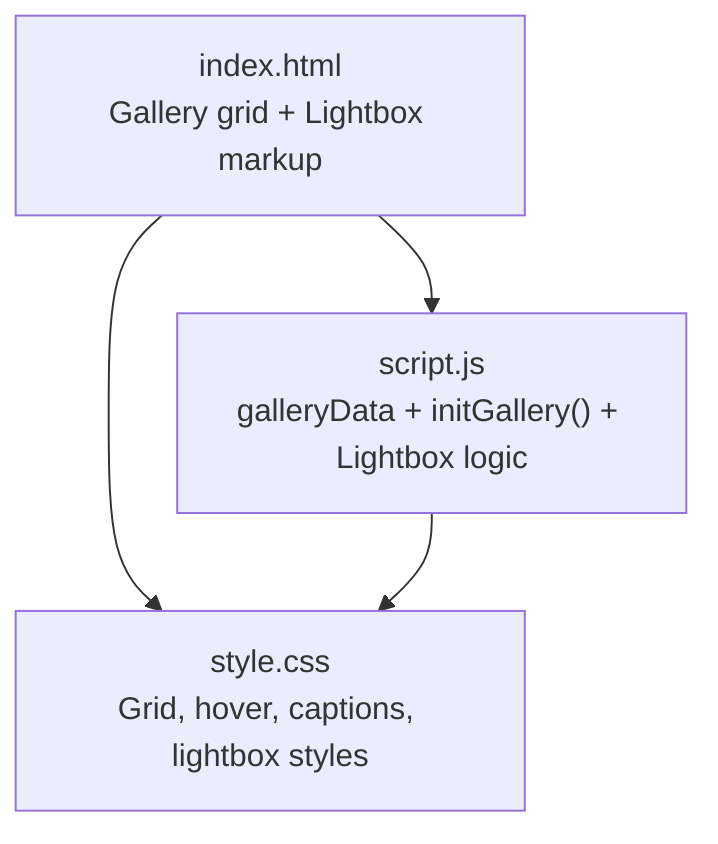
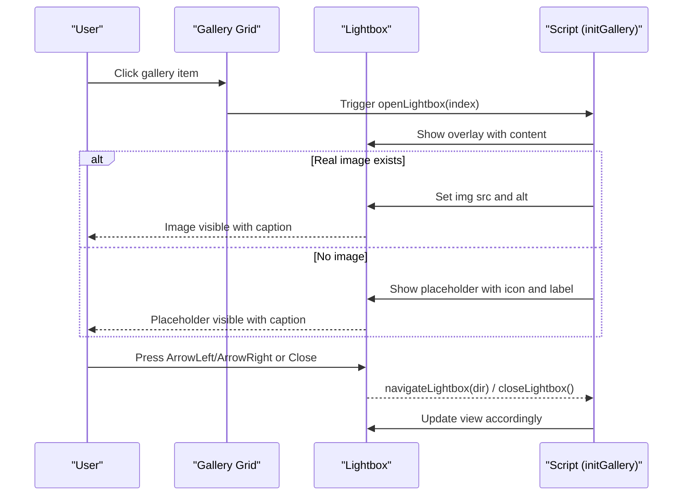
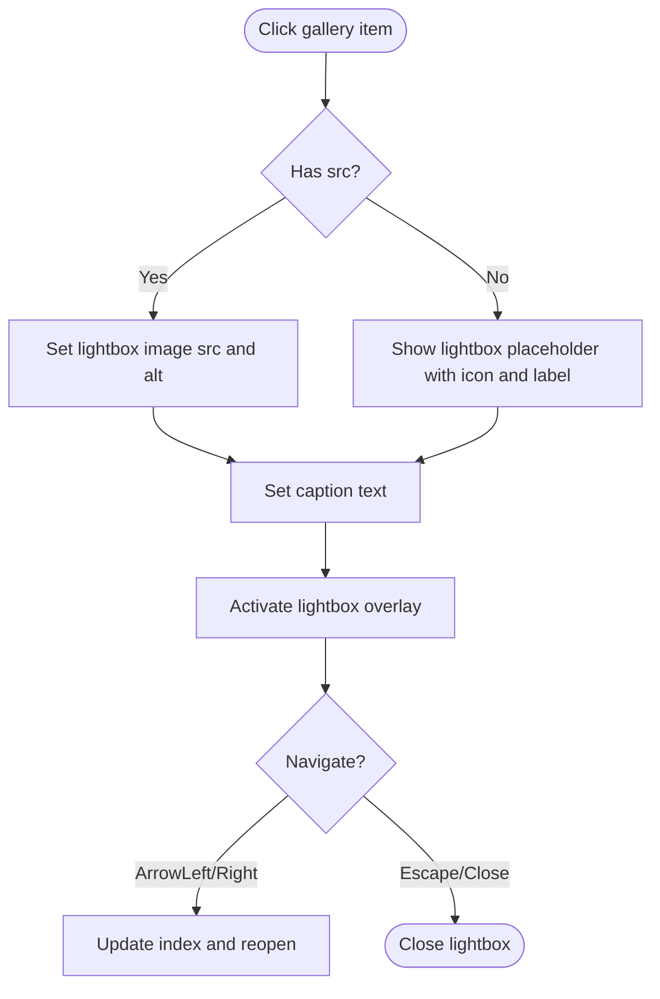
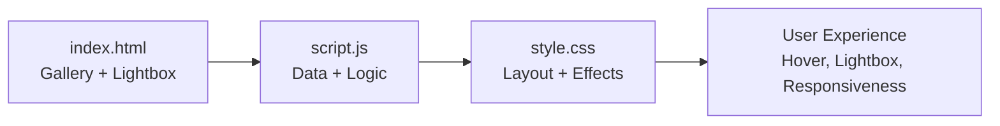

# Gallery Grid Display

<cite>
**Referenced Files in This Document**
- [index.html](file://index.html)
- [script.js](file://script.js)
- [style.css](file://style.css)
- [README.txt](file://gallery/README.txt)
</cite>

## Table of Contents
1. [Introduction](#introduction)
2. [Project Structure](#project-structure)
3. [Core Components](#core-components)
4. [Architecture Overview](#architecture-overview)
5. [Detailed Component Analysis](#detailed-component-analysis)
6. [Dependency Analysis](#dependency-analysis)
7. [Performance Considerations](#performance-considerations)
8. [Troubleshooting Guide](#troubleshooting-guide)
9. [Conclusion](#conclusion)
10. [Appendices](#appendices)

## Introduction
This document explains the photo gallery grid system used to display a responsive, interactive collection of moments. It covers:
- The data structure that drives each gallery item (src, icon, label, caption).
- The placeholder system that shows beautiful emoji icons when no images are provided and how real images automatically replace placeholders when src is set.
- The responsive CSS grid layout, hover effects, and click-to-open lightbox behavior.
- How to add new photos by updating the galleryData array.
- Styling customization options.
- Accessibility features such as alt text and keyboard navigation.

## Project Structure
The gallery is implemented across three main files:
- HTML defines the gallery container, individual items with placeholders, and the lightbox overlay.
- JavaScript provides the gallery data, renders images or placeholders, and handles lightbox interactions.
- CSS styles the responsive grid, hover effects, captions, and lightbox UI.

**Diagram sources**
- [index.html:75-145](file://index.html#L75-L145)
- [script.js:563-658](file://script.js#L563-L658)
- [style.css:469-760](file://style.css#L469-L760)

**Section sources**
- [index.html:75-145](file://index.html#L75-L145)
- [script.js:563-658](file://script.js#L563-L658)
- [style.css:469-760](file://style.css#L469-L760)

## Core Components
- Gallery data model: An array where each entry represents one gallery item with properties for image source, placeholder icon, label, and caption.
- Placeholder system: When src is empty, a styled placeholder with an emoji icon and label is shown; when src is present, a real image replaces it.
- Responsive grid: A CSS Grid layout that adapts from multiple columns on desktop to fewer columns on mobile.
- Hover effects: Items lift and glow on hover; captions fade in at the bottom.
- Click-to-open lightbox: Clicking any item opens a full-screen viewer with navigation and captions.

Key implementation references:
- Data model and rendering: [script.js:563-602](file://script.js#L563-L602)
- Lightbox open/close/navigation: [script.js:624-658](file://script.js#L624-L658)
- Grid and hover styles: [style.css:474-514](file://style.css#L474-L514)
- Placeholder styling: [style.css:524-567](file://style.css#L524-L567)
- Lightbox styles: [style.css:608-760](file://style.css#L608-L760)

**Section sources**
- [script.js:563-658](file://script.js#L563-L658)
- [style.css:474-567](file://style.css#L474-L567)
- [style.css:608-760](file://style.css#L608-L760)

## Architecture Overview
The gallery follows a simple data-driven flow:
- The page loads with static placeholders in the DOM.
- On initialization, the script reads galleryData and swaps placeholders for real images when src is provided.
- Each item listens for clicks to open the lightbox.
- The lightbox displays either the real image or a large placeholder with icon and label, along with the caption.
- Keyboard and mouse controls allow navigation and closing.

**Diagram sources**
- [script.js:583-622](file://script.js#L583-L622)
- [script.js:624-658](file://script.js#L624-L658)
- [index.html:75-145](file://index.html#L75-L145)

## Detailed Component Analysis

### Gallery Data Model
Each entry in the galleryData array contains:
- src: Path to the image file. If empty, a placeholder is shown.
- icon: Emoji displayed in the placeholder.
- label: Short title shown in the placeholder and lightbox placeholder.
- caption: Descriptive text shown under the image or placeholder in both grid and lightbox.

How it works:
- During initialization, the script iterates over DOM items and matches them with galleryData by index.
- If src is set, a real  element is created and replaces the placeholder. Alt text is set to the caption for accessibility.
- If src is empty, the existing placeholder remains visible.

References:
- Data definition and comments: [script.js:563-579](file://script.js#L563-L579)
- Rendering logic: [script.js:583-602](file://script.js#L583-L602)

**Section sources**
- [script.js:563-602](file://script.js#L563-L602)

### Placeholder System
When no image is provided:
- A visually appealing placeholder is rendered using CSS gradients and dashed borders, themed via a CSS custom property for hue.
- The placeholder includes an emoji icon and a short label.
- In the lightbox, a larger placeholder mirrors this design when no image is available.

Behavior:
- Placeholders remain until a real image path is added to src.
- When src is later set, the placeholder is replaced by an  tag with lazy loading and alt text derived from caption.

References:
- Placeholder HTML structure: [index.html:81-128](file://index.html#L81-L128)
- Placeholder CSS: [style.css:524-567](file://style.css#L524-L567)
- Lightbox placeholder CSS: [style.css:656-684](file://style.css#L656-L684)
- Replacement logic: [script.js:591-599](file://script.js#L591-L599)

**Section sources**
- [index.html:81-128](file://index.html#L81-L128)
- [style.css:524-567](file://style.css#L524-L567)
- [style.css:656-684](file://style.css#L656-L684)
- [script.js:591-599](file://script.js#L591-L599)

### Responsive CSS Grid Layout
- Desktop: Three-column grid with consistent gaps.
- Mobile: Two-column grid with reduced gaps for smaller screens.
- Aspect ratio: Both real images and placeholders maintain a square aspect ratio for uniform tiles.

References:
- Grid setup and hover: [style.css:474-514](file://style.css#L474-L514)
- Image sizing: [style.css:516-522](file://style.css#L516-L522)
- Mobile breakpoint: [style.css:601-606](file://style.css#L601-L606)

**Section sources**
- [style.css:474-522](file://style.css#L474-L522)
- [style.css:601-606](file://style.css#L601-L606)

### Hover Effects and Captions
- Hover lifts the card slightly, adds a glow shadow, and highlights the border.
- A gradient overlay fades in on hover.
- The caption slides up and becomes fully opaque on hover.

References:
- Hover transforms and shadows: [style.css:481-494](file://style.css#L481-L494)
- Overlay and caption transitions: [style.css:496-514](file://style.css#L496-L514)

**Section sources**
- [style.css:481-514](file://style.css#L481-L514)

### Click-to-Open Lightbox
- Clicking any gallery item opens the lightbox overlay.
- The lightbox shows either the real image or a large placeholder with icon and label.
- Navigation buttons and keyboard arrows move between items.
- Escape key closes the lightbox; clicking outside also closes it.

References:
- Item click binding: [script.js:601-602](file://script.js#L601-L602)
- Open/close/navigate functions: [script.js:624-658](file://script.js#L624-L658)
- Lightbox markup: [index.html:132-145](file://index.html#L132-L145)
- Lightbox styles: [style.css:608-760](file://style.css#L608-L760)

**Diagram sources**
- [script.js:624-658](file://script.js#L624-L658)
- [index.html:132-145](file://index.html#L132-L145)

**Section sources**
- [script.js:601-658](file://script.js#L601-L658)
- [index.html:132-145](file://index.html#L132-L145)
- [style.css:608-760](file://style.css#L608-L760)

### Adding New Photos
To add or update photos:
1. Place your image files in the gallery folder.
2. Update the galleryData array entries with the correct src paths.
3. Optionally adjust icon, label, and caption per item.
4. The script will automatically replace placeholders with real images on load.

References:
- Instructions in README: [README.txt:1-13](file://gallery/README.txt#L1-L13)
- Data array location: [script.js:563-579](file://script.js#L563-L579)

**Section sources**
- [README.txt:1-13](file://gallery/README.txt#L1-L13)
- [script.js:563-579](file://script.js#L563-L579)

### Styling Customization Options
You can customize appearance through CSS variables and classes:
- Theme colors and fonts are defined in root variables; adjust hues and accents to match your style.
- Grid spacing and column counts can be tuned via .gallery-grid rules and breakpoints.
- Hover intensity, shadows, and caption opacity can be adjusted in .gallery-item and .gallery-caption.
- Placeholder gradients and borders use a CSS custom property for hue; modify inline styles or class-based hue values to change color themes per tile.

References:
- Root variables: [style.css:8-24](file://style.css#L8-L24)
- Grid and hover: [style.css:474-514](file://style.css#L474-L514)
- Placeholder theme via --hue: [style.css:524-567](file://style.css#L524-L567)
- Lightbox visuals: [style.css:608-760](file://style.css#L608-L760)

**Section sources**
- [style.css:8-24](file://style.css#L8-L24)
- [style.css:474-567](file://style.css#L474-L567)
- [style.css:608-760](file://style.css#L608-L760)

### Accessibility Features
- Alt text: When a real image is present, its alt attribute is set to the caption for screen readers.
- Keyboard navigation:
  - Arrow keys navigate forward/backward in the lightbox.
  - Escape key closes the lightbox.
- Focus management: The lightbox overlay uses standard elements (buttons) that are naturally focusable.

References:
- Alt text assignment: [script.js:596-597](file://script.js#L596-L597), [script.js:633-634](file://script.js#L633-L634)
- Keyboard handlers: [script.js:614-621](file://script.js#L614-L621)

**Section sources**
- [script.js:596-597](file://script.js#L596-L597)
- [script.js:614-621](file://script.js#L614-L621)
- [script.js:633-634](file://script.js#L633-L634)

## Dependency Analysis
- HTML provides the structural anchors (grid container, items, lightbox).
- JavaScript binds data to the DOM and wires event listeners for interaction.
- CSS provides visual presentation and responsive behavior.

**Diagram sources**
- [index.html:75-145](file://index.html#L75-L145)
- [script.js:563-658](file://script.js#L563-L658)
- [style.css:469-760](file://style.css#L469-L760)

**Section sources**
- [index.html:75-145](file://index.html#L75-L145)
- [script.js:563-658](file://script.js#L563-L658)
- [style.css:469-760](file://style.css#L469-L760)

## Performance Considerations
- Lazy loading: Images are loaded lazily to improve initial page performance.
- Efficient updates: Only the specific placeholder is replaced when src is set, minimizing DOM churn.
- Lightweight interactions: Event listeners are attached once during initialization.

References:
- Lazy loading attribute: [script.js:597-598](file://script.js#L597-L598)
- Single-pass rendering loop: [script.js:583-602](file://script.js#L583-L602)

**Section sources**
- [script.js:583-602](file://script.js#L583-L602)
- [script.js:597-598](file://script.js#L597-L598)

## Troubleshooting Guide
Common issues and resolutions:
- Placeholder not replaced by image:
  - Ensure the src path in galleryData matches the actual file location.
  - Verify the image file exists in the gallery folder.
- Lightbox not opening:
  - Confirm that gallery items have click listeners bound during initialization.
  - Check that the lightbox overlay markup exists in the HTML.
- Keyboard navigation not working:
  - Ensure the lightbox is active before pressing arrow keys or Escape.
  - Verify event listeners for keydown are attached.

References:
- Placeholder replacement logic: [script.js:591-599](file://script.js#L591-L599)
- Lightbox open/close: [script.js:624-658](file://script.js#L624-L658)
- Key handling: [script.js:614-621](file://script.js#L614-L621)

**Section sources**
- [script.js:591-599](file://script.js#L591-L599)
- [script.js:614-621](file://script.js#L614-L621)
- [script.js:624-658](file://script.js#L624-L658)

## Conclusion
The gallery grid system combines a clean data model, elegant placeholders, responsive design, and accessible interactions. By updating galleryData and placing images in the gallery folder, you can seamlessly transition from placeholder tiles to a polished photo gallery with rich hover effects and a functional lightbox.

## Appendices

### Quick Reference: galleryData Properties
- src: String path to the image file. Leave empty to show a placeholder.
- icon: Emoji string displayed in the placeholder.
- label: Short title shown in the placeholder and lightbox placeholder.
- caption: Descriptive text used as alt text for images and shown as caption in grid and lightbox.

References:
- Data definition and comments: [script.js:563-579](file://script.js#L563-L579)

**Section sources**
- [script.js:563-579](file://script.js#L563-L579)