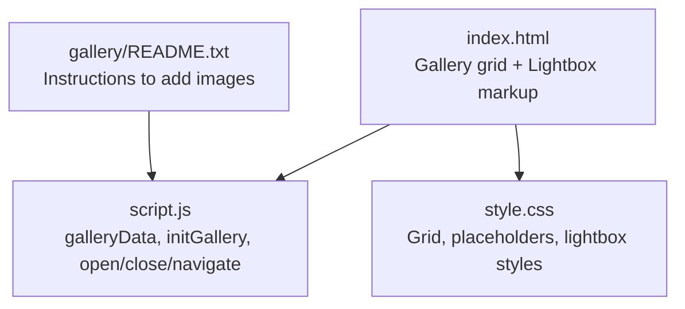
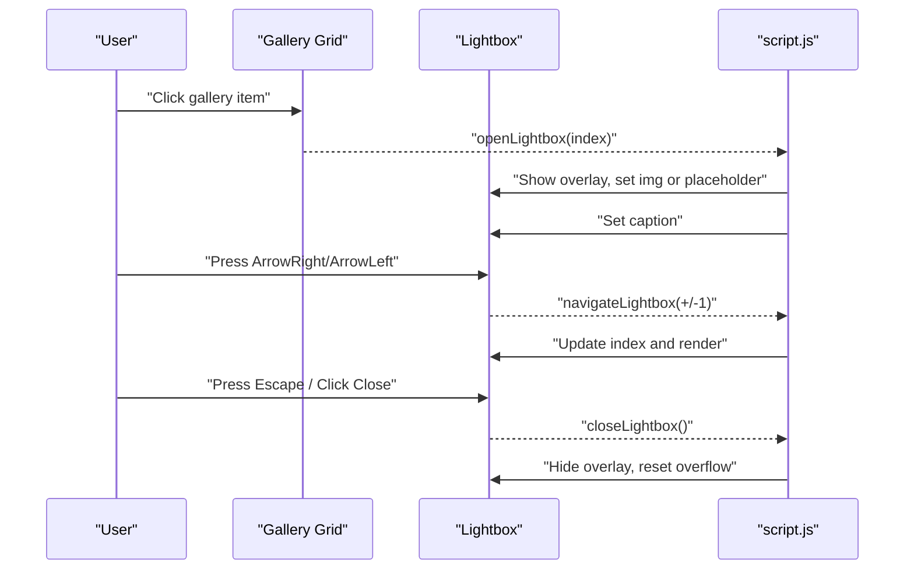
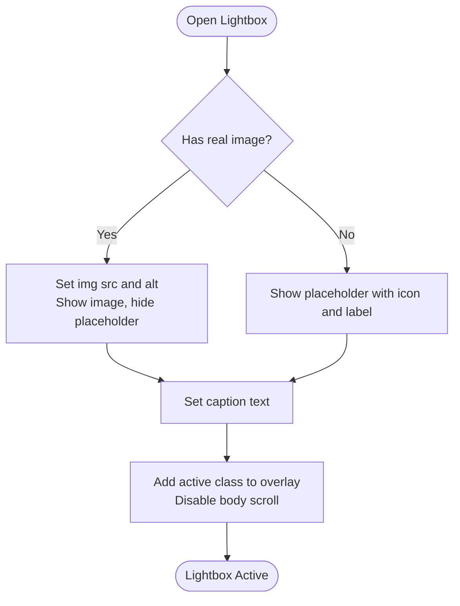
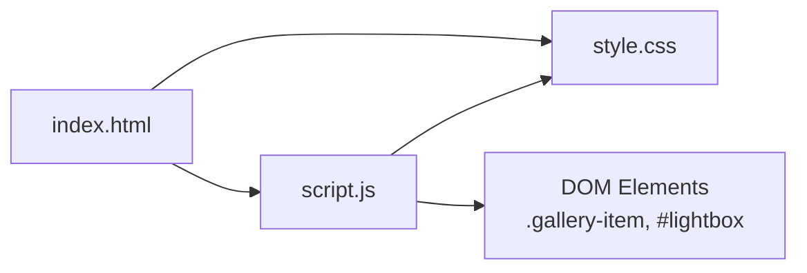

# Interactive Gallery

<cite>
**Referenced Files in This Document**
- [index.html](file://index.html)
- [script.js](file://script.js)
- [style.css](file://style.css)
- [README.txt](file://gallery/README.txt)
</cite>

## Table of Contents
1. [Introduction](#introduction)
2. [Project Structure](#project-structure)
3. [Core Components](#core-components)
4. [Architecture Overview](#architecture-overview)
5. [Detailed Component Analysis](#detailed-component-analysis)
6. [Dependency Analysis](#dependency-analysis)
7. [Performance Considerations](#performance-considerations)
8. [Troubleshooting Guide](#troubleshooting-guide)
9. [Conclusion](#conclusion)
10. [Appendices](#appendices)

## Introduction
This document explains the interactive photo gallery and lightbox system, including how to add real photos, how placeholders work when no images are provided, responsive grid layout, keyboard navigation, click-to-open behavior, CSS styling for both placeholders and actual images, and JavaScript methods for opening, closing, and navigating the lightbox. It also covers image loading optimization with lazy loading and accessibility considerations.

## Project Structure
The gallery and lightbox are implemented across three files:
- HTML defines the gallery grid items and the lightbox overlay structure.
- JavaScript provides data-driven rendering, event handling, and lightbox logic.
- CSS styles the responsive grid, placeholders, and lightbox UI.

**Diagram sources**
- [index.html:75-145](file://index.html#L75-L145)
- [script.js:563-658](file://script.js#L563-L658)
- [style.css:469-760](file://style.css#L469-L760)
- [README.txt:1-13](file://gallery/README.txt#L1-L13)

**Section sources**
- [index.html:75-145](file://index.html#L75-L145)
- [script.js:563-658](file://script.js#L563-L658)
- [style.css:469-760](file://style.css#L469-L760)
- [README.txt:1-13](file://gallery/README.txt#L1-L13)

## Core Components
- galleryData array: Central configuration for each gallery item (image source, placeholder icon, label, caption).
- Placeholder system: When src is empty, a styled placeholder with an icon and text is shown instead of an image.
- Lightbox: Fullscreen overlay with prev/next navigation, close button, caption, and placeholder support.
- Responsive grid: CSS Grid adapts from multiple columns on desktop to fewer on mobile.
- Keyboard navigation: Arrow keys move between items; Escape closes the lightbox.
- Click-to-open: Clicking any gallery item opens the lightbox at that index.

Key implementation references:
- Data and initialization: [script.js:563-658](file://script.js#L563-L658)
- HTML structure: [index.html:75-145](file://index.html#L75-L145)
- Styling: [style.css:469-760](file://style.css#L469-L760)

**Section sources**
- [script.js:563-658](file://script.js#L563-L658)
- [index.html:75-145](file://index.html#L75-L145)
- [style.css:469-760](file://style.css#L469-L760)

## Architecture Overview
The gallery uses a data-first approach:
- The galleryData array drives both the thumbnail grid and the lightbox content.
- During initialization, each grid item checks if a real image src exists; if so, it replaces the placeholder with a lazy-loaded image.
- Click events open the lightbox at the clicked index; navigation updates the index and re-renders the lightbox content.
- Keyboard events provide accessible navigation and closing.

**Diagram sources**
- [script.js:583-658](file://script.js#L583-L658)
- [index.html:132-145](file://index.html#L132-L145)

## Detailed Component Analysis

### galleryData Array Structure
Each entry represents one gallery item and supports two modes:
- Real image mode: Provide a valid path in src; the thumbnail shows the image and the lightbox displays it.
- Placeholder mode: Leave src empty; the thumbnail and lightbox show a styled placeholder with an icon and label.

Fields:
- src: string — Path to the image file (e.g., 'gallery/photo1.jpg'). Empty means use placeholder.
- icon: string — Emoji or symbol displayed in the placeholder.
- label: string — Short title shown inside the placeholder.
- caption: string — Text shown below the image or placeholder in the lightbox.

How it works:
- On initialization, the script loops through DOM items and applies data from galleryData.
- If src is present, it creates an , sets alt to caption, enables lazy loading, and replaces the placeholder.
- If src is absent, the placeholder remains visible.

References:
- Data definition and comments: [script.js:563-579](file://script.js#L563-L579)
- Rendering logic: [script.js:587-602](file://script.js#L587-L602)

**Section sources**
- [script.js:563-602](file://script.js#L563-L602)

### Placeholder System
When no image is provided:
- Thumbnails display a gradient box with a dashed border, a large icon, and a short label.
- The lightbox shows a larger placeholder with the same icon and label, plus the caption beneath.

Styling highlights:
- Thumbnail placeholder uses aspect-ratio: 1 for square tiles and a per-item hue via CSS custom property.
- Lightbox placeholder scales responsively and hides when a real image is shown.

References:
- Thumbnail placeholder styles: [style.css:524-567](file://style.css#L524-L567)
- Lightbox placeholder styles: [style.css:656-684](file://style.css#L656-L684)
- Placeholder toggling in lightbox: [script.js:632-643](file://script.js#L632-L643)

**Section sources**
- [style.css:524-567](file://style.css#L524-L567)
- [style.css:656-684](file://style.css#L656-L684)
- [script.js:632-643](file://script.js#L632-L643)

### Lightbox Implementation
Features:
- Open: Click any gallery item to open the lightbox at that index.
- Navigate: Use left/right buttons or arrow keys to cycle through items.
- Close: Click the close button, click the backdrop, or press Escape.
- Content: Displays either the real image or the placeholder, along with the caption.

Implementation details:
- openLightbox(index): Sets current index, chooses image vs placeholder, sets caption, shows overlay, and prevents background scrolling.
- closeLightbox(): Hides overlay and restores page scrolling.
- navigateLightbox(dir): Wraps around using modulo arithmetic over galleryData length.

References:
- Event bindings and keyboard handling: [script.js:604-621](file://script.js#L604-L621)
- Lightbox functions: [script.js:624-658](file://script.js#L624-L658)
- Overlay markup: [index.html:132-145](file://index.html#L132-L145)

**Diagram sources**
- [script.js:624-658](file://script.js#L624-L658)

**Section sources**
- [script.js:604-658](file://script.js#L604-L658)
- [index.html:132-145](file://index.html#L132-L145)

### Adding Real Photos
Follow these steps to replace placeholders with your own images:
1. Place your images in the gallery folder alongside this project.
2. Update the src field in galleryData to point to each image file (for example, 'gallery/photo1.jpg').
3. Optionally update the caption for each item.
4. Keep the icon and label fields for fallbacks or lightbox placeholder context.

Reference instructions:
- README guidance: [README.txt:1-13](file://gallery/README.txt#L1-L13)
- Where to edit: [script.js:563-579](file://script.js#L563-L579)

**Section sources**
- [README.txt:1-13](file://gallery/README.txt#L1-L13)
- [script.js:563-579](file://script.js#L563-L579)

### Responsive Grid Layout
- Desktop: Three-column grid with consistent gaps.
- Mobile: Switches to two columns for better usability on small screens.
- Items maintain a square aspect ratio for uniform tiles.

References:
- Grid and item styles: [style.css:474-522](file://style.css#L474-L522)
- Mobile breakpoint: [style.css:601-606](file://style.css#L601-L606)

**Section sources**
- [style.css:474-522](file://style.css#L474-L522)
- [style.css:601-606](file://style.css#L601-L606)

### Keyboard Navigation and Accessibility
- ArrowLeft/ArrowRight: Move to previous/next item while lightbox is active.
- Escape: Close the lightbox.
- Alt text: Each image’s alt attribute is set to the caption for screen readers.
- Focus management: Buttons are native elements with default focus behavior.

References:
- Keyboard listeners: [script.js:614-621](file://script.js#L614-L621)
- Image alt assignment: [script.js:596-598](file://script.js#L596-L598), [script.js:632-636](file://script.js#L632-L636)

**Section sources**
- [script.js:614-621](file://script.js#L614-L621)
- [script.js:596-598](file://script.js#L596-L598)
- [script.js:632-636](file://script.js#L632-L636)

### Click-to-Open Functionality
- Each .gallery-item has a click listener bound during initialization.
- The listener calls openLightbox with the item’s index to display the corresponding data.

References:
- Click binding: [script.js:601-602](file://script.js#L601-L602)
- Item markup with data-index: [index.html:81-128](file://index.html#L81-L128)

**Section sources**
- [script.js:601-602](file://script.js#L601-L602)
- [index.html:81-128](file://index.html#L81-L128)

### CSS Styling Summary
- Gallery thumbnails: Hover effects, gradient overlays, captions revealed on hover.
- Placeholders: Gradient backgrounds with per-item hue, dashed borders, icons, and script-style labels.
- Lightbox: Dark backdrop with blur, centered content, rounded image container, styled navigation buttons, and responsive sizing.

References:
- Gallery section: [style.css:469-599](file://style.css#L469-L599)
- Lightbox section: [style.css:608-760](file://style.css#L608-L760)

**Section sources**
- [style.css:469-599](file://style.css#L469-L599)
- [style.css:608-760](file://style.css#L608-L760)

## Dependency Analysis
- HTML depends on CSS for visual presentation and on JavaScript for interactivity.
- JavaScript depends on the DOM structure defined in HTML and reads/writes classes and attributes to control state.
- CSS relies on semantic class names used by JavaScript to toggle states (e.g., active, visible, hidden).

**Diagram sources**
- [index.html:75-145](file://index.html#L75-L145)
- [script.js:583-658](file://script.js#L583-L658)
- [style.css:469-760](file://style.css#L469-L760)

**Section sources**
- [index.html:75-145](file://index.html#L75-L145)
- [script.js:583-658](file://script.js#L583-L658)
- [style.css:469-760](file://style.css#L469-L760)

## Performance Considerations
- Lazy loading: Images in the gallery are loaded lazily to improve initial page performance and reduce bandwidth usage.
- Placeholder fallback: When src is empty, no network request is made; the lightweight placeholder renders instantly.
- Efficient DOM updates: The lightbox toggles visibility rather than recreating elements on each navigation.

References:
- Lazy loading attribute: [script.js:596-598](file://script.js#L596-L598)
- Placeholder branching: [script.js:591-599](file://script.js#L591-L599), [script.js:632-643](file://script.js#L632-L643)

[No sources needed since this section provides general guidance]

## Troubleshooting Guide
Common issues and resolutions:
- Images not showing: Ensure src paths in galleryData are correct and files exist in the specified location.
- Placeholder still appears: Verify that src is not empty and that the replacement logic runs during initialization.
- Lightbox not closing: Confirm that Escape key handler and close button listener are attached; check for overlapping overlays or z-index conflicts.
- Keyboard navigation not working: Ensure the lightbox has the active class before listening for keys; verify that keydown events are not being intercepted elsewhere.

References:
- Initialization and event binding: [script.js:583-621](file://script.js#L583-L621)
- Lightbox state toggling: [script.js:624-658](file://script.js#L624-L658)

**Section sources**
- [script.js:583-658](file://script.js#L583-L658)

## Conclusion
The gallery and lightbox system is data-driven, accessible, and performant. By updating galleryData with real image paths, you can seamlessly replace placeholders with your photos while preserving a consistent user experience. The responsive design, keyboard navigation, and lazy loading ensure a smooth interaction across devices and contexts.

[No sources needed since this section summarizes without analyzing specific files]

## Appendices

### How to Add Real Photos (Step-by-Step)
1. Place images in the gallery folder next to this project.
2. Edit galleryData in JavaScript to include the correct src for each image.
3. Optionally update caption for each item.
4. Save and refresh the page; thumbnails will swap placeholders for images and the lightbox will display them.

References:
- Instructions: [README.txt:1-13](file://gallery/README.txt#L1-L13)
- Data editing location: [script.js:563-579](file://script.js#L563-L579)

**Section sources**
- [README.txt:1-13](file://gallery/README.txt#L1-L13)
- [script.js:563-579](file://script.js#L563-L579)

### JavaScript Methods Reference
- initGallery(): Sets up gallery items, binds click handlers, and attaches lightbox controls and keyboard listeners.
- openLightbox(index): Opens the lightbox, selects image or placeholder, sets caption, and activates overlay.
- closeLightbox(): Closes the lightbox and restores page scrolling.
- navigateLightbox(dir): Moves forward or backward through galleryData with wrapping.

References:
- [script.js:583-658](file://script.js#L583-L658)

**Section sources**
- [script.js:583-658](file://script.js#L583-L658)