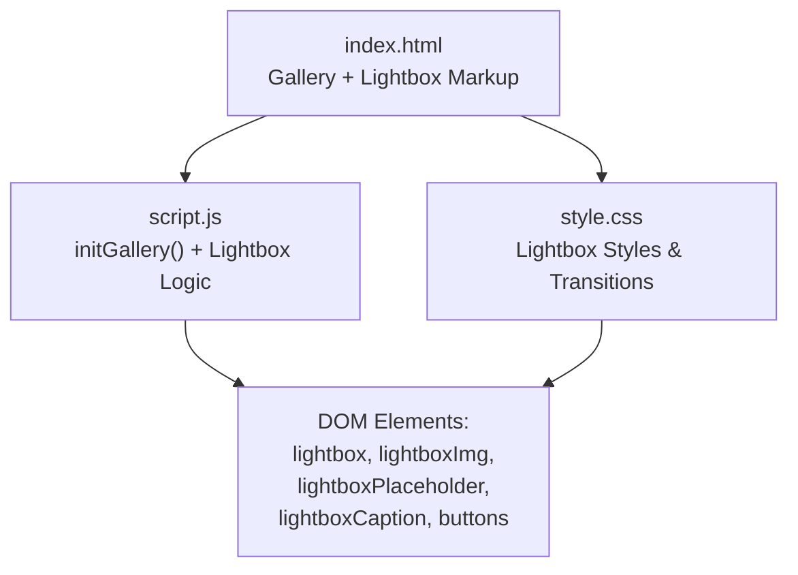
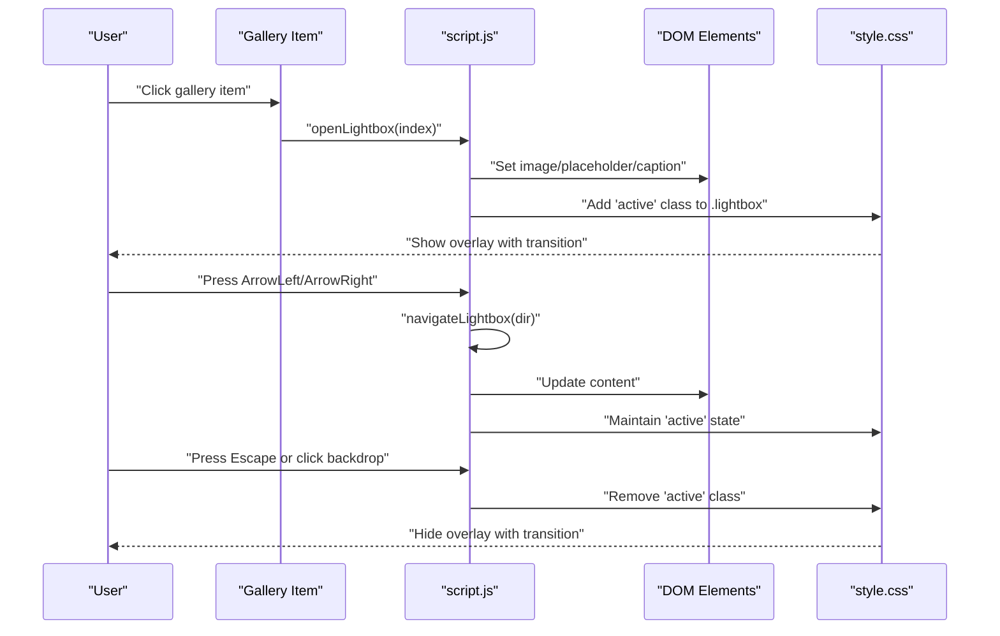
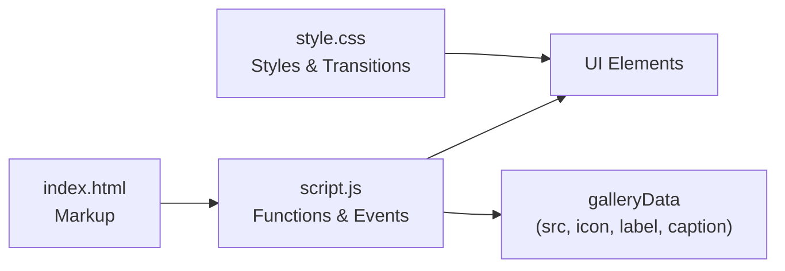

# Lightbox Implementation

<cite>
**Referenced Files in This Document**
- [index.html](file://index.html)
- [script.js](file://script.js)
- [style.css](file://style.css)
</cite>

## Table of Contents
1. [Introduction](#introduction)
2. [Project Structure](#project-structure)
3. [Core Components](#core-components)
4. [Architecture Overview](#architecture-overview)
5. [Detailed Component Analysis](#detailed-component-analysis)
6. [Dependency Analysis](#dependency-analysis)
7. [Performance Considerations](#performance-considerations)
8. [Troubleshooting Guide](#troubleshooting-guide)
9. [Conclusion](#conclusion)
10. [Appendices](#appendices)

## Introduction
This document explains the lightbox overlay system used to view gallery images with smooth transitions, keyboard navigation, and backdrop click-to-close behavior. It covers the core functions openLightbox(), closeLightbox(), and navigateLightbox(), the HTML structure for the lightbox, CSS styling and animations, and customization guidance for appearance, controls, and image formats/aspect ratios.

## Project Structure
The lightbox is implemented across three files:
- index.html: Defines the page layout including the gallery grid and the lightbox overlay markup.
- script.js: Implements gallery initialization, lightbox logic (open/close/navigate), keyboard handling, and event bindings.
- style.css: Styles the lightbox overlay, content area, image display, placeholder, caption, and navigation buttons, including responsive rules and transitions.

**Diagram sources**
- [index.html:75-145](file://index.html#L75-L145)
- [script.js:583-658](file://script.js#L583-L658)
- [style.css:608-760](file://style.css#L608-L760)

**Section sources**
- [index.html:75-145](file://index.html#L75-L145)
- [script.js:583-658](file://script.js#L583-L658)
- [style.css:608-760](file://style.css#L608-L760)

## Core Components
- Lightbox Overlay Container: A full-screen overlay that becomes visible when active.
- Image Container: Holds the current image or placeholder.
- Placeholder Display: Shown when no real image source is provided; includes an icon and label.
- Caption Area: Displays descriptive text for the current item.
- Navigation Controls: Close button, previous button, next button.
- Keyboard Support: Arrow keys to navigate, Escape to close.
- Backdrop Click-to-Close: Clicking outside the content closes the lightbox.
- Smooth Transitions: Fade/scale transitions for opening/closing and content changes.

Key behaviors are driven by:
- initGallery(): Sets up gallery items, binds clicks to open the lightbox, wires navigation buttons, backdrop click, and keyboard events.
- openLightbox(index): Shows the lightbox and updates image/placeholder and caption based on data at the given index.
- closeLightbox(): Hides the lightbox and restores body scroll.
- navigateLightbox(dir): Wraps around the gallery and reopens the lightbox at the new index.

**Section sources**
- [script.js:583-658](file://script.js#L583-L658)
- [style.css:608-760](file://style.css#L608-L760)

## Architecture Overview
The lightbox follows a simple event-driven architecture:
- Gallery items trigger openLightbox(index).
- The function updates DOM elements and toggles the active state for visibility.
- Navigation buttons and keyboard events call navigateLightbox(dir) or closeLightbox().
- Backdrop click listens for clicks on the overlay container to close.

**Diagram sources**
- [script.js:601-658](file://script.js#L601-L658)
- [style.css:608-641](file://style.css#L608-L641)

## Detailed Component Analysis

### HTML Structure
The lightbox overlay is defined within the main container and includes:
- Overlay wrapper with id="lightbox"
- Close button with id="lightboxClose"
- Previous button with id="lightboxPrev"
- Content container with class="lightbox-content"
  - Image element with id="lightboxImg"
  - Placeholder container with id="lightboxPlaceholder"
    - Icon span with id="lightboxPlaceholderIcon"
    - Text span with id="lightboxPlaceholderText"
  - Caption paragraph with id="lightboxCaption"
- Next button with id="lightboxNext"

This structure supports both real images and placeholders, and provides accessible labels via alt text and captions.

**Section sources**
- [index.html:132-145](file://index.html#L132-L145)

### JavaScript Functions

#### openLightbox(index)
- Purpose: Open the lightbox and render the item at the specified index.
- Parameters:
  - index: Number indicating which gallery item to show.
- Behavior:
  - Updates internal lightboxIndex.
  - If the item has a real image source, sets img src and alt, shows the image, hides the placeholder.
  - Otherwise, hides the image, shows the placeholder, and sets icon/text from gallery data.
  - Sets caption text from gallery data.
  - Adds 'active' class to the lightbox overlay to make it visible.
  - Disables body scrolling by setting overflow hidden.

**Section sources**
- [script.js:624-647](file://script.js#L624-L647)

#### closeLightbox()
- Purpose: Close the lightbox overlay.
- Behavior:
  - Removes 'active' class from the lightbox overlay.
  - Restores body scrolling by clearing overflow.

**Section sources**
- [script.js:649-653](file://script.js#L649-L653)

#### navigateLightbox(dir)
- Purpose: Navigate to the previous or next gallery item and reopen the lightbox.
- Parameters:
  - dir: Number, -1 for previous, 1 for next.
- Behavior:
  - Calculates new index with wrap-around using modulo arithmetic over galleryData length.
  - Calls openLightbox(newIndex) to update content and ensure visibility.

**Section sources**
- [script.js:655-658](file://script.js#L655-L658)

### Event Bindings and Interactions
- Gallery item click: Each gallery item triggers openLightbox(itemIndex).
- Navigation buttons:
  - Close button calls closeLightbox().
  - Previous button calls navigateLightbox(-1).
  - Next button calls navigateLightbox(1).
- Backdrop click: Clicking the overlay background (when not clicking a child) calls closeLightbox().
- Keyboard navigation:
  - When the lightbox is active, pressing Escape calls closeLightbox().
  - ArrowLeft calls navigateLightbox(-1).
  - ArrowRight calls navigateLightbox(1).

These bindings are set up during gallery initialization.

**Section sources**
- [script.js:601-622](file://script.js#L601-L622)

### CSS Styling and Transitions
- Overlay: Fixed position, full viewport coverage, dark translucent background with blur, opacity and visibility transitions for smooth fade-in/out.
- Content: Centered, constrained max width/height, scale transition for zoom effect when active.
- Image: Hidden by default; shown when 'visible' class is added; responsive sizing with object-fit contain.
- Placeholder: Styled with gradient background, dashed border, centered icon and text; hidden when image is present.
- Caption: Positioned below the content with script font styling.
- Buttons: Circular, positioned absolutely; hover effects with color and background changes; responsive adjustments for smaller screens.
- Transitions: All interactive states use ease or cubic-bezier easing for smooth UX.

**Section sources**
- [style.css:608-760](file://style.css#L608-L760)

### Data Model and Rendering Flow
The gallery uses an array of objects where each entry defines:
- src: Optional image path; if empty, placeholder is shown.
- icon: Emoji or symbol for placeholder.
- label: Short title for placeholder.
- caption: Descriptive text displayed in the lightbox.

During initialization:
- For each gallery item, if src is provided, replace the placeholder with an  element.
- Attach click handlers to open the lightbox at that item’s index.

Rendering in the lightbox:
- If src exists, set img attributes and toggle visibility classes.
- Else, populate placeholder icon and text, and hide the image.
- Update caption text accordingly.

**Section sources**
- [script.js:564-602](file://script.js#L564-L602)
- [script.js:624-647](file://script.js#L624-L647)

## Dependency Analysis
- script.js depends on DOM elements defined in index.html.
- style.css styles elements referenced by script.js and index.html.
- Gallery data drives rendering decisions in script.js.
- Event listeners bind user interactions to lightbox functions.

**Diagram sources**
- [index.html:75-145](file://index.html#L75-L145)
- [script.js:564-658](file://script.js#L564-L658)
- [style.css:608-760](file://style.css#L608-L760)

**Section sources**
- [script.js:564-658](file://script.js#L564-L658)
- [index.html:75-145](file://index.html#L75-L145)
- [style.css:608-760](file://style.css#L608-L760)

## Performance Considerations
- Lazy Loading: Gallery images can be loaded lazily to improve initial load performance.
- Minimal DOM Manipulation: openLightbox updates only necessary elements per navigation.
- Efficient Event Handling: Single keydown listener checks lightbox state before acting.
- Responsive Sizing: CSS constraints prevent oversized images from causing layout thrashing.
- Avoid Excessive Animations: Use hardware-accelerated properties (transform, opacity) for smooth transitions.

[No sources needed since this section provides general guidance]

## Troubleshooting Guide
Common issues and resolutions:
- Lightbox does not open:
  - Ensure gallery items have correct data-index and click handlers attached.
  - Verify initGallery runs after DOM is ready.
- Images not showing:
  - Confirm src paths exist and are correctly set in galleryData.
  - Check that img.visible class is applied when src is present.
- Placeholder not updating:
  - Ensure placeholder icon and text elements are updated from galleryData when src is empty.
- Keyboard navigation not working:
  - Verify keydown listener is attached and lightbox has 'active' class.
  - Confirm Escape and arrow keys are handled.
- Backdrop click not closing:
  - Ensure event listener targets the overlay container and ignores child elements.
- Body scroll remains locked:
  - Confirm closeLightbox removes 'active' and resets body overflow.

**Section sources**
- [script.js:601-658](file://script.js#L601-L658)
- [style.css:608-641](file://style.css#L608-L641)

## Conclusion
The lightbox system provides a clean, accessible, and responsive way to view gallery images with smooth transitions and intuitive controls. Its modular design separates concerns across HTML, CSS, and JavaScript, making it easy to customize appearance, extend functionality, and support various image formats and aspect ratios.

[No sources needed since this section summarizes without analyzing specific files]

## Appendices

### API Reference: Lightbox Functions
- openLightbox(index)
  - Parameters: index (number)
  - Behavior: Opens lightbox, renders image or placeholder, sets caption, enables overlay.
- closeLightbox()
  - Parameters: none
  - Behavior: Closes lightbox, disables overlay, restores body scroll.
- navigateLightbox(dir)
  - Parameters: dir (-1 or 1)
  - Behavior: Moves to previous/next item with wrap-around and reopens lightbox.

**Section sources**
- [script.js:624-658](file://script.js#L624-L658)

### Customization Examples

- Customize Appearance
  - Change overlay background and blur: Adjust .lightbox background and backdrop-filter in style.css.
  - Modify button styles: Update .lightbox-nav and .lightbox-close colors, sizes, and hover states.
  - Adjust caption typography: Edit .lightbox-caption font family, size, and color.

- Add Custom Navigation Controls
  - Insert additional buttons into the lightbox HTML and attach event listeners in script.js to call navigateLightbox or custom actions.
  - Style new buttons similarly to existing navigation controls.

- Handle Different Image Formats and Aspect Ratios
  - Supported formats: Any format supported by the browser (e.g., jpg, png, webp).
  - Aspect ratio: Use object-fit: contain to preserve proportions; adjust max-width/max-height in .lightbox-content img for optimal fit.
  - Placeholders: Provide meaningful icons and labels in galleryData for items without images.

**Section sources**
- [style.css:608-760](file://style.css#L608-L760)
- [script.js:564-602](file://script.js#L564-L602)