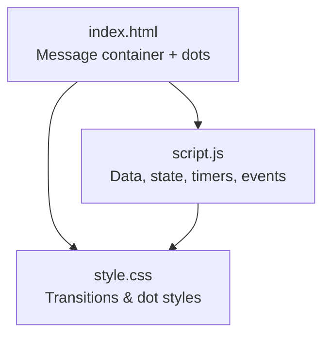
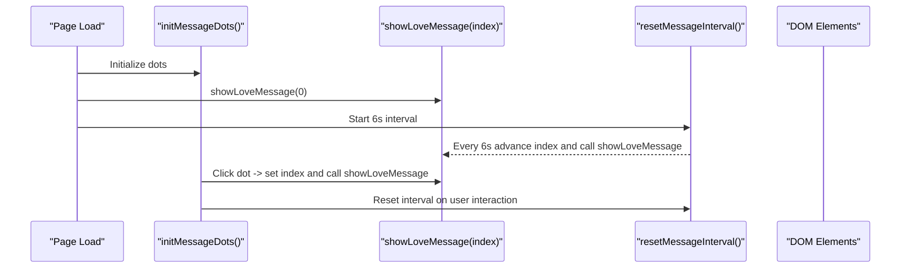
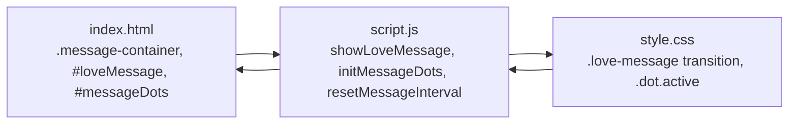

# Love Messages System

<cite>
**Referenced Files in This Document**
- [index.html](file://index.html)
- [script.js](file://script.js)
- [style.css](file://style.css)
</cite>

## Table of Contents
1. [Introduction](#introduction)
2. [Project Structure](#project-structure)
3. [Core Components](#core-components)
4. [Architecture Overview](#architecture-overview)
5. [Detailed Component Analysis](#detailed-component-analysis)
6. [Dependency Analysis](#dependency-analysis)
7. [Performance Considerations](#performance-considerations)
8. [Troubleshooting Guide](#troubleshooting-guide)
9. [Conclusion](#conclusion)
10. [Appendices](#appendices)

## Introduction
This document explains the rotating love messages feature: how messages are stored, how automatic rotation works with 6-second intervals, how users can navigate manually via dot indicators, and how smooth fade transitions are applied between messages. It also covers message indexing, interval management using clearInterval/setInterval, interaction-based timer resets, and guidance for extending or customizing behavior (adding messages, changing speed, implementing different transitions, integrating with other UI elements). Finally, it addresses memory management for intervals and performance optimization for frequent DOM updates.

## Project Structure
The rotating love messages feature spans three files:
- HTML defines the message container and dot indicators.
- JavaScript manages data, state, timers, and user interactions.
- CSS styles the message text and dot indicators, including transition effects.

**Diagram sources**
- [index.html:60-67](file://index.html#L60-L67)
- [script.js:153-193](file://script.js#L153-L193)
- [style.css:270-311](file://style.css#L270-L311)

**Section sources**
- [index.html:60-67](file://index.html#L60-L67)
- [script.js:153-193](file://script.js#L153-L193)
- [style.css:270-311](file://style.css#L270-L311)

## Core Components
- Message data array: a list of love messages that rotate automatically.
- State variables: current message index and interval handle.
- Display functions: render message with fade transition and update active dot.
- Navigation: dot click handlers to jump to specific messages and reset auto-rotation.
- Timer management: setInterval for auto-rotation and clearInterval on manual navigation.

Key responsibilities:
- Data: loveMessages array holds all messages.
- Rendering: showLoveMessage updates the DOM and applies opacity transitions.
- Interaction: initMessageDots creates clickable dots and resets the timer.
- Automation: resetMessageInterval starts/stops the 6-second rotation cycle.

**Section sources**
- [script.js:11-27](file://script.js#L11-L27)
- [script.js:153-193](file://script.js#L153-L193)
- [style.css:270-311](file://style.css#L270-L311)

## Architecture Overview
The system follows a simple event-driven flow:
- On page load, initialize dots and display the first message.
- Start an interval that advances the index and shows the next message every 6 seconds.
- When a user clicks a dot, update the index, show the selected message, and restart the interval from that point.

**Diagram sources**
- [script.js:172-193](file://script.js#L172-L193)
- [script.js:157-170](file://script.js#L157-L170)
- [script.js:661-670](file://script.js#L661-L670)

## Detailed Component Analysis

### Message Data and Indexing
- The loveMessages array stores each message string.
- currentMessageIndex tracks which message is currently displayed.
- Index wraps around using modulo arithmetic when advancing automatically.

Complexity:
- Access by index is O(1).
- Rotation logic is O(1) per tick.

Memory:
- Array size equals number of messages; negligible overhead.

**Section sources**
- [script.js:11-27](file://script.js#L11-L27)
- [script.js:153-155](file://script.js#L153-L155)
- [script.js:187-193](file://script.js#L187-L193)

### Automatic Rotation with 6-Second Intervals
- resetMessageInterval clears any existing interval and sets a new one that increments the index and calls showLoveMessage every 6000 ms.
- The initial start occurs during initialization after showing the first message.

Behavior:
- Ensures only one interval runs at a time by clearing before setting.
- Wraps index to avoid out-of-bounds access.

**Section sources**
- [script.js:187-193](file://script.js#L187-L193)
- [script.js:661-670](file://script.js#L661-L670)

### Manual Navigation Using Dot Indicators
- initMessageDots creates a dot for each message and attaches click listeners.
- Clicking a dot sets currentMessageIndex to the clicked index, displays that message, and resets the auto-rotation timer so the next auto-advance respects the user’s choice.

User experience:
- Active dot reflects the current message.
- Interactions pause and restart the rotation cycle.

**Section sources**
- [script.js:172-185](file://script.js#L172-L185)
- [style.css:292-311](file://style.css#L292-L311)

### Smooth Fade Transitions Between Messages
- showLoveMessage temporarily hides the message element by setting opacity to 0, then updates content and fades back to full opacity.
- CSS transition on the message element ensures smooth visual change.

Timing:
- A short delay allows the fade-out to complete before updating text, preventing flicker.

**Section sources**
- [script.js:157-170](file://script.js#L157-L170)
- [style.css:283-290](file://style.css#L283-L290)

### Interval Management and Memory Considerations
- Always clear previous intervals before starting a new one to prevent multiple overlapping timers.
- User interactions reset the interval, ensuring consistent timing after manual navigation.
- No explicit cleanup on page unload is required for this feature, but best practice is to clear intervals if the component were unmounted in a larger app.

Potential pitfalls:
- Forgetting to clear intervals can cause memory leaks and unexpected behavior.
- Rapid clicks should not spawn multiple intervals due to the clear-before-set pattern.

**Section sources**
- [script.js:187-193](file://script.js#L187-L193)
- [script.js:172-185](file://script.js#L172-L185)

### Integration Points with Other UI Elements
- The message section is independent but coexists with counters, gallery, and other features.
- If you add global keyboard shortcuts or focus management, ensure they do not interfere with dot clicks or message updates.

[No sources needed since this section provides general integration guidance]

## Dependency Analysis
The feature depends on:
- HTML structure for the message container and dots.
- CSS for transitions and dot styling.
- JavaScript for data, state, and timers.

**Diagram sources**
- [index.html:60-67](file://index.html#L60-L67)
- [script.js:157-193](file://script.js#L157-L193)
- [style.css:270-311](file://style.css#L270-L311)

**Section sources**
- [index.html:60-67](file://index.html#L60-L67)
- [script.js:157-193](file://script.js#L157-L193)
- [style.css:270-311](file://style.css#L270-L311)

## Performance Considerations
- DOM updates: Only one element (#loveMessage) is updated per rotation; minimal reflow/repaint.
- Transitions: Use CSS opacity transitions for GPU-accelerated animations.
- Timers: Single interval running; cleared before restarting to avoid overlap.
- Debouncing: Not strictly necessary here, but if adding more frequent updates, consider throttling or requestAnimationFrame for heavy tasks.
- Memory: Keep the messages array concise; avoid excessive strings or large objects.

Optimization tips:
- Batch DOM reads/writes if expanding functionality.
- Avoid unnecessary style recalculations by toggling classes instead of inline styles where possible.
- Ensure intervals are cleared on page unload or component teardown in larger applications.

[No sources needed since this section provides general guidance]

## Troubleshooting Guide
Common issues and resolutions:
- Multiple intervals firing: Ensure clearInterval is called before creating a new interval.
- Dots not updating: Verify that the active class is toggled correctly based on the current index.
- Fade not working: Confirm the message element has a CSS transition on opacity and that opacity is set to 0 before updating content.
- Auto-rotation stops after clicking: Check that resetMessageInterval is invoked on dot click to restart the timer.

Where to look:
- Interval setup and reset logic.
- Dot click handler and active class toggling.
- Message rendering function and CSS transitions.

**Section sources**
- [script.js:157-193](file://script.js#L157-L193)
- [style.css:283-311](file://style.css#L283-L311)

## Conclusion
The rotating love messages feature uses a clean separation of concerns: data in a simple array, state managed by a current index, and timers driving automatic rotation. Manual navigation via dot indicators enhances usability while preserving consistent timing through interval resets. Smooth fade transitions provide a polished user experience. With careful interval management and minimal DOM updates, the feature remains performant and easy to extend.

[No sources needed since this section summarizes without analyzing specific files]

## Appendices

### How-To Guides

#### Add a New Message
- Locate the loveMessages array and append a new message string.
- The dot indicators will automatically reflect the new count.

**Section sources**
- [script.js:11-27](file://script.js#L11-L27)

#### Customize Rotation Speed
- Modify the interval duration in resetMessageInterval to change the 6-second cadence.
- Ensure the value is appropriate for your content length and user experience goals.

**Section sources**
- [script.js:187-193](file://script.js#L187-L193)

#### Implement Different Transition Effects
- Replace opacity-based fading with CSS transforms or keyframe animations for slide, scale, or other effects.
- Update showLoveMessage to apply the chosen effect and adjust timing accordingly.

**Section sources**
- [script.js:157-170](file://script.js#L157-L170)
- [style.css:283-290](file://style.css#L283-L290)

#### Integrate With Other UI Elements
- Expose currentMessageIndex and showLoveMessage to allow external components to synchronize with the message state.
- Consider emitting a custom event when messages change to notify other parts of the UI.

[No sources needed since this section provides general integration guidance]

### Memory Management Checklist
- Clear intervals before starting new ones to prevent overlaps.
- Remove event listeners if dynamically recreating dots.
- In single-page apps, clear intervals on route changes or component unmount.

**Section sources**
- [script.js:187-193](file://script.js#L187-L193)