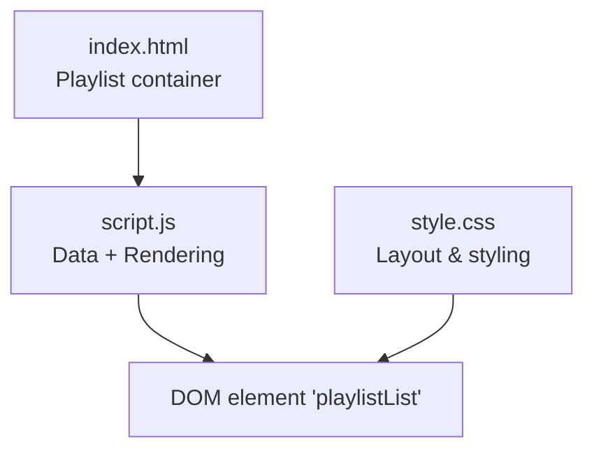
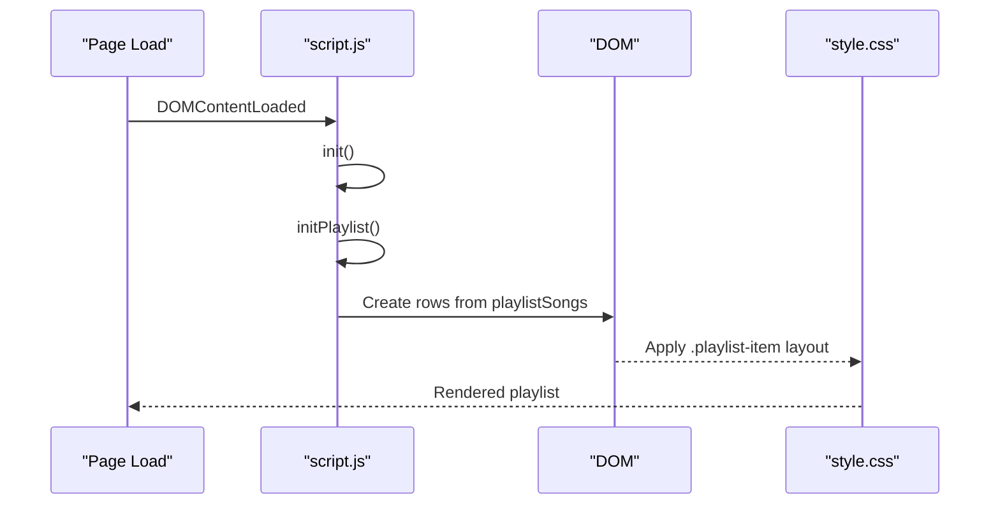
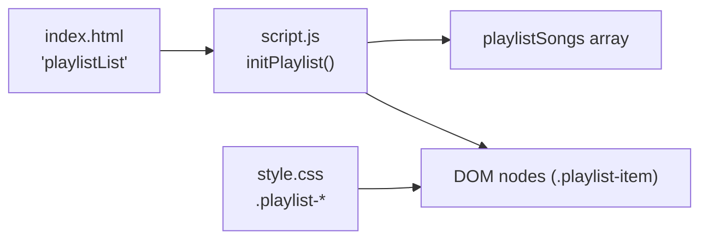

# Playlist Section

<cite>
**Referenced Files in This Document**
- [index.html](file://index.html)
- [script.js](file://script.js)
- [style.css](file://style.css)
</cite>

## Table of Contents
1. [Introduction](#introduction)
2. [Project Structure](#project-structure)
3. [Core Components](#core-components)
4. [Architecture Overview](#architecture-overview)
5. [Detailed Component Analysis](#detailed-component-analysis)
6. [Dependency Analysis](#dependency-analysis)
7. [Performance Considerations](#performance-considerations)
8. [Troubleshooting Guide](#troubleshooting-guide)
9. [Conclusion](#conclusion)
10. [Appendices](#appendices)

## Introduction
This document explains the curated playlist section that displays meaningful songs with a personal touch. It covers the data model used for songs, how the list is generated dynamically, the three-column layout (song number, information, and personal reason), and practical guidance on adding new songs, customizing display, modifying numbering, and integrating with external music services. It also includes responsive behavior notes and accessibility considerations for screen readers.

## Project Structure
The playlist section is implemented across three files:
- HTML defines the container where the playlist will be rendered.
- JavaScript holds the song data and renders the list dynamically.
- CSS styles the playlist items into a clean, responsive three-column layout.

**Diagram sources**
- [index.html:161-167](file://index.html#L161-L167)
- [script.js:384-415](file://script.js#L384-L415)
- [style.css:942-1016](file://style.css#L942-L1016)

**Section sources**
- [index.html:161-167](file://index.html#L161-L167)
- [script.js:384-415](file://script.js#L384-L415)
- [style.css:942-1016](file://style.css#L942-L1016)

## Core Components
- Data model: The playlist uses an array of objects, each representing a song with title, artist, and reason properties.
- Rendering: On page load, the script creates DOM nodes for each song and inserts them into the playlist container.
- Layout: Each row shows three columns:
  - Song number (left)
  - Song information (center): title and artist
  - Personal reason (right): a short note explaining why this song matters

Key implementation references:
- Song data array definition
- Dynamic list generation function
- Container element ID used to mount the list

**Section sources**
- [script.js:384-415](file://script.js#L384-L415)
- [index.html:161-167](file://index.html#L161-L167)

## Architecture Overview
The playlist follows a simple data-driven rendering pattern:
- Configuration: A constant array defines all songs.
- Initialization: On DOM ready, the initialization function calls the playlist renderer.
- Rendering: For each song, a row is created with three child elements for number, info, and reason.
- Styling: CSS arranges these children into a consistent three-column layout and applies hover effects and responsive rules.

**Diagram sources**
- [script.js:660-694](file://script.js#L660-L694)
- [script.js:384-415](file://script.js#L384-L415)
- [style.css:942-1016](file://style.css#L942-L1016)

## Detailed Component Analysis

### Playlist Data Model
- Structure: An array of objects with properties:
  - title: string
  - artist: string
  - reason: string
- Purpose: Encapsulates the song identity and the personal meaning behind it.
- Extensibility: You can add more fields later (e.g., year, genre) without changing the UI if you keep the existing properties.

References:
- Array definition with multiple entries

**Section sources**
- [script.js:384-394](file://script.js#L384-L394)

### Dynamic List Generation
- Functionality: Iterates over the data array and builds a list item for each song.
- Numbering: Uses the loop index to generate a two-digit number starting at 01.
- Content population: Safely sets text content for title, artist, and reason to avoid XSS risks.
- Mounting: Appends each item to the playlist container identified by its ID.

References:
- Rendering function and DOM insertion

**Section sources**
- [script.js:396-415](file://script.js#L396-L415)

### Three-Column Layout
- Columns:
  - Left: Song number (styled with a distinct font and color)
  - Center: Song information (title and artist stacked)
  - Right: Personal reason (italicized script-style font, right-aligned)
- Interactions: Hover effect slightly shifts the item and changes background/border colors.
- Responsive behavior: On small screens, the reason column hides to preserve readability.

References:
- CSS classes for playlist item, number, info, and reason
- Media query hiding reason on narrow viewports

**Section sources**
- [style.css:942-1016](file://style.css#L942-L1016)

### Adding New Songs
To add a new song:
- Open the script file and locate the playlist data array.
- Add a new object with title, artist, and reason properties.
- Save the file; the list will update automatically on reload.

Guidance:
- Keep reasons concise so they fit well in the right column.
- Maintain consistent casing and punctuation for a uniform look.

References:
- Location of the playlist data array

**Section sources**
- [script.js:384-394](file://script.js#L384-L394)

### Customizing Display Format
You can adjust the visual style without changing logic:
- Change fonts, colors, spacing, or borders via CSS classes for playlist items, numbers, titles, artists, and reasons.
- Modify hover transitions or alignment if needed.
- To show/hide the reason column on different screen sizes, adjust the media query.

References:
- Styling for playlist components and responsive rules

**Section sources**
- [style.css:942-1016](file://style.css#L942-L1016)

### Modifying the Numbering System
Current behavior:
- Numbers are zero-padded to two digits, starting at 01.
- The number is derived from the loop index plus one.

Customization options:
- Change padding width to support more than 99 songs (e.g., padStart(3, '0') for 001).
- Start numbering from a different base by adjusting the formula.
- Switch to non-zero-padded numbers by removing the padding call.

References:
- Number formatting within the render loop

**Section sources**
- [script.js:396-415](file://script.js#L396-L415)

### Integrating With External Music Services
While the current implementation is static, you can extend it to integrate with external services:
- Options:
  - Link each song to a streaming service URL (e.g., Spotify, Apple Music).
  - Fetch metadata from an API to enrich the list (album art, duration).
- Implementation ideas:
  - Add a link property to each song object and render a play button or link.
  - Use a service-specific deep link format for direct playback.
  - If using an API, handle loading states and errors gracefully.

Note: This is conceptual guidance; no external integration code exists in the repository.

[No sources needed since this section provides general guidance]

### Examples of Different Song Formats
You can represent various formats while keeping the same structure:
- Solo artist: title, artist, reason
- Duo or group: title, artist (e.g., “Artist A & Artist B”), reason
- Remix or live version: include version details in the title
- Instrumental or acoustic: specify in the title or reason

These examples maintain compatibility with the existing renderer and styles.

[No sources needed since this section provides general guidance]

### Responsive Design Behavior
- Desktop/tablet: All three columns visible; reason aligned to the right.
- Mobile: Reason column is hidden to prevent crowding; the layout remains readable.
- Hover effects remain functional on touch devices but do not interfere with usability.

References:
- Media query hiding reason on small screens
- Flex-based layout for consistent alignment

**Section sources**
- [style.css:942-1016](file://style.css#L942-L1016)

### Accessibility Considerations for Screen Readers
- Semantic structure: The playlist is a list of items; ensure future enhancements use semantic lists (e.g., <ul>/<li>) for better navigation.
- Text-only content: Current implementation uses plain text for title, artist, and reason, which screen readers can announce clearly.
- Avoid relying solely on color to convey meaning; the reason’s role is textual and visually distinct.
- Keyboard focus: If you add interactive elements (e.g., links or buttons), ensure they are keyboard-accessible and have descriptive labels.
- ARIA attributes: If you add dynamic updates, consider aria-live regions to announce changes to assistive technologies.

[No sources needed since this section provides general guidance]

## Dependency Analysis
The playlist depends on:
- The DOM container defined in HTML
- The data array and rendering function in JavaScript
- CSS classes for layout and styling

**Diagram sources**
- [index.html:161-167](file://index.html#L161-L167)
- [script.js:384-415](file://script.js#L384-L415)
- [style.css:942-1016](file://style.css#L942-L1016)

**Section sources**
- [index.html:161-167](file://index.html#L161-L167)
- [script.js:384-415](file://script.js#L384-L415)
- [style.css:942-1016](file://style.css#L942-L1016)

## Performance Considerations
- Rendering efficiency: The current approach creates DOM nodes per song; this is efficient for small to medium lists.
- Large playlists: If the list grows significantly, consider virtualization or pagination to reduce DOM size.
- Styling performance: Hover transforms are lightweight; avoid excessive animations on large lists.
- Memory usage: Keep song objects minimal; avoid attaching heavy data to DOM nodes.

[No sources needed since this section provides general guidance]

## Troubleshooting Guide
Common issues and resolutions:
- Playlist does not appear:
  - Ensure the container element with the correct ID exists in HTML.
  - Confirm the initialization function runs after DOM is ready.
- Numbers not showing correctly:
  - Verify the loop index and padding logic.
  - Check that the number element class is present in the template.
- Reason text not visible on mobile:
  - This is expected due to responsive hiding; widen the viewport or adjust the media query if needed.
- Styling conflicts:
  - Inspect computed styles to ensure your custom CSS overrides default rules appropriately.

References:
- Container ID and initialization flow
- Number formatting and template structure
- Responsive media queries

**Section sources**
- [index.html:161-167](file://index.html#L161-L167)
- [script.js:396-415](file://script.js#L396-L415)
- [style.css:1009-1016](file://style.css#L1009-L1016)

## Conclusion
The playlist section provides a clean, data-driven way to showcase meaningful songs with a personal touch. Its three-column layout balances clarity and emotion, while responsive design ensures readability across devices. Extending the playlist with links or external integrations is straightforward, and accessibility best practices can be applied as features evolve.

[No sources needed since this section summarizes without analyzing specific files]

## Appendices

### Quick Reference: How to Add a New Song
- Locate the playlist data array in the script file.
- Add a new object with title, artist, and reason.
- Save and refresh the page to see the updated list.

References:
- Playlist data array location

**Section sources**
- [script.js:384-394](file://script.js#L384-L394)

### Quick Reference: Customize Numbering
- Adjust the padding width to support more digits.
- Change the starting number by modifying the formula.
- Remove padding to switch to non-zero-padded numbers.

References:
- Number formatting in the render loop

**Section sources**
- [script.js:396-415](file://script.js#L396-L415)

### Quick Reference: Hide or Show Reason Column
- On mobile, the reason column is hidden by default.
- To show it on smaller screens, edit the media query to remove the hide rule.

References:
- Responsive rule for reason visibility

**Section sources**
- [style.css:1009-1016](file://style.css#L1009-L1016)