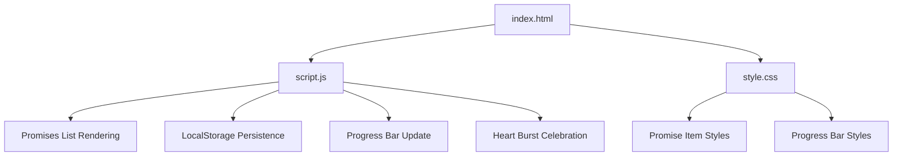
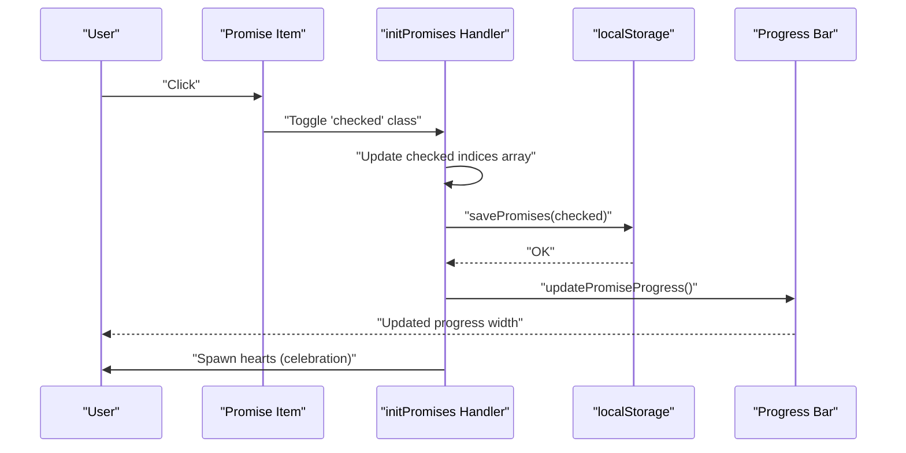
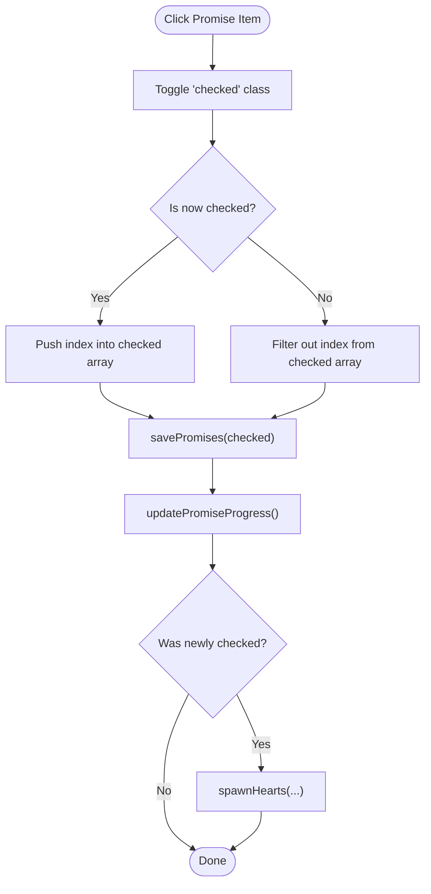
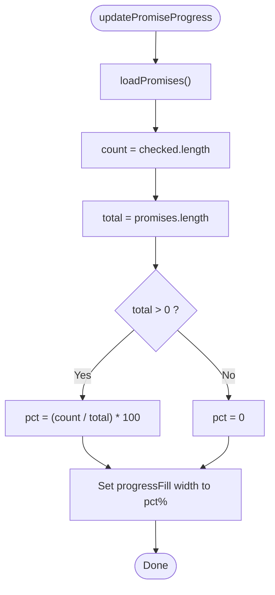
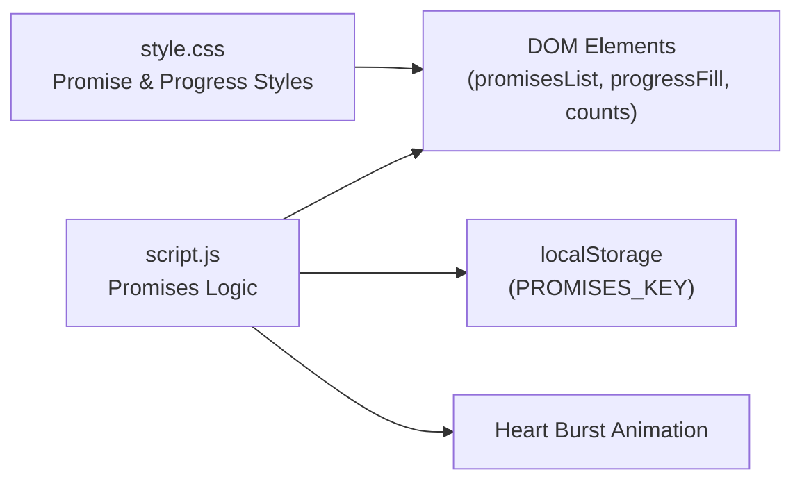

# Promises Tracker

<cite>
**Referenced Files in This Document**
- [index.html](file://index.html)
- [script.js](file://script.js)
- [style.css](file://style.css)
</cite>

## Table of Contents
1. [Introduction](#introduction)
2. [Project Structure](#project-structure)
3. [Core Components](#core-components)
4. [Architecture Overview](#architecture-overview)
5. [Detailed Component Analysis](#detailed-component-analysis)
6. [Dependency Analysis](#dependency-analysis)
7. [Performance Considerations](#performance-considerations)
8. [Troubleshooting Guide](#troubleshooting-guide)
9. [Conclusion](#conclusion)
10. [Appendices](#appendices)

## Introduction
This document explains the interactive promises/bucket list tracker embedded in a romantic-themed single-page application. It focuses on how promises are defined, rendered, toggled, persisted with LocalStorage, and visually tracked via a progress bar. It also covers celebration heart bursts when completing promises, security considerations for LocalStorage usage, fallback strategies if storage is unavailable, and guidance for customization and migration between versions.

## Project Structure
The project consists of three core files:
- HTML structure defines the page layout, including the promises section container and UI elements for progress display.
- JavaScript implements all runtime behavior: rendering promises, handling interactions, persisting state to LocalStorage, updating progress, and triggering animations.
- CSS styles define the visual appearance, including the promise items, checked states, and animated progress bar.

**Diagram sources**
- [index.html:169-176](file://index.html#L169-L176)
- [script.js:417-499](file://script.js#L417-L499)
- [style.css:1018-1113](file://style.css#L1018-L1113)

**Section sources**
- [index.html:169-176](file://index.html#L169-L176)
- [script.js:417-499](file://script.js#L417-L499)
- [style.css:1018-1113](file://style.css#L1018-L1113)

## Core Components
- Promises array: A static list of promise objects defining each bucket-list item with an icon and text.
- PROMISES_KEY constant: The LocalStorage key used to store checked indices.
- loadPromises/savePromises: Functions to read/write checked indices from/to LocalStorage with error handling.
- initPromises: Renders the list, attaches click handlers, applies saved checked states, and triggers celebrations on completion.
- updatePromiseProgress: Calculates and updates the progress bar based on checked count vs total.
- Heart burst animation: Visual feedback when a promise is completed.

Key responsibilities:
- Data model: promises array defines the content and order.
- State management: checked indices stored as an array of integers in LocalStorage.
- UI binding: DOM elements created per promise; classes toggled for checked state.
- Persistence: JSON-encoded array of checked indices under a dedicated key.
- Progress calculation: percentage = (checked.length / promises.length) * 100.

**Section sources**
- [script.js:417-499](file://script.js#L417-L499)
- [index.html:169-176](file://index.html#L169-L176)
- [style.css:1018-1113](file://style.css#L1018-L1113)

## Architecture Overview
The promises feature follows a simple client-side flow:
- On initialization, the app loads any previously checked indices from LocalStorage.
- For each promise, it creates a DOM element with a checkbox-like indicator, icon, and text.
- Clicking a promise toggles its checked state, updates the in-memory array of checked indices, persists changes to LocalStorage, and recalculates progress.
- When a promise becomes checked, a heart burst animation plays at the item’s location.

**Diagram sources**
- [script.js:445-499](file://script.js#L445-L499)

## Detailed Component Analysis

### Promises Array Structure
- Type: Array of objects.
- Fields per object:
  - icon: Emoji string displayed before the text.
  - text: Human-readable description of the promise.
- Purpose: Defines the full set of promises to render and track.

Behavioral notes:
- Order is preserved during rendering and persistence.
- Checked state is represented by storing the index of each checked item.

**Section sources**
- [script.js:417-431](file://script.js#L417-L431)

### Checkbox Toggle Functionality
- Each promise item is clickable.
- Toggling adds/removes a CSS class that visually indicates completion.
- The in-memory checked indices array is updated accordingly:
  - Adding an index when checking.
  - Removing an index when unchecking.
- After update, persistence and progress recalculation occur.

**Diagram sources**
- [script.js:451-489](file://script.js#L451-L489)

**Section sources**
- [script.js:451-489](file://script.js#L451-L489)

### Progress Bar Calculation
- Reads current checked indices from LocalStorage.
- Computes percentage: (count / total) * 100.
- Updates the progress fill width and the numeric counter text.

**Diagram sources**
- [script.js:492-499](file://script.js#L492-L499)

**Section sources**
- [script.js:492-499](file://script.js#L492-L499)

### Data Persistence Using LocalStorage
- Key: A dedicated constant ensures consistent storage across sessions.
- Read function:
  - Attempts to parse stored JSON.
  - Returns an empty array if parsing fails or no data exists.
- Write function:
  - Serializes the checked indices array to JSON and stores it under the key.
- Error handling:
  - Parsing errors are caught and treated as “no prior data,” returning an empty array.

Security note:
- Only non-sensitive, user preference data (indices) is stored.
- No user credentials or personal identifiers are persisted.

Fallback strategy:
- If LocalStorage is unavailable or throws, reads default to an empty array, ensuring the UI still renders without crashes.

**Section sources**
- [script.js:433-443](file://script.js#L433-L443)

### Checked State Management
- In-memory representation: An array of integer indices corresponding to checked promises.
- Initialization:
  - Loads existing checked indices from LocalStorage.
  - Applies the checked class to matching items during render.
- Interaction:
  - Toggles class and updates the array.
  - Persists changes immediately after toggle.

Visual feedback:
- Checked items receive a distinct border/background and strikethrough text via CSS.

**Section sources**
- [script.js:445-489](file://script.js#L445-L489)
- [style.css:1044-1085](file://style.css#L1044-L1085)

### Celebration Heart Bursts on Completion
- Triggered when a promise becomes newly checked.
- Spawns multiple floating heart emojis around the clicked item using shared animation utilities.
- Uses computed coordinates relative to the item’s bounding rectangle.

Implementation highlights:
- Coordinates derived from getBoundingClientRect.
- Emojis randomly selected from a predefined set.
- Elements are auto-removed after animation completes.

**Section sources**
- [script.js:472-483](file://script.js#L472-L483)
- [script.js:350-382](file://script.js#L350-L382)

### HTML Integration Points
- Container for the list: A div with a specific ID holds dynamically generated promise items.
- Progress display:
  - Numeric counters for checked/total.
  - A progress bar container and fill element whose width is updated by JS.

Accessibility and semantics:
- Items are interactive and keyboard-friendly due to event delegation on clicks.
- Visual cues (checkmark, strikethrough) clearly indicate state.

**Section sources**
- [index.html:169-176](file://index.html#L169-L176)

### CSS Styling for Promises
- List layout: Vertical stack with spacing.
- Item styling:
  - Hover effects and subtle background transitions.
  - Checked state styling: different border color, background tint, checkmark visibility, and strikethrough text.
- Progress bar:
  - Thin bar with rounded corners and gradient fill.
  - Smooth width transition for animated progress updates.

**Section sources**
- [style.css:1018-1113](file://style.css#L1018-L1113)

## Dependency Analysis
- script.js depends on:
  - DOM elements identified by IDs for rendering and progress updates.
  - localStorage API for persistence.
  - Shared animation helpers for heart bursts.
- style.css provides:
  - Visual states for unchecked/checked items.
  - Progress bar styling and transitions.
- index.html wires:
  - The promises section container and progress elements referenced by script.js.

**Diagram sources**
- [script.js:417-499](file://script.js#L417-L499)
- [index.html:169-176](file://index.html#L169-L176)
- [style.css:1018-1113](file://style.css#L1018-L1113)

**Section sources**
- [script.js:417-499](file://script.js#L417-L499)
- [index.html:169-176](file://index.html#L169-L176)
- [style.css:1018-1113](file://style.css#L1018-L1113)

## Performance Considerations
- Minimal DOM operations:
  - Items are created once during initialization.
  - Toggling only updates classes and re-renders the progress bar.
- LocalStorage writes:
  - Occur on every interaction; acceptable for small arrays of indices.
  - If the number of promises grows significantly, consider debouncing saves or batching updates.
- Animations:
  - Heart bursts create temporary nodes and remove them after animation; ensure not to spawn excessive bursts in rapid succession.

[No sources needed since this section provides general guidance]

## Troubleshooting Guide
Common issues and resolutions:
- Promises not persisting:
  - Verify LocalStorage availability and permissions.
  - Check for parsing errors in load functions; they should fall back to empty arrays.
- Progress bar not updating:
  - Ensure updatePromiseProgress runs after savePromises.
  - Confirm progress elements exist and have correct IDs.
- Checked state resets on reload:
  - Confirm loadPromises returns the stored array and that initPromises applies classes based on loaded indices.
- Heart bursts not appearing:
  - Ensure the heart container exists and animation styles are applied.
  - Validate that spawnHearts receives valid coordinates.

**Section sources**
- [script.js:433-499](file://script.js#L433-L499)
- [script.js:350-382](file://script.js#L350-L382)

## Conclusion
The promises tracker provides a simple yet engaging way to visualize shared goals with immediate feedback and persistent state. Its design separates concerns cleanly: data definition, UI rendering, state management, persistence, and visual celebration. With robust error handling and clear styling, it offers a smooth user experience while remaining easy to customize and extend.

[No sources needed since this section summarizes without analyzing specific files]

## Appendices

### Examples and Customization

- Adding new promises:
  - Extend the promises array with additional objects containing icon and text fields.
  - New items will automatically appear and be included in progress calculations.

- Customizing progress display:
  - Adjust CSS for the progress bar and counters to change colors, sizes, or transitions.
  - Modify updatePromiseProgress to include additional metrics (e.g., milestones).

- Implementing different completion states:
  - Introduce a multi-state model (e.g., pending, in-progress, completed) by expanding the checked representation.
  - Update initPromises to handle state classes and adjust persistence format accordingly.

- Migrating data between versions:
  - If changing the storage schema (e.g., switching from indices to objects), implement a versioned migration in loadPromises:
    - Detect old format and convert to new format.
    - Save the migrated data back to LocalStorage.
  - Keep backward compatibility until all users have upgraded.

- Security considerations for LocalStorage:
  - Store only non-sensitive, user preference data (like indices).
  - Avoid storing personal information or secrets.
  - Sanitize inputs if you later allow dynamic content insertion.

- Fallback strategies if storage is unavailable:
  - Wrap reads/writes in try/catch blocks.
  - Default to in-memory state when storage fails.
  - Optionally inform the user that progress won’t persist across sessions.

**Section sources**
- [script.js:417-499](file://script.js#L417-L499)
- [style.css:1018-1113](file://style.css#L1018-L1113)