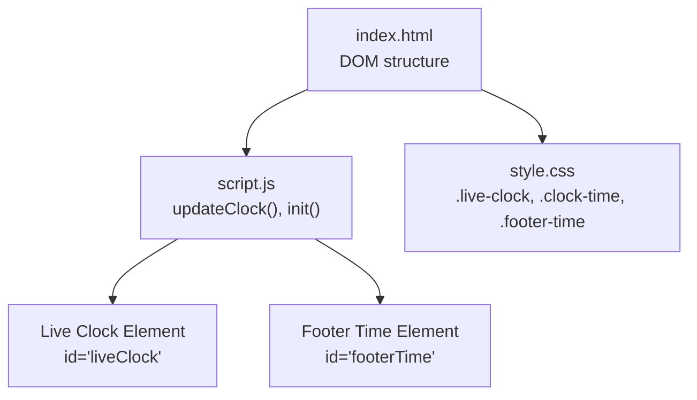
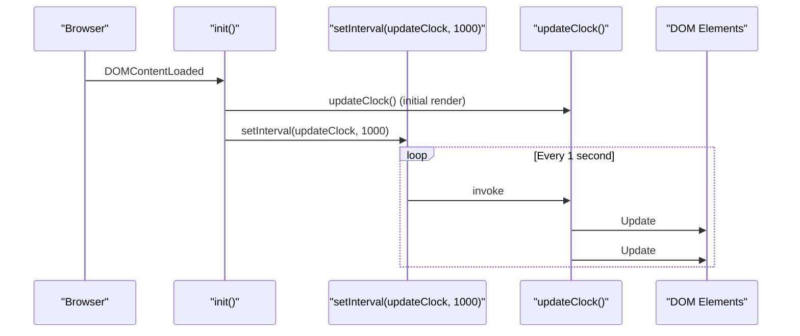
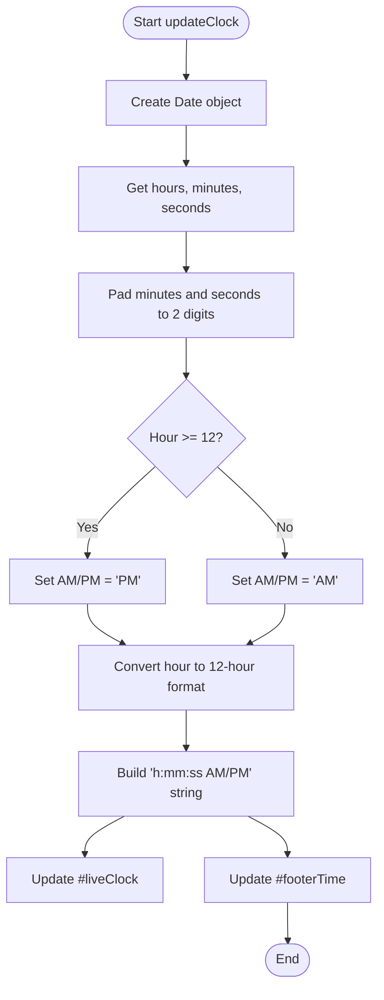
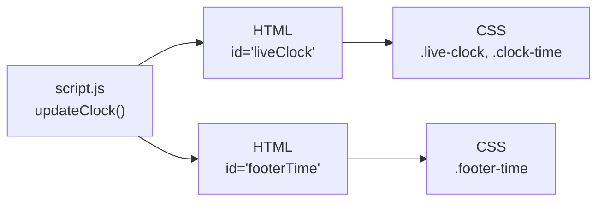
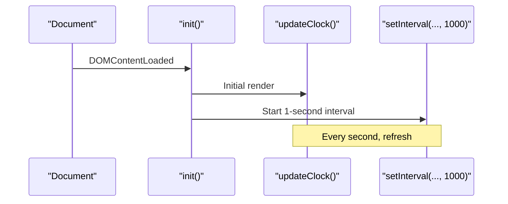
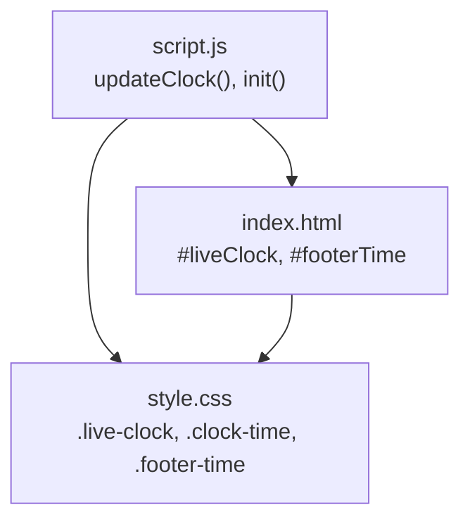

# Live Clock Display

<cite>
**Referenced Files in This Document**
- [script.js](file://script.js)
- [index.html](file://index.html)
- [style.css](file://style.css)
</cite>

## Table of Contents
1. [Introduction](#introduction)
2. [Project Structure](#project-structure)
3. [Core Components](#core-components)
4. [Architecture Overview](#architecture-overview)
5. [Detailed Component Analysis](#detailed-component-analysis)
6. [Dependency Analysis](#dependency-analysis)
7. [Performance Considerations](#performance-considerations)
8. [Troubleshooting Guide](#troubleshooting-guide)
9. [Conclusion](#conclusion)
10. [Appendices](#appendices)

## Introduction
This document explains the live clock display feature that updates real-time hours, minutes, and seconds in a 12-hour format with AM/PM indicators. It covers how the updateClock() function works, which DOM elements are updated, and how to customize time formatting, add timezone support, and adjust the visual style. It also addresses performance considerations for frequent DOM updates and browser compatibility for Date API methods used by the implementation.

## Project Structure
The live clock is implemented as a small set of JavaScript functions that run on page load and then update every second via a timer. The HTML provides two target elements: one in the hero section for the main clock and another in the footer for a secondary time display. CSS styles define the appearance of the live clock container and its text.

**Diagram sources**
- [index.html:26-29](file://index.html#L26-L29)
- [index.html:179-182](file://index.html#L179-L182)
- [script.js:55-64](file://script.js#L55-L64)
- [script.js:661-693](file://script.js#L661-L693)
- [style.css:140-162](file://style.css#L140-L162)
- [style.css:378-393](file://style.css#L378-L393)

**Section sources**
- [index.html:26-29](file://index.html#L26-L29)
- [index.html:179-182](file://index.html#L179-L182)
- [script.js:55-64](file://script.js#L55-L64)
- [script.js:661-693](file://script.js#L661-L693)
- [style.css:140-162](file://style.css#L140-L162)
- [style.css:378-393](file://style.css#L378-L393)

## Core Components
- updateClock(): Computes current local time, formats it into a 12-hour string with AM/PM, and writes the result to both the main clock and footer time elements.
- Initialization and scheduling: On DOMContentLoaded, init() sets initial values and starts timers to keep the clock and related counters up to date.

Key behaviors:
- Uses Date API methods to get hours, minutes, and seconds.
- Converts 24-hour hour to 12-hour format and determines AM/PM.
- Pads minutes and seconds to always show two digits.
- Updates two DOM nodes per tick.

**Section sources**
- [script.js:55-64](file://script.js#L55-L64)
- [script.js:661-693](file://script.js#L661-L693)

## Architecture Overview
The live clock follows a simple, robust pattern: compute time once per second, format it, and apply to the DOM.

**Diagram sources**
- [script.js:661-693](file://script.js#L661-L693)
- [script.js:55-64](file://script.js#L55-L64)

## Detailed Component Analysis

### updateClock() logic
- Creates a new Date instance to capture the current local time.
- Extracts hours, minutes, and seconds using standard Date methods.
- Formats minutes and seconds with zero-padding to ensure two-digit display.
- Determines AM/PM based on whether the hour is greater than or equal to 12.
- Converts the hour to 12-hour format; midnight displays as 12 AM and noon as 12 PM.
- Writes the formatted string to:
  - The main clock element with id liveClock inside the hero section.
  - The footer time element with id footerTime.

**Diagram sources**
- [script.js:55-64](file://script.js#L55-L64)

**Section sources**
- [script.js:55-64](file://script.js#L55-L64)

### DOM targets and styling
- Main clock:
  - Element id: liveClock
  - Container class: live-clock
  - Styled with a glass-like pill shape, subtle border, backdrop blur, and glowing accent color.
- Footer time:
  - Element id: footerTime
  - Styled with smaller font size, letter spacing, and muted opacity to sit quietly at the bottom.

**Diagram sources**
- [script.js:55-64](file://script.js#L55-L64)
- [index.html:26-29](file://index.html#L26-L29)
- [index.html:179-182](file://index.html#L179-L182)
- [style.css:140-162](file://style.css#L140-L162)
- [style.css:378-393](file://style.css#L378-L393)

**Section sources**
- [index.html:26-29](file://index.html#L26-L29)
- [index.html:179-182](file://index.html#L179-L182)
- [style.css:140-162](file://style.css#L140-L162)
- [style.css:378-393](file://style.css#L378-L393)

### Scheduling and lifecycle
- On DOMContentLoaded, init() calls updateClock() once to render immediately.
- A setInterval schedules updateClock() every 1000 ms to keep the display current.
- Other periodic updates (greeting/date) run less frequently to reduce overhead.

**Diagram sources**
- [script.js:661-693](file://script.js#L661-L693)
- [script.js:55-64](file://script.js#L55-L64)

**Section sources**
- [script.js:661-693](file://script.js#L661-L693)

## Dependency Analysis
- script.js depends on:
  - DOM elements with ids liveClock and footerTime defined in index.html.
  - CSS classes and ids for styling the live clock and footer time.
- index.html provides the structural anchors for the clock outputs.
- style.css defines the visual presentation of the live clock and footer time.

**Diagram sources**
- [script.js:55-64](file://script.js#L55-L64)
- [script.js:661-693](file://script.js#L661-L693)
- [index.html:26-29](file://index.html#L26-L29)
- [index.html:179-182](file://index.html#L179-L182)
- [style.css:140-162](file://style.css#L140-L162)
- [style.css:378-393](file://style.css#L378-L393)

**Section sources**
- [script.js:55-64](file://script.js#L55-L64)
- [script.js:661-693](file://script.js#L661-L693)
- [index.html:26-29](file://index.html#L26-L29)
- [index.html:179-182](file://index.html#L179-L182)
- [style.css:140-162](file://style.css#L140-L162)
- [style.css:378-393](file://style.css#L378-L393)

## Performance Considerations
- Frequency of updates:
  - The clock updates every second via setInterval. This is lightweight but still performs two DOM writes per tick.
- DOM write minimization:
  - Only textContent is updated on two elements per tick. Avoid additional layout-triggering reads/writes inside the same tick.
- Throttling alternatives:
  - For very heavy pages, consider requestAnimationFrame-based updates or throttling to every 2–3 seconds if sub-second precision is not required.
- Memory and timers:
  - Ensure only one interval is active for the clock. If you add more features, avoid creating duplicate intervals.
- Accessibility:
  - Keep the clock readable and high contrast. Avoid animations that conflict with user preferences (e.g., reduced motion).

[No sources needed since this section provides general guidance]

## Troubleshooting Guide
- Clock not visible:
  - Verify that elements with ids liveClock and footerTime exist in the HTML.
  - Check that the script runs after the DOM is ready (DOMContentLoaded).
- Incorrect time or AM/PM:
  - The implementation uses local time from the browser’s Date API. If the displayed time is off, check the device’s system time zone settings.
- Formatting issues:
  - Minutes and seconds are padded to two digits. If you see single digits, confirm that the padding logic is intact.
- Styling problems:
  - Ensure the CSS classes for .live-clock, .clock-time, and .footer-time are present and not overridden by custom styles.

**Section sources**
- [index.html:26-29](file://index.html#L26-L29)
- [index.html:179-182](file://index.html#L179-L182)
- [script.js:55-64](file://script.js#L55-L64)
- [script.js:661-693](file://script.js#L661-L693)
- [style.css:140-162](file://style.css#L140-L162)
- [style.css:378-393](file://style.css#L378-L393)

## Conclusion
The live clock feature is a concise, efficient component that computes and renders local time every second in a 12-hour format with AM/PM. It updates two DOM nodes and relies on widely supported Date API methods. With minimal DOM writes and straightforward logic, it delivers smooth performance across modern browsers. Customization points include formatting, timezone handling, and styling through CSS variables and classes.

[No sources needed since this section summarizes without analyzing specific files]

## Appendices

### Customization Examples

- Change time format:
  - To switch to 24-hour format, remove the AM/PM conversion and use the raw hour value.
  - To change separators or order, adjust the string construction step before writing to the DOM.
  - Reference: [script.js:55-64](file://script.js#L55-L64)

- Add timezone support:
  - Use Intl.DateTimeFormat or toLocaleString with a specified timeZone option to display time in a chosen region.
  - Apply the formatted result to both #liveClock and #footerTime.
  - Reference: [script.js:55-64](file://script.js#L55-L64), [index.html:26-29](file://index.html#L26-L29), [index.html:179-182](file://index.html#L179-L182)

- Modify display style:
  - Adjust colors, fonts, spacing, and effects via .live-clock, .clock-time, and .footer-time in CSS.
  - Example adjustments: increase font size, change glow intensity, or alter background transparency.
  - Reference: [style.css:140-162](file://style.css#L140-L162), [style.css:378-393](file://style.css#L378-L393)

### Browser Compatibility Notes
- Date methods used:
  - getHours(), getMinutes(), getSeconds() are broadly supported across all modern browsers.
  - String.prototype.padStart() is supported in all major browsers; if targeting very old environments, provide a fallback.
- Timezone-aware formatting:
  - Intl.DateTimeFormat and toLocaleString(timeZone) are widely supported; verify compatibility if supporting legacy browsers.

[No sources needed since this section provides general guidance]