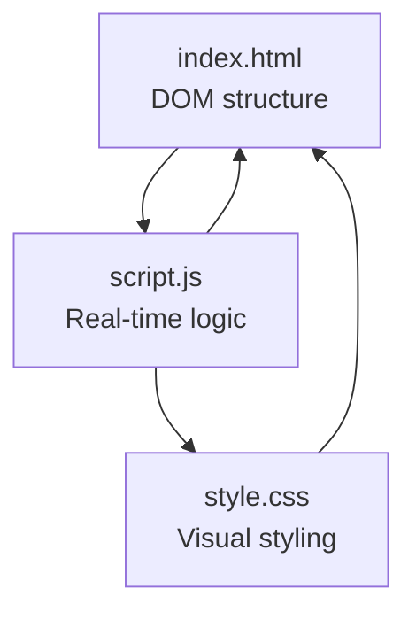
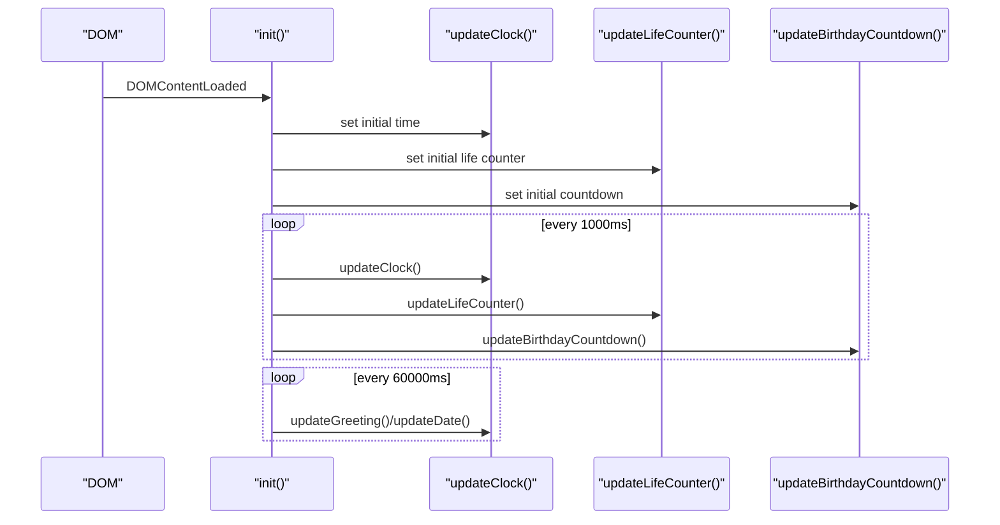
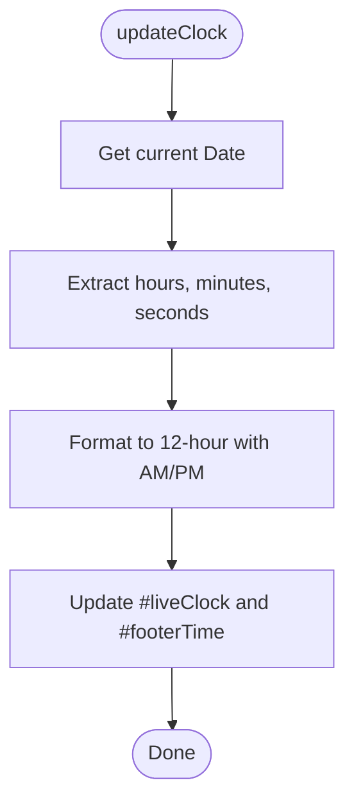
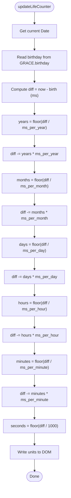
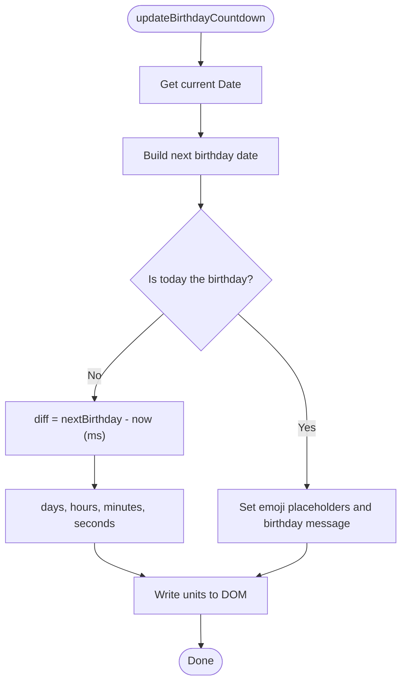
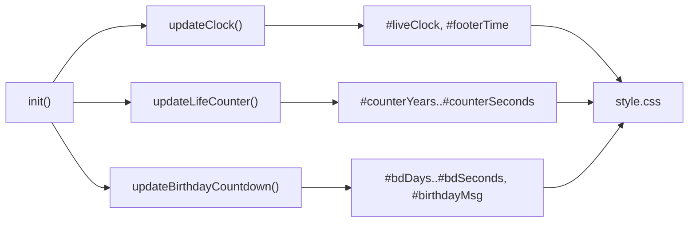

# Real-Time Counters

<cite>
**Referenced Files in This Document**
- [index.html](file://index.html)
- [script.js](file://script.js)
- [style.css](file://style.css)
</cite>

## Table of Contents
1. [Introduction](#introduction)
2. [Project Structure](#project-structure)
3. [Core Components](#core-components)
4. [Architecture Overview](#architecture-overview)
5. [Detailed Component Analysis](#detailed-component-analysis)
6. [Dependency Analysis](#dependency-analysis)
7. [Performance Considerations](#performance-considerations)
8. [Troubleshooting Guide](#troubleshooting-guide)
9. [Conclusion](#conclusion)
10. [Appendices](#appendices)

## Introduction
This document explains the real-time counters feature set: a live clock, a life counter since birthday, and a birthday countdown system. It covers how time-based calculations are performed, how setInterval drives second-by-second updates, special birthday detection logic, the GRACE configuration object for birthday data, date formatting methods, and timezone handling. It also includes examples for modifying the birthday date, customizing display formats, extending with additional time-based features, and addresses performance and browser compatibility considerations.

## Project Structure
The project is a single-page site with three primary files:
- index.html: Defines the DOM elements for the live clock, life counter, and birthday countdown sections.
- script.js: Implements all logic for time updates, counters, and UI interactions.
- style.css: Styles the counters, cards, animations, and responsive layout.

**Diagram sources**
- [index.html:15-58](file://index.html#L15-L58)
- [script.js:660-694](file://script.js#L660-L694)
- [style.css:140-268](file://style.css#L140-L268)

**Section sources**
- [index.html:15-58](file://index.html#L15-L58)
- [script.js:660-694](file://script.js#L660-L694)
- [style.css:140-268](file://style.css#L140-L268)

## Core Components
- Live Clock: Displays current local time in 12-hour format with AM/PM and updates every second.
- Life Counter (since birthday): Shows years, months, days, hours, minutes, seconds elapsed since the configured birthday.
- Birthday Countdown: Counts down to the next birthday; on the birthday, shows celebratory emojis and a message.

Key behaviors:
- All timers use setInterval to update displays once per second.
- The greeting and date are refreshed every minute to handle boundary transitions (e.g., midnight).
- Date formatting uses the browser’s Intl API via toLocaleDateString for locale-aware output.

**Section sources**
- [script.js:55-84](file://script.js#L55-L84)
- [script.js:87-151](file://script.js#L87-L151)
- [script.js:660-694](file://script.js#L660-L694)

## Architecture Overview
The real-time counters are driven by a central initialization routine that sets initial values and starts periodic updates. Each counter has its own function that computes values from the current time and writes to specific DOM nodes.

**Diagram sources**
- [script.js:660-694](file://script.js#L660-L694)
- [script.js:55-84](file://script.js#L55-L84)
- [script.js:87-151](file://script.js#L87-L151)

## Detailed Component Analysis

### Live Clock
- Computes current hour, minute, second using Date API.
- Formats into 12-hour time with AM/PM.
- Updates two DOM elements: the hero clock and footer time.
- Runs every second via setInterval.

**Diagram sources**
- [script.js:55-64](file://script.js#L55-L64)

**Section sources**
- [script.js:55-64](file://script.js#L55-L64)
- [index.html:26-29](file://index.html#L26-L29)
- [index.html:179-182](file://index.html#L179-L182)

### Life Counter (Since Birthday)
- Calculates elapsed time since the configured birthday using millisecond differences.
- Converts milliseconds into years, months, days, hours, minutes, seconds using approximate month/year lengths.
- Writes each unit to corresponding DOM elements.
- Runs every second via setInterval.

**Diagram sources**
- [script.js:87-110](file://script.js#L87-L110)

**Section sources**
- [script.js:87-110](file://script.js#L87-L110)
- [index.html:33-45](file://index.html#L33-L45)

### Birthday Countdown
- Determines the next birthday based on current year and configured month/day.
- If today is the birthday, switches to celebratory mode with emojis and a special message.
- Otherwise, calculates remaining days, hours, minutes, seconds and updates DOM.
- Adjusts motivational messages when within 7 or 30 days of the birthday.
- Runs every second via setInterval.

**Diagram sources**
- [script.js:113-151](file://script.js#L113-L151)

**Section sources**
- [script.js:113-151](file://script.js#L113-L151)
- [index.html:47-58](file://index.html#L47-L58)

### Configuration: GRACE Object
- Holds personalization data including name, nickname, and birthday.
- birthdayMonth and birthdayDay are used to compute the next birthday.
- To change the birthday, modify the birthday Date and the month/day fields accordingly.

Examples:
- Change birthday date: update the birthday field to a new Date instance.
- Ensure birthdayMonth matches the month index (0-indexed) and birthdayDay matches the day.

**Section sources**
- [script.js:1-8](file://script.js#L1-L8)

### Date Formatting and Time Zones
- Date formatting uses toLocaleDateString with an explicit locale to produce human-readable dates.
- Time display uses local time via getHours/getMinutes/getSeconds, which respects the user’s system time zone.
- No explicit UTC conversions are used; all computations rely on local time.

Best practices:
- Keep birthday as a local Date representing midnight at the start of the birthday.
- If you need UTC semantics, convert explicitly before comparisons.

**Section sources**
- [script.js:80-84](file://script.js#L80-L84)
- [script.js:55-64](file://script.js#L55-L64)

### DOM Elements and Styling
- Live clock container and time element are styled with glassmorphism and subtle animations.
- Counter blocks use consistent card-like styling with pulsing seconds.
- Responsive adjustments ensure readability on small screens.

**Section sources**
- [index.html:26-29](file://index.html#L26-L29)
- [index.html:33-45](file://index.html#L33-L45)
- [index.html:47-58](file://index.html#L47-L58)
- [style.css:140-268](file://style.css#L140-L268)

## Dependency Analysis
- Initialization orchestrates all components and sets up intervals.
- Each timer depends on the Date API and writes to specific DOM IDs defined in the HTML.
- Styling depends on CSS classes applied to these elements.

**Diagram sources**
- [script.js:660-694](file://script.js#L660-L694)
- [index.html:26-58](file://index.html#L26-L58)
- [style.css:140-268](file://style.css#L140-L268)

**Section sources**
- [script.js:660-694](file://script.js#L660-L694)
- [index.html:26-58](file://index.html#L26-L58)
- [style.css:140-268](file://style.css#L140-L268)

## Performance Considerations
- Frequent DOM updates: Each second, three functions write to multiple DOM nodes. This is generally acceptable but can be optimized:
  - Batch DOM writes where possible (e.g., construct strings and assign once per tick).
  - Use requestAnimationFrame for visual effects only; keep setInterval minimal for pure calculations.
- Avoid layout thrashing: Read and write DOM properties in separate phases if expanding functionality.
- Memory: Intervals are started once; ensure no duplicate intervals are created on re-init.
- Browser compatibility: Uses standard Date API and toLocaleDateString, supported in all modern browsers. For very old environments, provide fallbacks.

[No sources needed since this section provides general guidance]

## Troubleshooting Guide
Common issues and fixes:
- Counters not updating:
  - Verify that init runs after DOMContentLoaded and that setInterval calls are present.
  - Check that DOM IDs match those referenced in script.js.
- Incorrect birthday behavior:
  - Confirm birthdayMonth is zero-indexed and matches the intended month.
  - Ensure birthday Day is correct and that the Date constructor uses local time.
- Time zone confusion:
  - All times are local; if you need UTC, convert explicitly before comparisons.
- Greeting/date not changing at midnight:
  - The minute interval refreshes greeting and date; ensure it still runs.

**Section sources**
- [script.js:660-694](file://script.js#L660-L694)
- [script.js:80-84](file://script.js#L80-L84)
- [script.js:113-151](file://script.js#L113-L151)

## Conclusion
The real-time counters provide a smooth, engaging experience by combining precise time calculations with frequent UI updates. The GRACE configuration centralizes personalization, while the modular functions make it easy to extend or customize. With careful attention to performance and clear date/time handling, the system remains reliable across devices and browsers.

[No sources needed since this section summarizes without analyzing specific files]

## Appendices

### How to Modify the Birthday Date
- Open script.js and locate the GRACE configuration object.
- Update the birthday field to a new Date instance representing the desired birthday.
- Ensure birthdayMonth and birthdayDay reflect the same date (month is zero-indexed).

Example steps:
- Change birthday to a new date: set birthday to a new Date(year, monthIndex, day).
- Align birthdayMonth and birthdayDay with the updated date.

**Section sources**
- [script.js:1-8](file://script.js#L1-L8)

### Customizing Counter Display Format
- Live clock format:
  - Modify the formatting logic in the clock function to switch between 12-hour and 24-hour modes or add leading zeros consistently.
- Life counter granularity:
  - You can hide or show certain units by toggling visibility in CSS or adjusting the DOM writes.
- Birthday countdown messaging:
  - Customize thresholds and messages to suit your preferences.

**Section sources**
- [script.js:55-64](file://script.js#L55-L64)
- [script.js:87-110](file://script.js#L87-L110)
- [script.js:113-151](file://script.js#L113-L151)

### Extending With Additional Time-Based Features
Ideas:
- Add a “days since last anniversary” counter by adding another configuration entry and a dedicated update function.
- Implement a daily quote that changes at midnight using a minute-level interval.
- Show sunrise/sunset times by integrating a geolocation-based API and updating periodically.

Implementation tips:
- Create a new configuration entry under GRACE for the new event.
- Write a dedicated update function similar to existing ones.
- Register a setInterval call in init to run the new function every second or minute as appropriate.

**Section sources**
- [script.js:660-694](file://script.js#L660-L694)