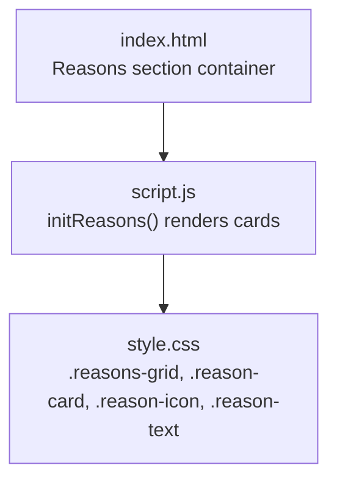
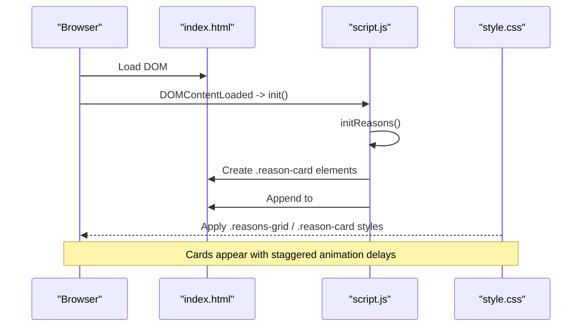
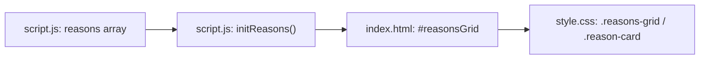

# Reasons Grid

<cite>
**Referenced Files in This Document**
- [index.html](file://index.html)
- [script.js](file://script.js)
- [style.css](file://style.css)
</cite>

## Table of Contents
1. [Introduction](#introduction)
2. [Project Structure](#project-structure)
3. [Core Components](#core-components)
4. [Architecture Overview](#architecture-overview)
5. [Detailed Component Analysis](#detailed-component-analysis)
6. [Dependency Analysis](#dependency-analysis)
7. [Performance Considerations](#performance-considerations)
8. [Troubleshooting Guide](#troubleshooting-guide)
9. [Conclusion](#conclusion)
10. [Appendices](#appendices)

## Introduction
This document explains the Reasons Grid feature that dynamically generates illustrated cards describing why Grace is loved. It covers the data structure for reasons, how HTML cards are generated, CSS animations with staggered delays, glass morphism styling, and responsive behavior. It also provides guidance on adding new reasons, customizing icons and text (including HTML support), adjusting animation timing, and adapting the grid layout for different screen sizes.

## Project Structure
The Reasons Grid is implemented across three files:
- HTML defines a container element where the grid will be rendered.
- JavaScript contains the reasons data and logic to generate cards.
- CSS styles the grid, cards, icons, text, hover effects, and responsive layout.

**Diagram sources**
- [index.html:69-73](file://index.html#L69-L73)
- [script.js:195-208](file://script.js#L195-L208)
- [style.css:313-350](file://style.css#L313-L350)

**Section sources**
- [index.html:69-73](file://index.html#L69-L73)
- [script.js:195-208](file://script.js#L195-L208)
- [style.css:313-350](file://style.css#L313-L350)

## Core Components
- Data source: reasons array with icon and text properties.
- Rendering: initReasons builds DOM nodes per reason and appends them into the grid container.
- Styling: grid uses CSS Grid; cards use glass-like visuals; icons and text have dedicated styles.
- Animation: each card receives a staggered animation delay based on its index.

Key implementation references:
- Reasons data definition and rendering function
- Grid and card styles
- Staggered animation via inline style

**Section sources**
- [script.js:29-37](file://script.js#L29-L37)
- [script.js:195-208](file://script.js#L195-L208)
- [style.css:313-350](file://style.css#L313-L350)

## Architecture Overview
The Reasons Grid follows a simple data-driven pattern:
- The reasons array holds structured entries.
- On page load, initReasons reads the array and creates a card for each entry.
- Each card includes an icon and text node.
- CSS Grid arranges cards responsively; glass morphism and hover effects enhance appearance.

**Diagram sources**
- [index.html:69-73](file://index.html#L69-L73)
- [script.js:195-208](file://script.js#L195-L208)
- [style.css:313-350](file://style.css#L313-L350)

## Detailed Component Analysis

### Reasons Data Structure
- Array of objects with two properties:
  - icon: a string representing the visual marker (e.g., emoji).
  - text: a string that may include HTML markup for emphasis or formatting.
- The rendering code inserts this content directly into the DOM, enabling rich text styling within each card.

Examples of supported patterns:
- Emoji icons for quick recognition.
- HTML tags like strong to emphasize key words in the text.

How to add a new reason:
- Add a new object to the reasons array with icon and text fields.
- Optionally include HTML in text for styling (e.g., bolding).

Where to find it:
- Reasons array definition
- Rendering loop that maps items to DOM nodes

**Section sources**
- [script.js:29-37](file://script.js#L29-L37)
- [script.js:195-208](file://script.js#L195-L208)

### HTML Generation for Each Card
- For each reason, a div with class reason-card is created.
- Inside the card:
  - A span with class reason-icon displays the icon.
  - A paragraph with class reason-text displays the text.
- The card’s inline style sets animationDelay based on its index to create a staggered entrance effect.

Notes:
- The text property supports HTML because it is inserted via innerHTML.
- The staggered delay is computed as index multiplied by a fixed step.

Customization tips:
- Change the delay multiplier to speed up or slow down the cascade.
- Adjust the base delay value to control the overall timing feel.

**Section sources**
- [script.js:195-208](file://script.js#L195-L208)

### CSS Animations and Staggered Delays
- The staggered animation is applied via inline animationDelay set during card creation.
- The base animation used for scroll reveal applies to glass cards; individual cards inherit transitions and hover effects.
- Hover states provide subtle lift and border color changes for interactivity.

To modify timing:
- Update the delay calculation in the rendering function to change the per-step delay.
- Adjust transition durations and easing in the CSS for smoother or snappier interactions.

**Section sources**
- [script.js:195-208](file://script.js#L195-L208)
- [style.css:313-350](file://style.css#L313-L350)
- [style.css:421-431](file://style.css#L421-L431)

### Glass Morphism Styling
- Cards use a translucent background, subtle borders, and backdrop blur to achieve a glass-like appearance.
- Hover states increase background opacity and adjust border colors for visual feedback.
- The parent section uses a glass card style consistent with other sections.

Key styling areas:
- Glass card base styles
- Reason card specific styles
- Hover transitions

**Section sources**
- [style.css:164-191](file://style.css#L164-L191)
- [style.css:313-350](file://style.css#L313-L350)

### Responsive Design Considerations
- The grid adapts using CSS Grid with auto-fit and minmax to reflow columns based on available width.
- On small screens, the grid collapses to a single column for readability.
- Padding and spacing adjust at breakpoints to maintain comfortable touch targets and legible text.

Adjustments:
- Modify minmax values to change minimum card width and thus the number of columns.
- Tweak gap and padding for tighter or looser layouts.

**Section sources**
- [style.css:313-319](file://style.css#L313-L319)
- [style.css:434-452](file://style.css#L434-L452)

### Examples of Icon Types and Text Styling Patterns
- Icons: Use emojis or any inline symbol that fits the design tone.
- Text: Supports HTML; you can emphasize keywords, add line breaks, or apply additional classes if needed.
- Keep text concise for better readability on smaller screens.

Guidelines:
- Choose icons that clearly represent the reason.
- Use HTML sparingly to avoid overly complex cards.
- Maintain consistent tone and length across reasons.

[No sources needed since this section provides general guidance]

## Dependency Analysis
- script.js depends on index.html to find the reasons grid container and attach generated cards.
- style.css styles the grid and cards referenced by both HTML and JS.
- The reasons array is the single source of truth; changes there automatically update the UI.

**Diagram sources**
- [script.js:29-37](file://script.js#L29-L37)
- [script.js:195-208](file://script.js#L195-L208)
- [index.html:69-73](file://index.html#L69-L73)
- [style.css:313-350](file://style.css#L313-L350)

**Section sources**
- [script.js:29-37](file://script.js#L29-L37)
- [script.js:195-208](file://script.js#L195-L208)
- [index.html:69-73](file://index.html#L69-L73)
- [style.css:313-350](file://style.css#L313-L350)

## Performance Considerations
- The grid renders a modest number of lightweight DOM nodes; performance impact is minimal.
- Using CSS Grid ensures efficient layout calculations.
- Avoid excessive HTML in text to keep rendering fast.
- If adding many reasons, consider pagination or virtualization for very large lists.

[No sources needed since this section provides general guidance]

## Troubleshooting Guide
Common issues and fixes:
- Cards not appearing:
  - Ensure the reasons array is defined and non-empty.
  - Verify the reasons grid container exists in the HTML.
- Icons not showing:
  - Confirm the icon property is a valid string.
- Text not rendering HTML:
  - The rendering uses innerHTML; ensure the text property contains valid HTML.
- Animation not staggered:
  - Check that the rendering loop assigns animationDelay based on index.
- Layout looks cramped:
  - Adjust grid minmax values and gap in CSS.
  - Review responsive breakpoint rules for mobile adjustments.

Relevant implementation references:
- Reasons array and rendering function
- Grid and card styles
- Scroll reveal and transitions

**Section sources**
- [script.js:29-37](file://script.js#L29-L37)
- [script.js:195-208](file://script.js#L195-L208)
- [style.css:313-350](file://style.css#L313-L350)
- [style.css:421-431](file://style.css#L421-L431)

## Conclusion
The Reasons Grid is a clean, data-driven component that transforms a simple array into visually appealing, animated cards. With HTML-supported text and flexible icons, it is easy to customize. CSS Grid and glass morphism provide a modern look and responsive behavior. Adjusting the reasons array and a few CSS/JS parameters allows fine-tuning of content, timing, and layout.

[No sources needed since this section summarizes without analyzing specific files]

## Appendices

### How-To: Add New Reasons
- Open the JavaScript file and locate the reasons array.
- Add a new object with icon and text properties.
- Save and reload the page; the new card appears with a staggered animation.

References:
- Reasons array definition
- Rendering function

**Section sources**
- [script.js:29-37](file://script.js#L29-L37)
- [script.js:195-208](file://script.js#L195-L208)

### How-To: Customize Icons and Text Formatting
- Icons: Replace the emoji with another symbol or image placeholder if desired.
- Text: Include HTML tags to emphasize or format content (e.g., bold, italics).
- Keep text concise for best readability on all devices.

References:
- Rendering function that inserts icon and text into DOM

**Section sources**
- [script.js:195-208](file://script.js#L195-L208)

### How-To: Modify Animation Timing
- To change stagger delay:
  - Update the delay calculation in the rendering function to multiply the index by a different factor.
- To adjust overall animation feel:
  - Modify transition durations and easing in the CSS for cards and hover states.

References:
- Staggered delay assignment
- Card transitions and hover effects

**Section sources**
- [script.js:195-208](file://script.js#L195-L208)
- [style.css:313-350](file://style.css#L313-L350)

### How-To: Adjust Grid Layout
- Change responsiveness:
  - Edit the grid-template-columns minmax value to alter card width and column count.
- Adjust spacing:
  - Modify the gap property to increase or decrease space between cards.
- Mobile tweaks:
  - Review the media query for single-column layout and adjust padding/gap as needed.

References:
- Grid configuration
- Responsive breakpoint rules

**Section sources**
- [style.css:313-319](file://style.css#L313-L319)
- [style.css:434-452](file://style.css#L434-L452)