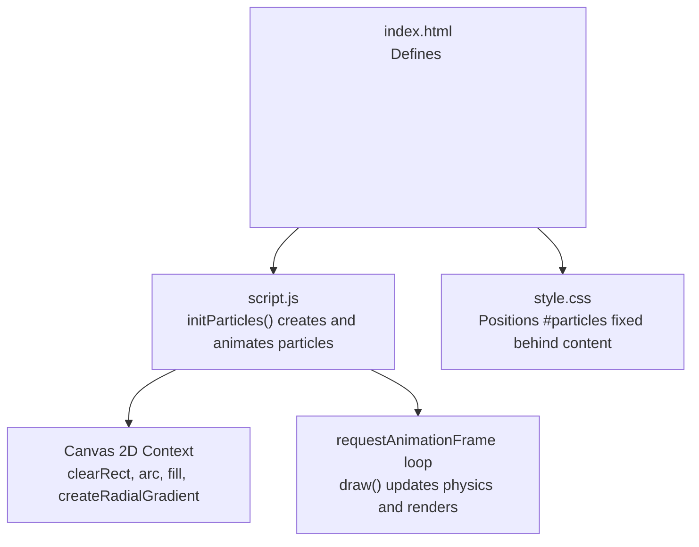
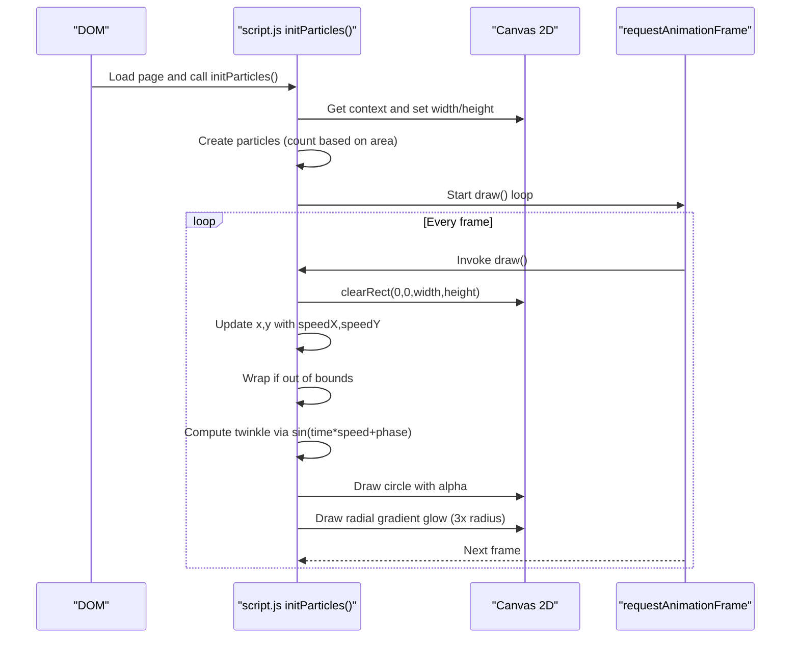
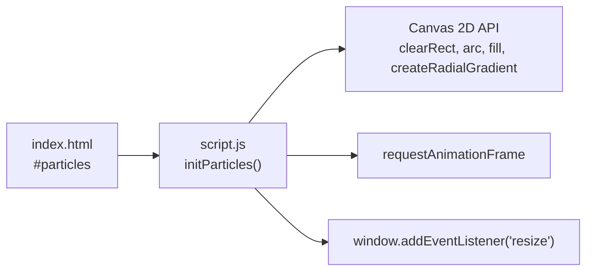

# Background Particle System

<cite>
**Referenced Files in This Document**
- [index.html](file://index.html)
- [script.js](file://script.js)
- [style.css](file://style.css)
</cite>

## Table of Contents
1. [Introduction](#introduction)
2. [Project Structure](#project-structure)
3. [Core Components](#core-components)
4. [Architecture Overview](#architecture-overview)
5. [Detailed Component Analysis](#detailed-component-analysis)
6. [Dependency Analysis](#dependency-analysis)
7. [Performance Considerations](#performance-considerations)
8. [Troubleshooting Guide](#troubleshooting-guide)
9. [Conclusion](#conclusion)
10. [Appendices](#appendices)

## Introduction
This document explains the background particle system implemented with the HTML Canvas API. It covers how particles are created, animated, and rendered to produce a smooth, twinkling, glowing effect. The implementation includes:
- Random positioning and size variation
- Color assignment between two accent colors
- Movement and boundary wrapping
- Twinkling via sine-based opacity modulation
- Glow using radial gradients
- Performance optimizations such as dynamic particle count based on screen area and requestAnimationFrame-driven rendering

## Project Structure
The project is organized into three primary files:
- index.html: Defines the canvas element for particles and other UI elements
- script.js: Implements the particle system and other interactive features
- style.css: Styles the page and positions the particle canvas behind content

**Diagram sources**
- [index.html:12-13](file://index.html#L12-L13)
- [script.js:211-281](file://script.js#L211-L281)
- [style.css:62-71](file://style.css#L62-L71)

**Section sources**
- [index.html:12-13](file://index.html#L12-L13)
- [script.js:211-281](file://script.js#L211-L281)
- [style.css:62-71](file://style.css#L62-L71)

## Core Components
- Particle creation: Generates a number of particles proportional to screen area, capped at a maximum. Each particle has random position, radius, speed, base opacity, color, twinkle speed, and phase.
- Physics update: Moves each particle by its velocity per frame; wraps coordinates when crossing edges so particles re-enter from the opposite side.
- Rendering: Clears the canvas each frame, draws each particle as a filled circle, then draws a larger radial gradient behind it to simulate glow. Opacity is modulated over time using a sine wave to create a twinkling effect.
- Animation loop: Uses requestAnimationFrame to drive smooth 60fps rendering.

Key behaviors:
- Particle count: Computed as floor(screen area / 12000), capped at 120.
- Radius range: Between 0.5 and 2.5 pixels.
- Speed range: Velocity components derived from a centered range that yields speeds roughly within -0.15 to 0.15 pixels per frame.
- Colors: Two accent colors are used (blue and pink).
- Boundary wrapping: Particles wrap around horizontally and vertically.
- Twinkle: Sine-based modulation applied to base opacity.
- Glow: Radial gradient with radius expanded to 3x particle radius and reduced opacity.

**Section sources**
- [script.js:221-275](file://script.js#L221-L275)

## Architecture Overview
The particle system is self-contained within a single initialization function that sets up the canvas, computes dimensions, creates particles, and starts the animation loop. It listens for window resize events to recalculate dimensions and regenerate particles.

**Diagram sources**
- [script.js:211-281](file://script.js#L211-L281)

## Detailed Component Analysis

### Particle Creation and Configuration
- Count calculation: Number of particles equals floor((width * height) / 12000), with an upper bound of 120. This scales density with screen area while preventing overload on large displays.
- Positioning: Each particle gets a random x and y within the current canvas dimensions.
- Size: Radius is randomized between 0.5 and 2.5 pixels.
- Movement: Horizontal and vertical speeds are randomly chosen from a symmetric range around zero, producing gentle drift.
- Appearance:
  - Base opacity is randomized within a small positive range.
  - Color is randomly assigned to one of two accent colors.
  - Twinkle parameters include a per-particle speed and a random phase offset.

Customization tips:
- To change color palette, modify the conditional selection logic to pick from a different set of colors.
- To adjust twinkle intensity or speed, scale the sine multiplier or adjust the per-particle twinkleSpeed values.
- To alter density, change the divisor in the count formula or adjust the cap.

**Section sources**
- [script.js:221-237](file://script.js#L221-L237)

### Physics and Boundary Wrapping
- Movement: Each frame, x increases by speedX and y increases by speedY.
- Wrapping: If a particle’s coordinate goes below 0 or beyond the canvas dimension, it is wrapped to the opposite edge. This ensures continuous motion without particles disappearing off-screen.

Performance note:
- Simple arithmetic per particle keeps per-frame cost low and predictable.

**Section sources**
- [script.js:243-250](file://script.js#L243-L250)

### Rendering and Twinkling
- Clearing: The canvas is cleared every frame before drawing to avoid trails.
- Drawing:
  - A filled circle is drawn at each particle’s position with radius and color.
  - Opacity is computed as baseOpacity multiplied by a sine-based twinkle factor, creating a pulsing shimmer.
- Glow:
  - A radial gradient is created with center at the particle and radius equal to 3 times the particle radius.
  - The gradient transitions from a semi-transparent version of the particle color to transparent, giving a soft halo.

Customization tips:
- To increase glow size, multiply the particle radius by a larger factor when creating the gradient.
- To reduce flicker, adjust the twinkle amplitude or frequency.

**Section sources**
- [script.js:239-275](file://script.js#L239-L275)

### Animation Loop and Resize Handling
- Animation: The draw function uses requestAnimationFrame to schedule the next frame, ensuring smooth, synchronized rendering with the display refresh rate.
- Resize: On window resize, the canvas dimensions are updated and particles are regenerated to match the new area and maintain consistent density.

**Section sources**
- [script.js:274-281](file://script.js#L274-L281)

### Integration with Page Layout
- The particle canvas is placed behind all content using CSS positioning and z-index, so it acts as a non-interactive background layer.

**Section sources**
- [style.css:62-71](file://style.css#L62-L71)
- [index.html:12-13](file://index.html#L12-L13)

## Dependency Analysis
- The particle system depends on:
  - The DOM element with id "particles"
  - The Canvas 2D API methods: getContext('2d'), clearRect, beginPath, arc, fillStyle, fill, createRadialGradient, addColorStop
  - requestAnimationFrame for the render loop
  - Window resize events to recalculate dimensions and regenerate particles

**Diagram sources**
- [index.html:12-13](file://index.html#L12-L13)
- [script.js:211-281](file://script.js#L211-L281)

**Section sources**
- [script.js:211-281](file://script.js#L211-L281)

## Performance Considerations
- Dynamic particle count: Particle count is proportional to screen area divided by a constant, capped at a maximum to prevent overdraw on high-resolution screens.
- Efficient clearing: The entire canvas is cleared each frame to avoid artifacts and simplify state management.
- Minimal per-frame work: Each particle performs simple math and a couple of draw calls; glow uses a single radial gradient per particle.
- Smooth rendering: requestAnimationFrame ensures frames align with the display refresh cycle, reducing jank and power usage.

Optimization recommendations:
- For very large screens, consider lowering the divisor or capping the maximum further to maintain performance.
- If devices struggle, reduce the glow radius multiplier or skip glow on low-end devices by detecting capability or user preference.
- Avoid heavy operations inside the loop; keep calculations minimal and reuse constants where possible.

[No sources needed since this section provides general guidance]

## Troubleshooting Guide
Common issues and resolutions:
- Particles not visible:
  - Ensure the canvas element exists and has a valid width/height after resize.
  - Verify the canvas is not hidden by CSS (e.g., display:none or z-index issues).
- Stuttering or low FPS:
  - Reduce particle density by increasing the divisor in the count formula or lowering the maximum cap.
  - Disable or reduce glow effects on slower devices.
- Particles disappear or behave unexpectedly:
  - Confirm boundary wrapping logic runs every frame and that width/height are correctly updated on resize.
- Excessive memory usage:
  - Ensure particles array is recreated on resize rather than growing indefinitely.

**Section sources**
- [script.js:216-281](file://script.js#L216-L281)

## Conclusion
The background particle system delivers a visually appealing, performant effect by combining simple physics, sine-based twinkling, and radial gradient glows. Its design scales with screen resolution and leverages requestAnimationFrame for smooth rendering. With straightforward customization points for colors, twinkle behavior, and density, it can be adapted to various visual styles and device capabilities.

[No sources needed since this section summarizes without analyzing specific files]

## Appendices

### Customization Examples
- Change particle colors:
  - Modify the color selection logic to choose from a different palette or introduce more colors.
- Adjust twinkle speed:
  - Increase or decrease the per-particle twinkleSpeed or the sine multiplier to make particles pulse faster or slower.
- Modify particle density:
  - Change the divisor used to compute particle count or adjust the maximum cap to suit target devices.
- Tune glow intensity:
  - Increase the gradient radius multiplier or adjust gradient color stops to enhance or reduce the halo effect.

[No sources needed since this section provides general guidance]