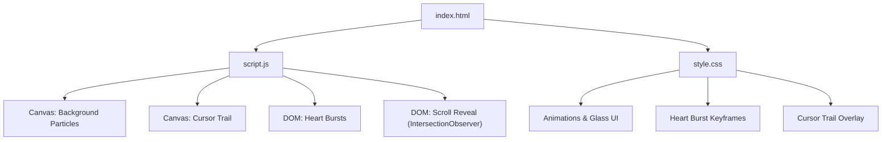
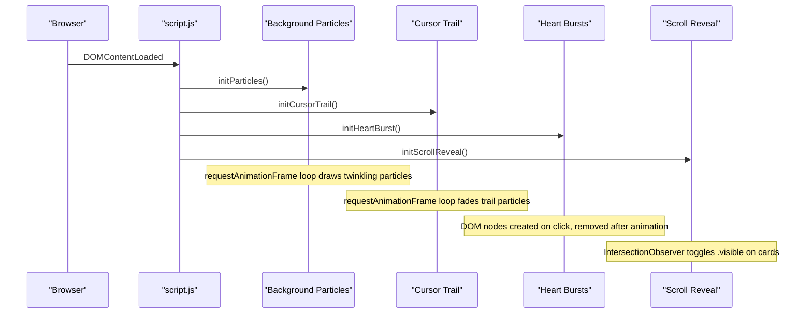
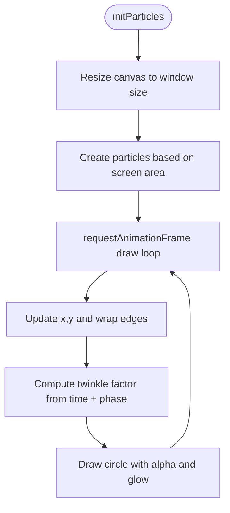
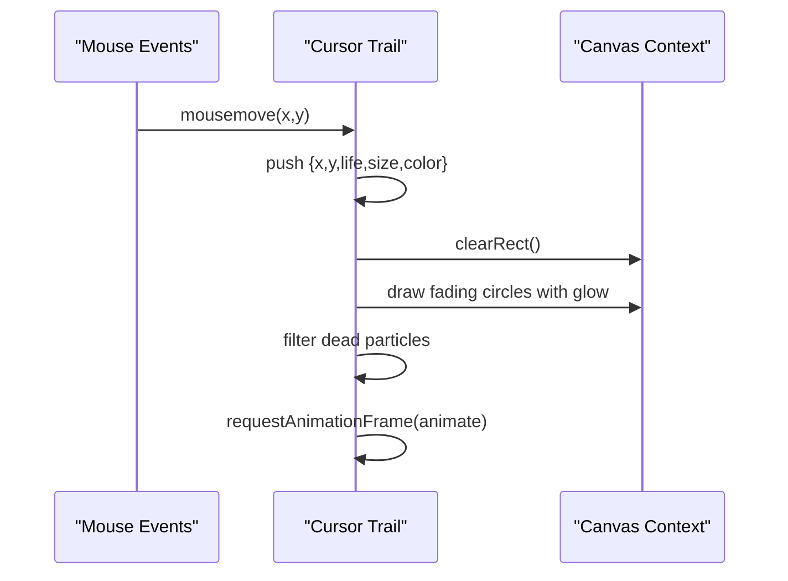
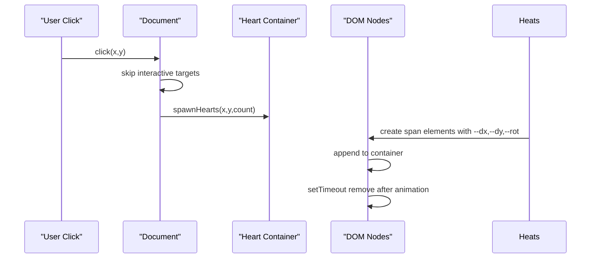
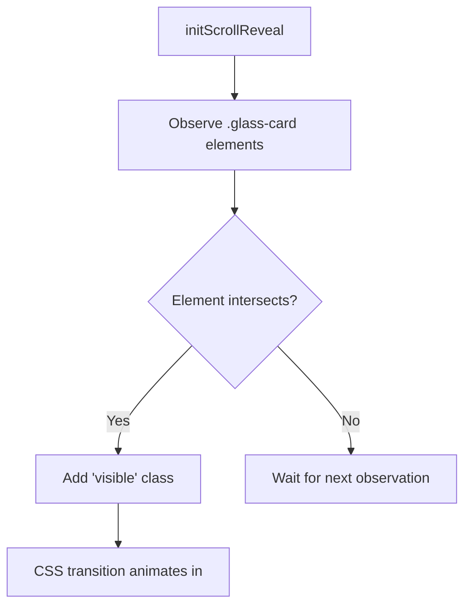
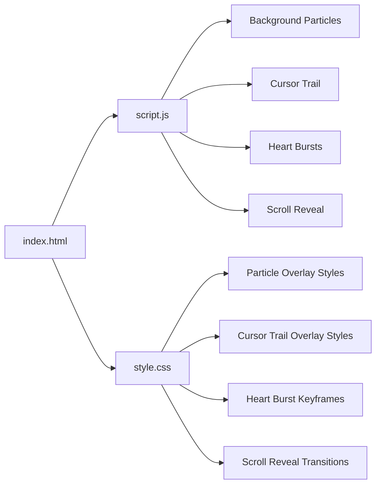

# Visual Effects

<cite>
**Referenced Files in This Document**
- [index.html](file://index.html)
- [script.js](file://script.js)
- [style.css](file://style.css)
- [gallery/README.txt](file://gallery/README.txt)
</cite>

## Table of Contents
1. [Introduction](#introduction)
2. [Project Structure](#project-structure)
3. [Core Components](#core-components)
4. [Architecture Overview](#architecture-overview)
5. [Detailed Component Analysis](#detailed-component-analysis)
6. [Dependency Analysis](#dependency-analysis)
7. [Performance Considerations](#performance-considerations)
8. [Troubleshooting Guide](#troubleshooting-guide)
9. [Conclusion](#conclusion)
10. [Appendices](#appendices)

## Introduction
This document explains all visual effects implemented in the project: background particle system with twinkling, cursor trail with fading particles, click-triggered heart bursts with physics-like motion, and scroll reveal animations using Intersection Observer. It covers how each effect is implemented via the Canvas API and DOM/CSS, how performance is optimized (requestAnimationFrame usage, particle count limits, efficient DOM updates), and how to customize colors, speeds, and add new effects. It also includes troubleshooting tips for smooth performance across devices.

## Project Structure
The visual effects are implemented across three files:
- HTML defines canvases and containers for effects and content sections that will be animated on scroll.
- JavaScript initializes and runs all effects and interactions.
- CSS styles the page, animations, and effect containers.

**Diagram sources**
- [index.html:12-13](file://index.html#L12-L13)
- [index.html:201-205](file://index.html#L201-L205)
- [script.js:211-281](file://script.js#L211-L281)
- [script.js:502-561](file://script.js#L502-L561)
- [script.js:350-382](file://script.js#L350-L382)
- [script.js:284-297](file://script.js#L284-L297)
- [style.css:62-71](file://style.css#L62-L71)
- [style.css:762-768](file://style.css#L762-L768)
- [style.css:910-940](file://style.css#L910-L940)

**Section sources**
- [index.html:12-13](file://index.html#L12-L13)
- [index.html:201-205](file://index.html#L201-L205)
- [script.js:211-281](file://script.js#L211-L281)
- [script.js:502-561](file://script.js#L502-L561)
- [script.js:350-382](file://script.js#L350-L382)
- [script.js:284-297](file://script.js#L284-L297)
- [style.css:62-71](file://style.css#L62-L71)
- [style.css:762-768](file://style.css#L762-L768)
- [style.css:910-940](file://style.css#L910-L940)

## Core Components
- Background Particle System: Canvas-based floating particles with twinkling opacity and glow.
- Cursor Trail: Canvas-based trail following the mouse with fading particles and glow.
- Heart Bursts: DOM-based emoji particles spawned on click or button press with CSS-driven physics-like trajectories.
- Scroll Reveal: IntersectionObserver adds a visible class to cards as they enter the viewport.

Key implementation highlights:
- requestAnimationFrame drives smooth rendering for both canvas systems.
- Particle counts are computed from screen area to maintain performance.
- Efficient DOM updates avoid layout thrashing; elements are removed after animation completion.
- CSS keyframes provide performant motion for heart bursts.

**Section sources**
- [script.js:211-281](file://script.js#L211-L281)
- [script.js:502-561](file://script.js#L502-L561)
- [script.js:350-382](file://script.js#L350-L382)
- [script.js:284-297](file://script.js#L284-L297)
- [style.css:910-940](file://style.css#L910-L940)

## Architecture Overview
The application initializes multiple independent effect modules during DOMContentLoaded. Each module manages its own lifecycle:
- Canvas modules set up their own contexts, handle resize events, and run continuous render loops via requestAnimationFrame.
- DOM-based effects attach event listeners and manage element creation/removal.
- Scroll reveal uses IntersectionObserver to toggle visibility classes.

**Diagram sources**
- [script.js:661-693](file://script.js#L661-L693)
- [script.js:211-281](file://script.js#L211-L281)
- [script.js:502-561](file://script.js#L502-L561)
- [script.js:350-382](file://script.js#L350-L382)
- [script.js:284-297](file://script.js#L284-L297)

## Detailed Component Analysis

### Background Particle System (Twinkling Particles)
- Purpose: Create an ambient, twinkling starfield behind content.
- Implementation:
  - Canvas setup and resize handling ensure full-screen coverage.
  - Particle count is derived from screen area to keep performance consistent across devices.
  - Each particle has position, velocity, radius, base opacity, color, twinkle speed, and phase.
  - Rendering loop clears the canvas, updates positions, wraps edges, computes twinkle-modulated alpha, draws circles, and adds radial gradient glow.
  - Uses requestAnimationFrame for smooth animation.

**Diagram sources**
- [script.js:211-281](file://script.js#L211-L281)

Customization points:
- Colors: Modify the two-tone palette used when assigning particle colors.
- Speeds: Adjust velocity ranges and twinkle frequency.
- Count limit: Tune the divisor and maximum cap to balance density vs. performance.

Performance notes:
- Particle count scales with width × height and is capped to prevent overload.
- Glow uses radial gradients per particle; consider reducing if needed on low-end devices.

**Section sources**
- [script.js:211-281](file://script.js#L211-L281)

### Cursor Trail (Fading Particles)
- Purpose: Provide a subtle sparkle trail following the mouse.
- Implementation:
  - Separate canvas overlay positioned fixed over the page.
  - Tracks mouse movement and appends trail particles with random sizes and colors.
  - Each frame, particles lose life, shrink, and fade out; old particles are pruned.
  - Uses requestAnimationFrame for smooth rendering.

**Diagram sources**
- [script.js:502-561](file://script.js#L502-L561)
- [index.html:204-205](file://index.html#L204-L205)
- [style.css:762-768](file://style.css#L762-L768)

Customization points:
- Colors: Change the two-tone palette used for trail particles.
- Fade rate: Adjust life decrement to make trails last longer or shorter.
- Max trail length: Cap array size to control memory usage.

Performance notes:
- Trailing particles are limited to a fixed max length to avoid unbounded growth.
- Drawing simple circles with alpha is GPU-friendly; avoid heavy filters.

**Section sources**
- [script.js:502-561](file://script.js#L502-L561)
- [style.css:762-768](file://style.css#L762-L768)

### Heart Bursts (Click-triggered Explosions)
- Purpose: Celebrate clicks with a burst of emojis that float upward and fade.
- Implementation:
  - On click (excluding interactive elements), spawn a small number of emoji spans into a fixed container.
  - Each heart receives randomized displacement and rotation via CSS custom properties.
  - CSS keyframes animate translation, scale, rotation, and opacity to simulate physics-like motion.
  - Elements are removed after animation duration to free memory.

**Diagram sources**
- [script.js:350-382](file://script.js#L350-L382)
- [index.html:201-202](file://index.html#L201-L202)
- [style.css:910-940](file://style.css#L910-L940)

Customization points:
- Emoji set: Extend or replace the emoji list for different themes.
- Count: Adjust number of hearts per click or per action.
- Motion: Tweak CSS keyframes to change trajectory, duration, or easing.

Performance notes:
- Short-lived DOM nodes are auto-removed; ensure counts stay modest.
- Use CSS transforms and opacity for GPU-accelerated animations.

**Section sources**
- [script.js:350-382](file://script.js#L350-L382)
- [style.css:910-940](file://style.css#L910-L940)

### Scroll Reveal Animations (IntersectionObserver)
- Purpose: Animate sections into view as the user scrolls.
- Implementation:
  - Observe all card elements with IntersectionObserver.
  - When a card enters the viewport, add a visible class that triggers CSS transitions (opacity and transform).
  - Threshold tuned to trigger early enough for smooth reveals.

**Diagram sources**
- [script.js:284-297](file://script.js#L284-L297)
- [style.css:421-431](file://style.css#L421-L431)

Customization points:
- Threshold: Increase to trigger earlier or later.
- Animation: Modify CSS transitions for different timing or effects.

Performance notes:
- IntersectionObserver is efficient and does not require scroll event polling.
- Keep observed elements minimal; here it targets only cards.

**Section sources**
- [script.js:284-297](file://script.js#L284-L297)
- [style.css:421-431](file://style.css#L421-L431)

## Dependency Analysis
- index.html provides the structural anchors:
  - Two canvases: #particles and #cursorTrail.
  - A container for heart bursts: #heartContainer.
  - Sections with .glass-card for scroll reveal.
- script.js wires everything together:
  - Initializes all effects and sets up intervals for live updates.
  - Coordinates event listeners for clicks and compliments.
- style.css defines:
  - Fixed overlays for canvases.
  - Keyframe animations for heart bursts.
  - Transition styles for scroll reveal.

**Diagram sources**
- [index.html:12-13](file://index.html#L12-L13)
- [index.html:201-205](file://index.html#L201-L205)
- [script.js:661-693](file://script.js#L661-L693)
- [style.css:62-71](file://style.css#L62-L71)
- [style.css:762-768](file://style.css#L762-L768)
- [style.css:910-940](file://style.css#L910-L940)
- [style.css:421-431](file://style.css#L421-L431)

**Section sources**
- [index.html:12-13](file://index.html#L12-L13)
- [index.html:201-205](file://index.html#L201-L205)
- [script.js:661-693](file://script.js#L661-L693)
- [style.css:62-71](file://style.css#L62-L71)
- [style.css:762-768](file://style.css#L762-L768)
- [style.css:910-940](file://style.css#L910-L940)
- [style.css:421-431](file://style.css#L421-L431)

## Performance Considerations
- requestAnimationFrame:
  - Used by both canvas systems to synchronize with the display refresh rate and avoid jank.
- Particle count limits:
  - Background particles compute count from screen area and cap at a maximum to prevent overdraw on large screens.
- Efficient DOM manipulation:
  - Heart burst elements are appended once and removed after animation; no repeated reflows.
  - Scroll reveal toggles a single class rather than inline styles.
- Canvas optimization:
  - Clearing the entire canvas each frame ensures clean redraws.
  - Radial gradients are used sparingly; reduce glow intensity or particle count if needed on low-end devices.
- Event handling:
  - Mouse move events update state without heavy work; drawing happens in the RAF loop.
  - Click handlers skip interactive elements to avoid unnecessary spawns.

[No sources needed since this section provides general guidance]

## Troubleshooting Guide
Common issues and resolutions:
- Stuttering or high CPU usage:
  - Reduce particle count divisor or maximum cap in the background particle system.
  - Limit trail length or increase fade rate to reduce active particles.
  - Disable or reduce glow effects if frames drop.
- Heart bursts not appearing:
  - Ensure the heart container exists and is not blocked by z-index or pointer-events.
  - Verify click handler excludes interactive elements unintentionally.
- Scroll reveal not triggering:
  - Confirm elements have the correct class and that IntersectionObserver thresholds are appropriate.
  - Check that CSS transitions are defined for the visible state.
- Mobile performance:
  - Lower particle counts and disable complex glows on smaller screens.
  - Prefer CSS transforms and opacity for animations to leverage GPU acceleration.

**Section sources**
- [script.js:211-281](file://script.js#L211-L281)
- [script.js:502-561](file://script.js#L502-L561)
- [script.js:350-382](file://script.js#L350-L382)
- [script.js:284-297](file://script.js#L284-L297)
- [style.css:910-940](file://style.css#L910-L940)
- [style.css:421-431](file://style.css#L421-L431)

## Conclusion
The project implements a cohesive set of visual effects that enhance user experience while maintaining performance through careful use of requestAnimationFrame, adaptive particle counts, and efficient DOM/CSS techniques. The background particles provide ambiance, the cursor trail adds interactivity, heart bursts deliver delightful feedback, and scroll reveal guides attention as users explore the page. Customization is straightforward via configuration constants and CSS variables, and troubleshooting steps help ensure smooth operation across devices.

[No sources needed since this section summarizes without analyzing specific files]

## Appendices

### Customization Examples
- Customize particle colors:
  - Modify the two-tone palette used when assigning colors to background particles and cursor trail particles.
- Adjust animation speeds:
  - For background particles, adjust velocity ranges and twinkle frequency.
  - For cursor trail, tweak life decrement to change fade speed.
  - For heart bursts, modify CSS keyframe durations and easing.
- Create new effect types:
  - Add a new canvas layer similar to existing ones, or introduce DOM-based animations with CSS keyframes.
  - Use IntersectionObserver to trigger additional reveal effects on other elements.

[No sources needed since this section provides general guidance]

### Gallery Integration Notes
- To add real photos, place images in the gallery folder and reference them in the script’s gallery data.
- Placeholder visuals are provided when no image source is set.

**Section sources**
- [gallery/README.txt:1-13](file://gallery/README.txt#L1-L13)
- [script.js:564-579](file://script.js#L564-L579)