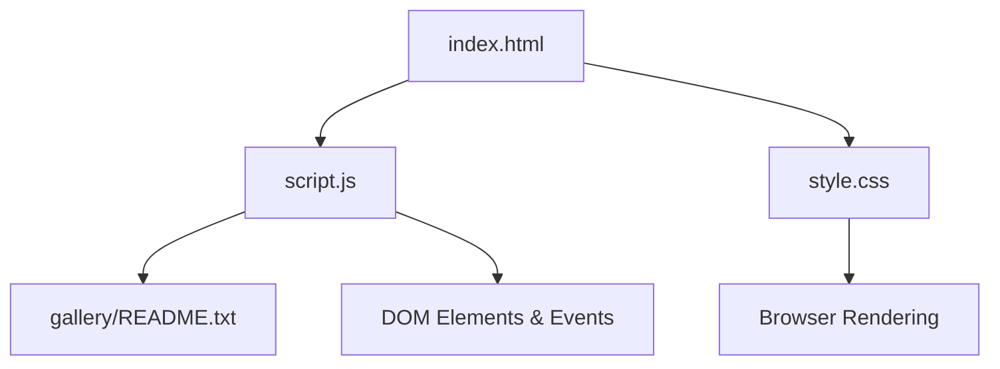
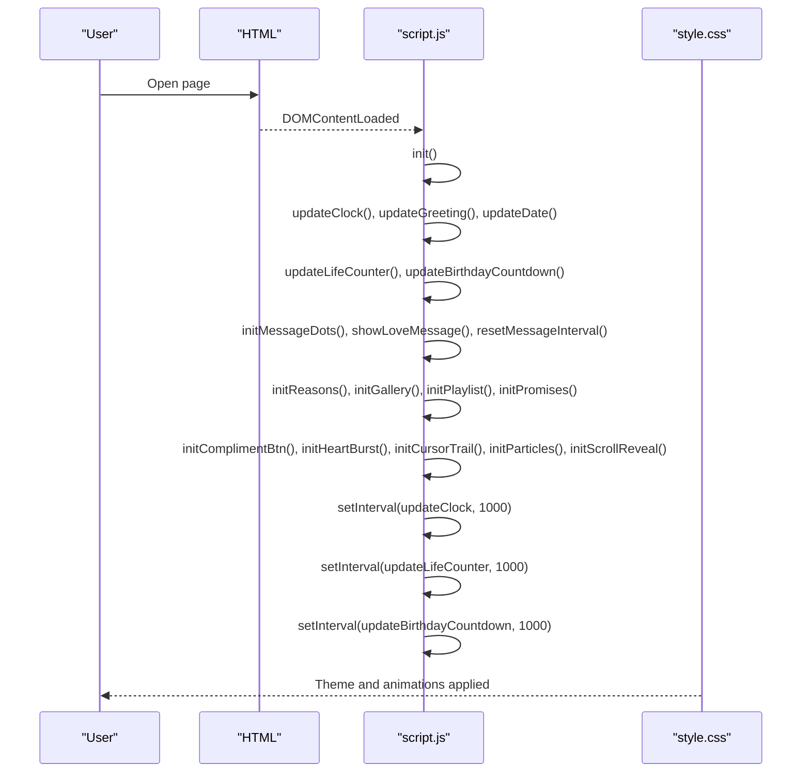
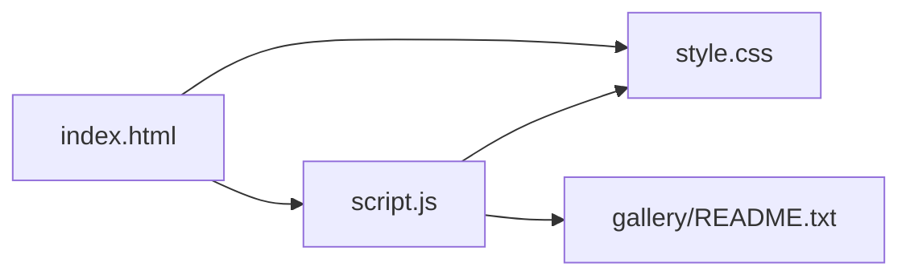

# Customization Guide

<cite>
**Referenced Files in This Document**
- [index.html](file://index.html)
- [script.js](file://script.js)
- [style.css](file://style.css)
- [gallery/README.txt](file://gallery/README.txt)
</cite>

## Table of Contents
1. Introduction
2. Project Structure
3. Core Components
4. Architecture Overview
5. Detailed Component Analysis
6. Dependency Analysis
7. Performance Considerations
8. Troubleshooting Guide
9. Conclusion
10. Appendices

## Introduction
This guide explains how to personalize Bellisima beyond the basic setup. You will learn how to edit the central configuration object for personal details and milestones, add love messages, customize the reasons grid, update the playlist, manage promises/bucket list items, replace gallery placeholders with real photos, and extend functionality with CSS and JavaScript. It also covers responsive design considerations and mobile optimization tips.

## Project Structure
Bellisima is a single-page experience composed of:
- index.html: page layout and static content sections (hero, counters, gallery, playlist, promises, letter).
- script.js: application logic, data arrays, and dynamic behaviors (counters, messages, gallery lightbox, promises persistence, animations).
- style.css: visual theme, layout, animations, and responsive rules.
- gallery/README.txt: instructions for adding images and naming conventions.

**Diagram sources**
- [index.html:1-210](file://index.html#L1-L210)
- [script.js:1-694](file://script.js#L1-L694)
- [style.css:1-1113](file://style.css#L1-L1113)
- [gallery/README.txt:1-13](file://gallery/README.txt#L1-L13)

**Section sources**
- [index.html:1-210](file://index.html#L1-L210)
- [script.js:1-694](file://script.js#L1-L694)
- [style.css:1-1113](file://style.css#L1-L1113)
- [gallery/README.txt:1-13](file://gallery/README.txt#L1-L13)

## Core Components
- Central configuration object for personal details and milestones.
- Rotating love messages.
- Reasons grid with icons and text.
- Photo gallery with placeholder support and lightbox navigation.
- Playlist section with song entries and reasons.
- Promises/bucket list with persistent checkmarks and progress.
- Real-time greeting, clock, date, life counter, and birthday countdown.
- Visual effects: particles, cursor trail, heart bursts, scroll reveal.

Key customization entry points are defined in script.js and styled in style.css. HTML provides the structure and labels that can be edited directly.

**Section sources**
- [script.js:1-694](file://script.js#L1-L694)
- [style.css:1-1113](file://style.css#L1-L1113)
- [index.html:1-210](file://index.html#L1-L210)

## Architecture Overview
The app initializes on DOMContentLoaded and runs several initialization routines:
- Update time-based greetings, live clock, and date.
- Render reasons, playlist, promises, and gallery.
- Start intervals for counters and birthday countdown.
- Attach event listeners for interactions (lightbox, compliments, promises).
- Launch canvas-based effects (particles, cursor trail).

**Diagram sources**
- [script.js:660-694](file://script.js#L660-L694)
- [style.css:1-1113](file://style.css#L1-L1113)

## Detailed Component Analysis

### Central Configuration Object (Personal Details and Milestones)
- Edit name, nickname, birthday date, and birthday month/day to personalize greetings, counters, and countdowns.
- The birthday countdown uses these values to compute days/hours/minutes/seconds until the next birthday and shows special messages on the actual day.
- Greetings and subtitles adapt based on current hour.

How to customize:
- Change name/nickname in the configuration object to update all references across the page.
- Adjust birthday date and month/day to reflect the correct milestone.
- If you want different time-based greetings or subtitles, modify the functions that return them.

Where to look:
- Configuration object and birthday fields.
- Functions for time-based greetings and subtitles.
- Life counter and birthday countdown updates.

**Section sources**
- [script.js:1-8](file://script.js#L1-L8)
- [script.js:39-52](file://script.js#L39-L52)
- [script.js:86-151](file://script.js#L86-L151)

### Love Messages
- Add, remove, or reorder messages in the rotating array.
- Each message appears with fade transitions and dot indicators; clicking a dot jumps to that message and resets rotation.

How to customize:
- Extend or edit the messages array to include your own phrases.
- Optionally adjust rotation interval timing if desired.

Where to look:
- Messages array definition.
- Message display and dot initialization.
- Interval management for rotation.

**Section sources**
- [script.js:10-27](file://script.js#L10-L27)
- [script.js:153-193](file://script.js#L153-L193)

### Reasons Grid
- Each reason has an icon and text. Items are rendered into a responsive grid.
- Hover effects and subtle animations are handled via CSS.

How to customize:
- Add new items by appending objects with icon and text properties.
- Remove or reorder existing items to match your story.
- Style individual cards through CSS classes if needed.

Where to look:
- Reasons array.
- Function that renders the grid.
- CSS for grid layout and card hover states.

**Section sources**
- [script.js:29-37](file://script.js#L29-L37)
- [script.js:195-208](file://script.js#L195-L208)
- [style.css:313-350](file://style.css#L313-L350)

### Photo Gallery and Lightbox
- The gallery supports placeholders and real images. When a src is provided, the placeholder is replaced with an image element.
- Lightbox supports keyboard navigation (Escape, arrows), click-to-close, and prev/next controls.

How to customize:
- Place images in the gallery folder and reference them in the gallery data array.
- Update captions and labels for each item.
- Follow naming suggestions in the gallery README for consistency.

Where to look:
- Gallery data array and placeholder handling.
- Lightbox open/close/navigation functions.
- Gallery README with file naming guidance.

**Section sources**
- [index.html:75-145](file://index.html#L75-L145)
- [script.js:563-658](file://script.js#L563-L658)
- [gallery/README.txt:1-13](file://gallery/README.txt#L1-L13)
- [style.css:469-760](file://style.css#L469-L760)

### Playlist
- Songs are listed with title, artist, and a short reason why they matter.
- The list is generated from an array; you can add or remove songs easily.

How to customize:
- Edit the playlist array to include meaningful songs and reasons.
- Adjust styling via CSS if you want different spacing or emphasis.

Where to look:
- Playlist array and rendering function.
- CSS for playlist items and hover effects.

**Section sources**
- [script.js:384-415](file://script.js#L384-L415)
- [style.css:942-1016](file://style.css#L942-L1016)

### Promises / Bucket List
- Promises are interactive checklists with local storage persistence. Checked items persist across sessions.
- Progress bar reflects completion percentage.

How to customize:
- Add or remove promise items in the array.
- Customize icons and text to reflect shared goals.
- Modify styles for checked state and progress bar if desired.

Where to look:
- Promises array and rendering logic.
- Local storage save/load functions.
- Progress update and styling.

**Section sources**
- [script.js:417-499](file://script.js#L417-L499)
- [style.css:1018-1113](file://style.css#L1018-L1113)

### Real-Time Features (Clock, Date, Greetings, Counters)
- Live clock updates every second and displays in footer too.
- Greeting and subtitle change based on current hour.
- Life counter computes years/months/days/hours/minutes/seconds since birthday.
- Birthday countdown counts down to the next birthday and shows celebratory emojis on the actual day.

How to customize:
- Adjust time ranges for greetings/subtitles if you prefer different periods.
- Tweak formatting or units in counters if needed.

Where to look:
- Clock and date update functions.
- Greeting and subtitle functions.
- Life counter and birthday countdown logic.

**Section sources**
- [script.js:54-84](file://script.js#L54-L84)
- [script.js:86-151](file://script.js#L86-L151)

### Visual Effects and Animations
- Particle system creates floating, twinkling background elements.
- Cursor trail adds sparkles following mouse movement.
- Heart burst spawns animated hearts on clicks and compliments.
- Scroll reveal animates cards as they enter the viewport.

How to customize:
- Adjust particle colors, count, speed, and glow in the particle initializer.
- Modify cursor trail colors, size, and decay rate.
- Change heart emoji set and animation durations.
- Tune scroll reveal thresholds and transition timings.

Where to look:
- Particle initialization and draw loop.
- Cursor trail animation loop.
- Heart burst spawning and CSS keyframes.
- Scroll reveal observer setup.

**Section sources**
- [script.js:210-281](file://script.js#L210-L281)
- [script.js:501-561](file://script.js#L501-L561)
- [script.js:350-382](file://script.js#L350-L382)
- [style.css:395-431](file://style.css#L395-L431)
- [style.css:910-940](file://style.css#L910-L940)

### Advanced Styling and Layout (CSS)
- Theme variables define colors, fonts, glass effects, and accents.
- Responsive breakpoints adjust grids, padding, and font sizes for mobile.
- Glass cards, gradients, and backdrop filters create the modern aesthetic.

How to customize:
- Change color palette by editing CSS variables at the top of the stylesheet.
- Swap fonts by updating variable assignments and ensuring Google Fonts links remain valid.
- Adjust glass effect intensity via opacity and blur values.
- Modify responsive behavior by editing media queries.

Where to look:
- Root variables and base styles.
- Card and hero styles.
- Media queries for mobile adjustments.

**Section sources**
- [style.css:1-24](file://style.css#L1-L24)
- [style.css:73-153](file://style.css#L73-L153)
- [style.css:164-209](file://style.css#L164-L209)
- [style.css:433-452](file://style.css#L433-L452)

### Extending Functionality with JavaScript
You can add new features without breaking existing ones:
- New interactive widgets: attach event listeners to buttons or sections and render results dynamically.
- Additional counters or timers: follow the pattern used for clock and birthday countdown.
- Data-driven lists: mirror the reasons/playlist/promises approach with arrays and render loops.
- Persist user preferences: use localStorage similarly to promises tracking.

Guidelines:
- Keep global configuration centralized (like the main config object).
- Avoid inline scripts; encapsulate logic in functions and call them during init.
- Debounce or throttle heavy operations (e.g., resize handlers) to maintain performance.

[No sources needed since this section provides general guidance]

### Responsive Design and Mobile Optimization Tips
- Use relative units (rem, em, clamp) for scalable typography and spacing.
- Ensure touch targets are large enough for mobile interaction.
- Optimize images: lazy loading for gallery images reduces initial load time.
- Reduce heavy animations on low-power devices by checking device capabilities or using prefers-reduced-motion.
- Test layouts at common breakpoints (320px, 375px, 768px, 1024px).

Where to look:
- Existing media queries and responsive grid adjustments.
- Image loading attributes in gallery initialization.

**Section sources**
- [style.css:433-452](file://style.css#L433-L452)
- [style.css:601-606](file://style.css#L601-L606)
- [script.js:583-602](file://script.js#L583-L602)

## Dependency Analysis
- index.html depends on script.js for dynamic content and events, and on style.css for appearance.
- script.js reads and writes to DOM elements defined in index.html and manipulates styles via CSS classes.
- style.css defines variables and animations consumed by both HTML and JS.
- gallery/README.txt guides image placement referenced by script.js gallery logic.

**Diagram sources**
- [index.html:1-210](file://index.html#L1-L210)
- [script.js:1-694](file://script.js#L1-L694)
- [style.css:1-1113](file://style.css#L1-L1113)
- [gallery/README.txt:1-13](file://gallery/README.txt#L1-L13)

**Section sources**
- [index.html:1-210](file://index.html#L1-L210)
- [script.js:1-694](file://script.js#L1-L694)
- [style.css:1-1113](file://style.css#L1-L1113)
- [gallery/README.txt:1-13](file://gallery/README.txt#L1-L13)

## Performance Considerations
- Limit particle count based on screen size to reduce CPU usage on mobile.
- Use requestAnimationFrame for smooth animations and avoid layout thrashing.
- Lazy-load images in the gallery to improve initial load performance.
- Debounce window resize handlers to prevent excessive recalculations.
- Prefer CSS transforms and opacity for animations to leverage GPU acceleration.

[No sources needed since this section provides general guidance]

## Troubleshooting Guide
- Gallery placeholders not replaced: ensure the src field in the gallery data array points to a valid path and that images exist in the gallery folder.
- Lightbox not closing: verify event listeners for close button and backdrop click are attached.
- Promises not persisting: confirm localStorage is available and not blocked by browser settings.
- Countdown showing incorrect dates: double-check birthday month/day and timezone handling.
- Animations stuttering: reduce particle count or disable cursor trail on low-performance devices.

Where to look:
- Gallery initialization and lightbox control functions.
- Promises save/load logic.
- Birthday countdown calculations.
- Particle and cursor trail loops.

**Section sources**
- [script.js:583-658](file://script.js#L583-L658)
- [script.js:435-443](file://script.js#L435-L443)
- [script.js:112-151](file://script.js#L112-L151)
- [script.js:210-281](file://script.js#L210-L281)
- [script.js:501-561](file://script.js#L501-L561)

## Conclusion
Bellisima is highly customizable through a small set of well-structured configuration arrays and CSS variables. By editing the central configuration, love messages, reasons, playlist, and promises, you can tailor the experience to your relationship milestones and preferences. The gallery supports seamless replacement of placeholders with real images, while CSS allows deep visual customization. With careful attention to performance and responsiveness, Bellisima can be adapted to various devices and audiences while maintaining its emotional impact.

[No sources needed since this section summarizes without analyzing specific files]

## Appendices

### Quick Customization Checklist
- Personal details: update name, nickname, birthday in the configuration object.
- Love messages: add or edit messages in the messages array.
- Reasons: add new items with icons and text.
- Playlist: insert meaningful songs and reasons.
- Promises: curate your bucket list and track progress.
- Gallery: place images in the gallery folder and update src paths and captions.
- Styling: tweak colors, fonts, and glass effects via CSS variables.
- Responsiveness: test on multiple screen sizes and adjust media queries if needed.

[No sources needed since this section provides general guidance]