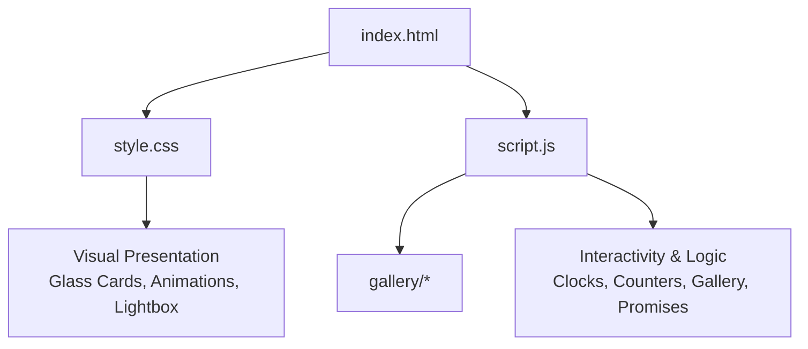
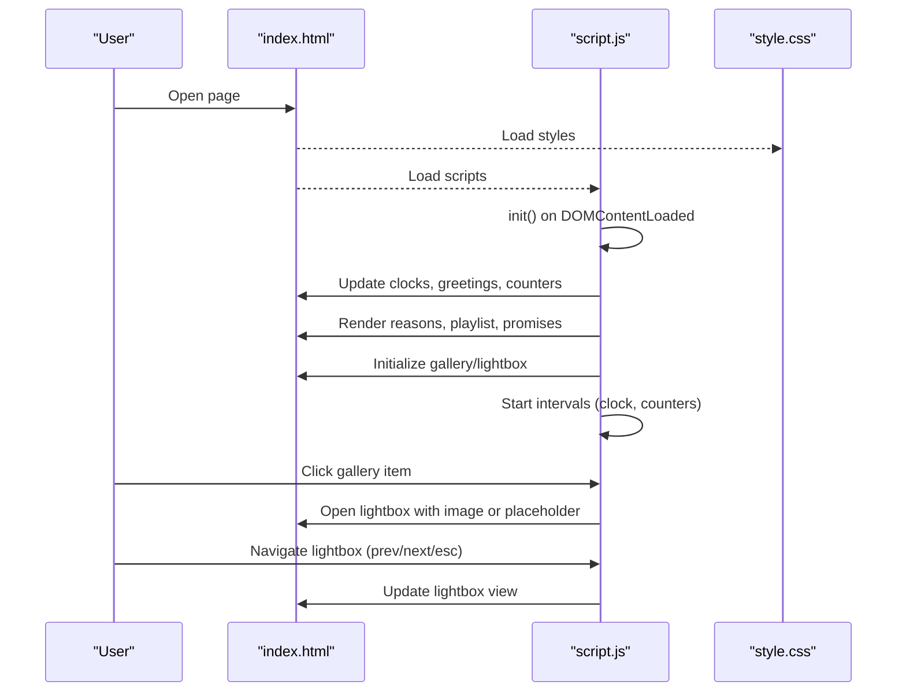
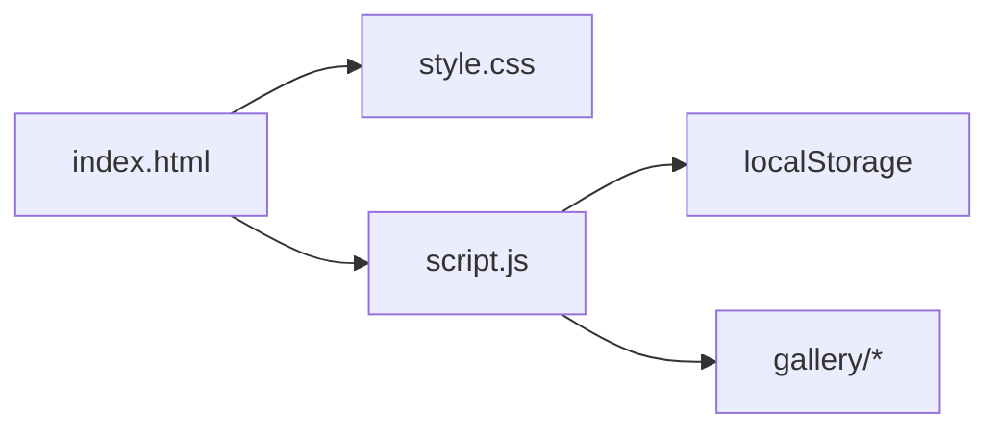

# File Structure

<cite>
**Referenced Files in This Document**
- [index.html](file://index.html)
- [style.css](file://style.css)
- [script.js](file://script.js)
- [README.txt](file://gallery/README.txt)
</cite>

## Table of Contents
1. [Introduction](#introduction)
2. [Project Structure](#project-structure)
3. [Core Components](#core-components)
4. [Architecture Overview](#architecture-overview)
5. [Detailed Component Analysis](#detailed-component-analysis)
6. [Dependency Analysis](#dependency-analysis)
7. [Performance Considerations](#performance-considerations)
8. [Troubleshooting Guide](#troubleshooting-guide)
9. [Conclusion](#conclusion)

## Introduction
Bellisima is a single-page, romantic tribute site built with a clean separation of concerns: HTML for structure, CSS for visual presentation (including glass morphism and animations), and JavaScript for interactivity and business logic. The project uses a minimal file layout to keep it easy to understand and customize.

## Project Structure
The repository follows a simple, flat structure optimized for clarity:
- index.html: Semantic markup that defines all UI sections (hero, counters, gallery, lightbox, playlist, promises, etc.)
- style.css: All styling, including glass cards, responsive layouts, animations, and the lightbox
- script.js: All behavior, including real-time updates, galleries, playlists, promises, particles, and cursor effects
- gallery/: Directory for photos; README.txt explains how to add images and wire them into the app

**Diagram sources**
- [index.html:1-208](file://index.html#L1-L208)
- [style.css:1-1113](file://style.css#L1-L1113)
- [script.js:1-694](file://script.js#L1-L694)

**Section sources**
- [index.html:1-208](file://index.html#L1-L208)
- [style.css:1-1113](file://style.css#L1-L1113)
- [script.js:1-694](file://script.js#L1-L694)
- [README.txt:1-13](file://gallery/README.txt#L1-L13)

## Core Components
- index.html
  - Defines semantic sections: hero, love counter, birthday countdown, rotating messages, reasons grid, photo gallery, lightbox overlay, love letter, playlist, promises/bucket list, footer, floating compliment button, heart burst container, and cursor trail canvas
  - Links to external fonts and local style.css; includes script.js at the end of body
- style.css
  - Provides a cohesive dark theme with glass morphism cards, gradients, and subtle glows
  - Implements responsive grids, hover effects, scroll reveal, lightbox, playlist, and promise styles
  - Uses CSS variables for consistent theming and smooth transitions/animations
- script.js
  - Centralized configuration object for personalization (name, nickname, birthday)
  - Real-time features: live clock/date, greeting updates, life counter since birthday, birthday countdown
  - Content modules: rotating love messages, reasons grid, playlist, promises with localStorage persistence
  - Visual effects: particle system, cursor sparkle trail, heart bursts on click, scroll reveal
  - Gallery and lightbox: renders placeholders or real images, supports keyboard navigation and backdrop close
- gallery/README.txt
  - Instructions for adding photos by naming files and updating script.js galleryData entries

How they work together:
- index.html provides the DOM skeleton and IDs/classes that script.js manipulates and style.css targets
- script.js initializes all interactive features on DOMContentLoaded and sets up intervals for live updates
- style.css ensures the UI looks polished across devices and enhances interactions with animations and glass effects

**Section sources**
- [index.html:1-208](file://index.html#L1-L208)
- [style.css:1-1113](file://style.css#L1-L1113)
- [script.js:1-694](file://script.js#L1-L694)
- [README.txt:1-13](file://gallery/README.txt#L1-L13)

## Architecture Overview
This is a classic single-page application architecture:
- Presentation layer (HTML): static structure and content placeholders
- Styling layer (CSS): themes, layout, animations, responsive rules
- Behavior layer (JS): data-driven rendering, event handling, timers, and state management via localStorage

**Diagram sources**
- [index.html:1-208](file://index.html#L1-L208)
- [script.js:660-694](file://script.js#L660-L694)
- [script.js:563-658](file://script.js#L563-L658)
- [style.css:608-760](file://style.css#L608-L760)

## Detailed Component Analysis

### HTML Structure (index.html)
- Semantic sections are clearly separated using <section> tags with descriptive classes
- Each interactive area has unique IDs for JS targeting (e.g., liveClock, galleryGrid, lightbox)
- Placeholder elements exist for dynamic content (reasons grid, playlist list, promises list)
- Lightbox overlay is pre-built in markup and toggled via JS classes

Where to find specific features:
- Hero, greeting, live clock: lines around the hero section
- Love counter and birthday countdown: dedicated card sections
- Rotating messages: message container and dots
- Reasons grid: reasonsGrid container
- Photo gallery: galleryGrid with items and captions
- Lightbox: overlay with controls and content area
- Playlist: playlistList container
- Promises: promisesList container and progress bar
- Footer time: footerTime element

Modification guidance:
- Change text content directly in HTML where appropriate (e.g., letter section)
- For dynamic lists (reasons, playlist, promises), prefer editing script.js arrays to keep content centralized

**Section sources**
- [index.html:1-208](file://index.html#L1-L208)

### Styling (style.css)
- Uses CSS variables for colors, fonts, and glass effects to maintain consistency
- Glass morphism achieved via semi-transparent backgrounds, borders, and backdrop-filter blur
- Responsive design with media queries for mobile adjustments
- Animations include fade-in-up, pulse, spin, twinkle, and custom keyframes
- Lightbox styles handle visibility, transitions, and responsive navigation buttons

Where to find specific features:
- Base reset and variables: top of file
- Glass cards: .glass-card and related hover states
- Counter blocks: .alive-counter, .birthday-countdown, .counter-block
- Messages and reasons: .messages-section, .reasons-grid, .reason-card
- Gallery and lightbox: .gallery-section, .lightbox, .lightbox-content
- Playlist and promises: .playlist-list, .promises-list, .progress-bar

Modification guidance:
- Adjust color palette via CSS variables at the top
- Tweak animation timings in @keyframes
- Modify responsive breakpoints in media queries
- Customize glass effect intensity by adjusting opacity and blur values

**Section sources**
- [style.css:1-1113](file://style.css#L1-L1113)

### Interactivity and Business Logic (script.js)
- Configuration: GRACE object centralizes name, nickname, and birthday settings
- Time-based features: updateClock, updateGreeting, updateDate run on intervals
- Counters: updateLifeCounter computes years/months/days/hours/minutes/seconds since birthday; updateBirthdayCountdown calculates days until next birthday and shows celebratory messages on the day
- Content modules:
  - Rotating messages: showLoveMessage with dot indicators and auto-rotation
  - Reasons grid: dynamically render reason cards from an array
  - Playlist: render song list with titles, artists, and reasons
  - Promises: toggle checked state, persist via localStorage, update progress bar
- Visual effects:
  - Particles: canvas-based animated background with twinkling and glow
  - Cursor trail: canvas-based sparkle trail following mouse movement
  - Heart bursts: spawn emoji hearts on clicks and compliments
  - Scroll reveal: IntersectionObserver adds visible class to cards
- Gallery and lightbox:
  - galleryData holds entries with optional src, icon, label, caption
  - initGallery swaps placeholders for real images when src is set
  - openLightbox/closeLightbox/navigateLightbox manage viewing mode and keyboard support

Where to find specific features:
- Personalization: GRACE config near the top
- Clock/greeting/date: functions around the clock section
- Life counter and birthday countdown: dedicated functions
- Rotating messages: message initialization and interval
- Reasons grid: initReasons
- Playlist: initPlaylist
- Promises: initPromises, load/save helpers, progress updater
- Effects: initParticles, initCursorTrail, initHeartBurst, initScrollReveal
- Gallery/lightbox: galleryData and related functions

Modification guidance:
- Edit GRACE to personalize dates and names
- Add/remove reasons, playlist songs, or promises by editing their arrays
- To add photos, follow README instructions and update galleryData entries
- Adjust timing of intervals (e.g., message rotation, clock updates) within init

**Section sources**
- [script.js:1-694](file://script.js#L1-L694)

### Gallery Directory and Adding Photos (gallery/README.txt)
- Place images in the gallery folder with suggested names corresponding to each slot
- Update script.js galleryData to point to your image paths (e.g., 'gallery/photo1.jpg')
- When src is empty, a styled placeholder appears instead

Where to find guidance:
- README.txt contains explicit steps and naming suggestions
- script.js galleryData comments explain how to wire images

Modification guidance:
- Keep filenames consistent with galleryData order
- Ensure images are accessible relative to the site root
- Optionally adjust captions and icons per entry

**Section sources**
- [README.txt:1-13](file://gallery/README.txt#L1-L13)
- [script.js:563-579](file://script.js#L563-L579)

## Dependency Analysis
- index.html depends on style.css for visuals and script.js for behavior
- script.js depends on DOM elements defined in index.html and reads/writes to localStorage for promises
- style.css does not depend on other files but targets classes/IDs present in index.html
- No circular dependencies; clear one-way relationships

**Diagram sources**
- [index.html:1-208](file://index.html#L1-L208)
- [script.js:435-443](file://script.js#L435-L443)
- [script.js:563-579](file://script.js#L563-L579)

**Section sources**
- [index.html:1-208](file://index.html#L1-L208)
- [script.js:435-443](file://script.js#L435-L443)
- [script.js:563-579](file://script.js#L563-L579)

## Performance Considerations
- Canvas animations (particles and cursor trail) use requestAnimationFrame for smooth performance
- Image loading uses lazy loading for gallery images to reduce initial payload
- Intervals are used sparingly (clock, counters) and updated only when necessary
- Scroll reveal leverages IntersectionObserver for efficient visibility detection
- LocalStorage usage for promises is lightweight and avoids server calls

[No sources needed since this section provides general guidance]

## Troubleshooting Guide
- Gallery images not showing:
  - Ensure images are placed in the gallery folder and referenced correctly in script.js galleryData
  - Verify file paths match actual filenames and extensions
  - Check browser console for 404 errors if images fail to load
- Lightbox not closing:
  - Confirm lightbox ID and event listeners are attached
  - Ensure Escape key handler is active and backdrop click closes the lightbox
- Promises not persisting:
  - Verify localStorage is enabled in the browser
  - Check for JSON parse errors when loading saved state
- Animations lagging:
  - Reduce particle count or disable effects on low-power devices
  - Ensure no heavy synchronous operations block the main thread

**Section sources**
- [script.js:563-658](file://script.js#L563-L658)
- [script.js:435-443](file://script.js#L435-L443)

## Conclusion
Bellisima’s file structure is intentionally simple and effective:
- index.html organizes content semantically and prepares hooks for JS
- style.css delivers a polished, responsive interface with glass morphism and animations
- script.js centralizes all logic, keeping the codebase modular and easy to extend
- gallery/README.txt guides users to add personal photos seamlessly

This separation of concerns makes it straightforward to locate and modify features:
- Change appearance in style.css
- Update content and behavior in script.js
- Add photos in gallery/ and reference them in script.js

With this structure, you can quickly personalize the experience while maintaining a clean, maintainable codebase.