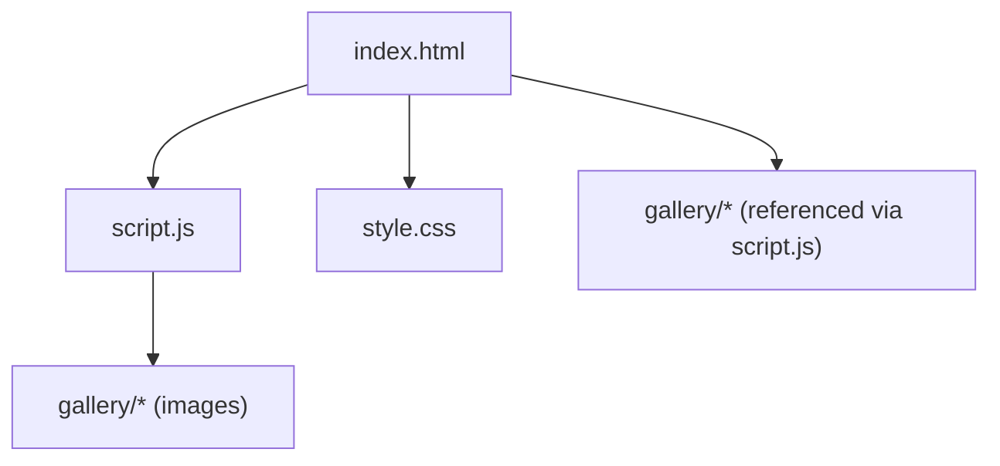
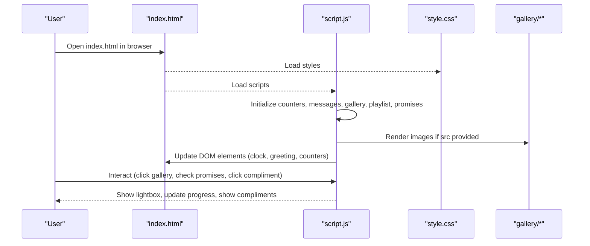
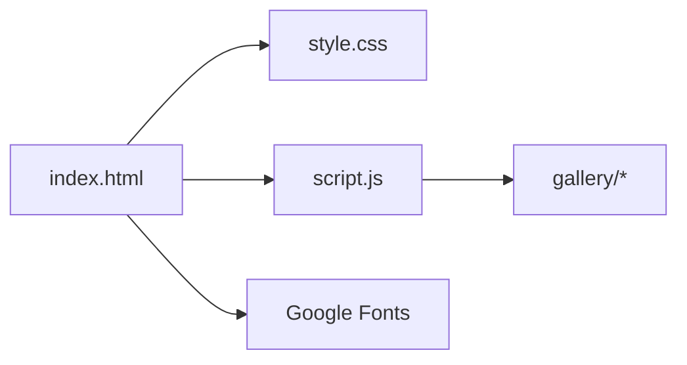

# Getting Started

<cite>
**Referenced Files in This Document**
- [index.html](file://index.html)
- [script.js](file://script.js)
- [style.css](file://style.css)
- [gallery/README.txt](file://gallery/README.txt)
</cite>

## Table of Contents
1. Introduction
2. Project Structure
3. Core Components
4. Architecture Overview
5. Detailed Component Analysis
6. Dependency Analysis
7. Performance Considerations
8. Troubleshooting Guide
9. Conclusion
10. Appendices

## Introduction
Bellisima is a romantic, interactive single-page template designed to celebrate someone special with live counters, rotating love messages, a photo gallery, playlist list, and an interactive promises checklist. You can run it locally without any server by simply opening index.html in your browser. All personalization happens through simple edits in script.js and adding photos into the gallery folder.

This guide walks you through:
- Running the template locally
- Personalizing names, dates, and messages via the GRACE configuration object
- Adding your own photos to the gallery
- Customizing love messages, reasons grid, playlist songs, and promises list
- Troubleshooting common issues like file paths and browser compatibility

## Project Structure
The project is intentionally minimal:
- index.html: The page layout and sections (hero, counters, gallery, playlist, promises, etc.)
- script.js: All behavior and data arrays for customization (GRACE config, messages, reasons, playlist, promises, gallery data)
- style.css: Visual styling and animations
- gallery/: Folder for your images; includes README.txt with naming suggestions

**Diagram sources**
- [index.html:1-210](file://index.html#L1-L210)
- [script.js:1-694](file://script.js#L1-L694)
- [style.css:1-1113](file://style.css#L1-L1113)
- [gallery/README.txt:1-13](file://gallery/README.txt#L1-L13)

**Section sources**
- [index.html:1-210](file://index.html#L1-L210)
- [script.js:1-694](file://script.js#L1-L694)
- [style.css:1-1113](file://style.css#L1-L1113)
- [gallery/README.txt:1-13](file://gallery/README.txt#L1-L13)

## Core Components
- GRACE configuration object: Central place to set name, nickname, birthday date, and month/day used by counters and greetings.
- Love messages array: Rotating messages displayed in the “A Little Reminder” section.
- Reasons array: Items rendered as cards in the “Why The World Stops” grid.
- Playlist songs array: List items shown under “Our Soundtrack.”
- Promises array: Interactive checklist that persists checked items in the browser’s local storage.
- Gallery data array: Maps placeholders to real images placed in the gallery folder.

Key customization points are all in script.js. No server or build step is required.

**Section sources**
- [script.js:1-694](file://script.js#L1-L694)

## Architecture Overview
At a high level:
- index.html defines the UI sections and elements with IDs that script.js targets.
- script.js initializes dynamic content (counters, messages, gallery, playlist, promises), sets up event listeners, and runs periodic updates.
- style.css provides the visual theme, glassmorphism cards, responsive layout, and animations.
- gallery/ holds user images referenced by script.js when configured.

**Diagram sources**
- [index.html:1-210](file://index.html#L1-L210)
- [script.js:1-694](file://script.js#L1-L694)
- [style.css:1-1113](file://style.css#L1-L1113)
- [gallery/README.txt:1-13](file://gallery/README.txt#L1-L13)

## Detailed Component Analysis

### Run Locally (No Server Required)
- Ensure all files are in the same folder structure as provided.
- Double-click index.html to open it in your default browser.
- If you see blank placeholders in the gallery, add images to the gallery folder and configure their paths in script.js as described below.

Notes:
- Some browsers restrict loading local files from certain locations due to security policies. If images do not load, try moving the entire folder to a simpler path (e.g., Desktop) and reopen index.html.

**Section sources**
- [index.html:1-210](file://index.html#L1-L210)
- [script.js:564-622](file://script.js#L564-L622)
- [gallery/README.txt:1-13](file://gallery/README.txt#L1-L13)

### Personalize Names, Dates, and Messages (GRACE Configuration)
- Open script.js and locate the GRACE configuration object at the top.
- Edit:
  - name: Displayed in greetings and countdowns.
  - nickname: Used in subtitles and accents throughout the page.
  - birthday: Set the birth date using a standard date format.
  - birthdayMonth and birthdayDay: Numeric values used by the birthday countdown logic.

What this affects:
- Live greeting text and subtitle based on time of day.
- Life counter since birthday.
- Birthday countdown display and celebratory message on the actual birthday.

Tip: Keep the date consistent with your intended timezone; the template uses the browser’s local time.

**Section sources**
- [script.js:1-8](file://script.js#L1-L8)
- [script.js:39-52](file://script.js#L39-L52)
- [script.js:86-151](file://script.js#L86-L151)

### Add Your Own Photos to the Gallery
Step-by-step:
1. Place your image files inside the gallery folder.
2. Choose meaningful filenames (the README suggests photo1.jpg, photo2.jpg, etc.).
3. In script.js, find the galleryData array and replace empty src values with relative paths to your images, e.g., 'gallery/photo1.jpg'.
4. Optionally update icon, label, and caption for each item.
5. Save script.js and refresh the page.

How it works:
- When a src is provided, script.js replaces the placeholder with an  tag.
- Clicking a gallery item opens a lightbox with navigation and captions.

Common pitfalls:
- Ensure the path matches the actual filename and extension exactly.
- Use forward slashes even on Windows.
- Avoid spaces or special characters in filenames; use hyphens instead.

**Section sources**
- [gallery/README.txt:1-13](file://gallery/README.txt#L1-L13)
- [script.js:564-622](file://script.js#L564-L622)
- [script.js:624-658](file://script.js#L624-L658)

### Customize Love Messages
- In script.js, find the loveMessages array.
- Add, remove, or edit messages as desired. Each string becomes one rotating message.
- The UI automatically creates dots to indicate current message position.

Tips:
- Keep messages concise for readability on mobile.
- You can include emojis for extra personality.

**Section sources**
- [script.js:10-27](file://script.js#L10-L27)
- [script.js:153-193](file://script.js#L153-L193)

### Customize Reasons Grid
- In script.js, find the reasons array.
- Each item has an icon and text. You can change icons and wording.
- The grid renders these as cards with hover effects.

Tips:
- Use short phrases so cards remain balanced.
- Emojis work well as icons.

**Section sources**
- [script.js:29-37](file://script.js#L29-L37)
- [script.js:195-208](file://script.js#L195-L208)

### Customize Playlist Songs
- In script.js, find the playlistSongs array.
- Each song entry includes title, artist, and reason.
- The UI renders numbered rows with title, artist, and a short reason line.

Tips:
- Keep titles and artists accurate.
- Reasons can be short notes about why the song matters.

Note: This template displays the list only; no audio playback is included.

**Section sources**
- [script.js:384-415](file://script.js#L384-L415)

### Customize Promises List
- In script.js, find the promises array.
- Each promise has an icon and text.
- Users can tap to check off promises; progress updates and persists in the browser’s local storage.

Tips:
- Mix fun activities with meaningful milestones.
- Icons help visually differentiate items.

Persistence note: Checked states are stored per browser. Clearing site data will reset progress.

**Section sources**
- [script.js:417-499](file://script.js#L417-L499)

### Optional: Edit Static Text in HTML
Some sections contain static text directly in index.html (for example, the love letter). If you want to customize those parts:
- Open index.html and locate the relevant section.
- Edit the text between tags carefully.
- Save and refresh the page.

Caution:
- Do not break HTML tags while editing.
- Keep the overall structure intact to avoid layout issues.

**Section sources**
- [index.html:147-159](file://index.html#L147-L159)

## Dependency Analysis
- index.html depends on:
  - style.css for visual presentation
  - script.js for dynamic behavior and data rendering
- script.js depends on:
  - DOM elements defined in index.html (IDs like loveMessage, reasonsGrid, playlistList, promisesList, galleryGrid)
  - Optional assets in gallery/ for images
- style.css depends on:
  - Google Fonts loaded in index.html head

**Diagram sources**
- [index.html:1-210](file://index.html#L1-L210)
- [script.js:1-694](file://script.js#L1-L694)
- [style.css:1-1113](file://style.css#L1-L1113)

**Section sources**
- [index.html:1-210](file://index.html#L1-L210)
- [script.js:1-694](file://script.js#L1-L694)
- [style.css:1-1113](file://style.css#L1-L1113)

## Performance Considerations
- Images: Use optimized images (reasonable resolution, compressed) to keep the page fast.
- Effects: The template includes particle and cursor trail animations. On very low-end devices, consider reducing effect intensity by editing animation-related code if needed.
- LocalStorage: Promises persistence uses small JSON strings; negligible performance impact.

[No sources needed since this section provides general guidance]

## Troubleshooting Guide
- Blank gallery placeholders after adding images:
  - Verify the image is inside the gallery folder.
  - Confirm the src path in script.js matches the exact filename and extension.
  - Use forward slashes in paths (e.g., 'gallery/photo1.jpg').
- Images not loading on some browsers:
  - Move the entire project to a simpler path (avoid long or restricted directories).
  - Try a different browser or ensure the browser allows local file access.
- Countdown or greeting looks wrong:
  - Check the GRACE configuration object for correct birthday date and month/day values.
  - Remember that the template uses the browser’s local time zone.
- Promises progress resets unexpectedly:
  - Progress is stored in the browser’s local storage. Clearing site data or switching browsers/devices will reset it.
- Animations feel heavy:
  - Disable or reduce effects by commenting out initialization calls in script.js if necessary.

**Section sources**
- [script.js:564-622](file://script.js#L564-L622)
- [script.js:1-8](file://script.js#L1-L8)
- [script.js:86-151](file://script.js#L86-L151)
- [script.js:417-499](file://script.js#L417-L499)

## Conclusion
You now have everything you need to run Bellisima locally and personalize it for someone special. Start by opening index.html, then tweak the GRACE configuration, add photos to the gallery, and customize messages, reasons, playlist, and promises. If you encounter issues, consult the troubleshooting tips above. With minimal changes, you can make the template uniquely yours.

[No sources needed since this section summarizes without analyzing specific files]

## Appendices

### Quick Customization Checklist
- Edit GRACE config (name, nickname, birthday, month, day) in script.js
- Add images to gallery/ and update galleryData src paths in script.js
- Edit loveMessages, reasons, playlistSongs, and promises arrays in script.js
- Optionally edit static text in index.html (e.g., love letter)
- Save and refresh index.html in your browser

**Section sources**
- [script.js:1-694](file://script.js#L1-L694)
- [index.html:1-210](file://index.html#L1-L210)
- [gallery/README.txt:1-13](file://gallery/README.txt#L1-L13)