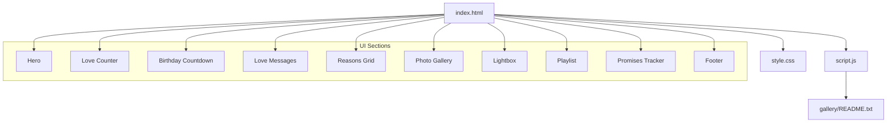
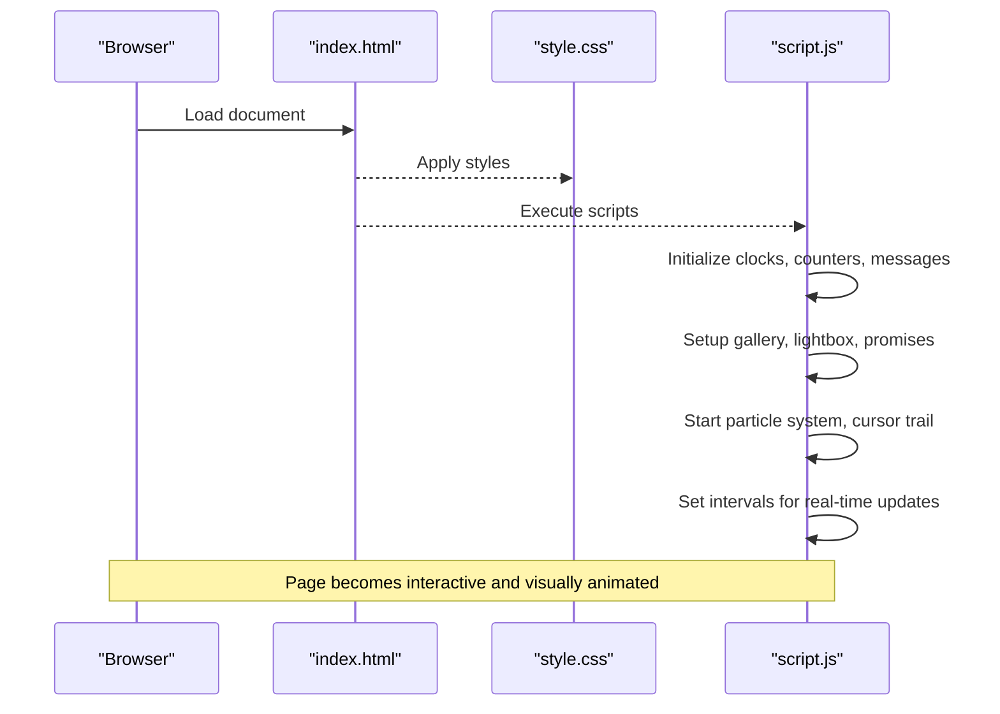
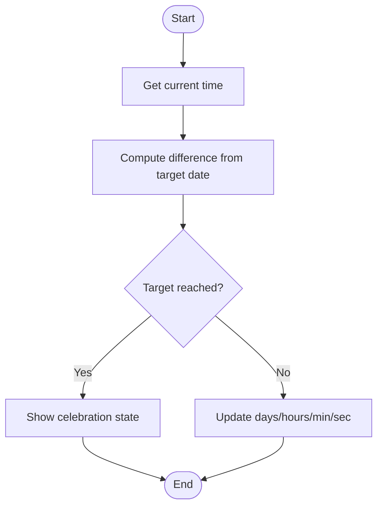
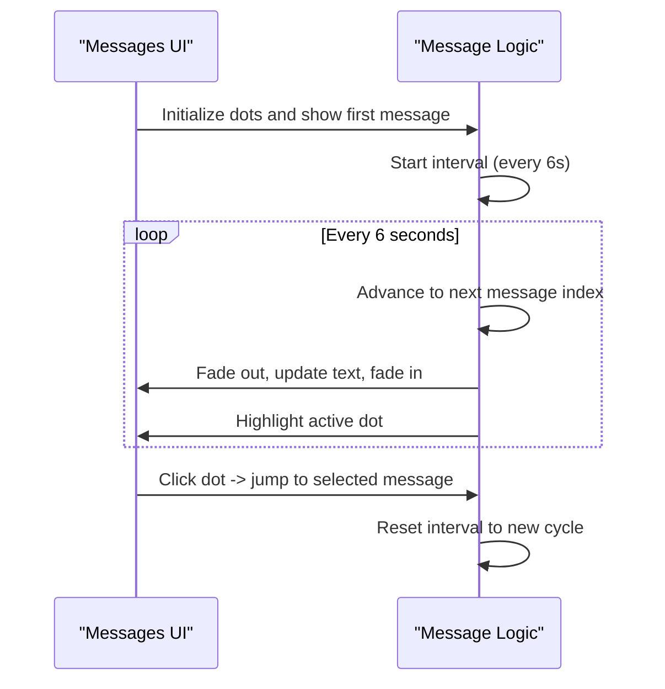
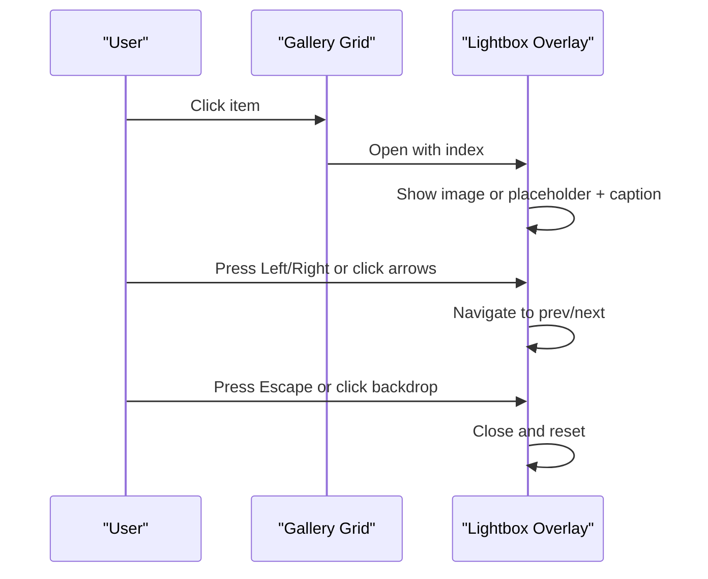
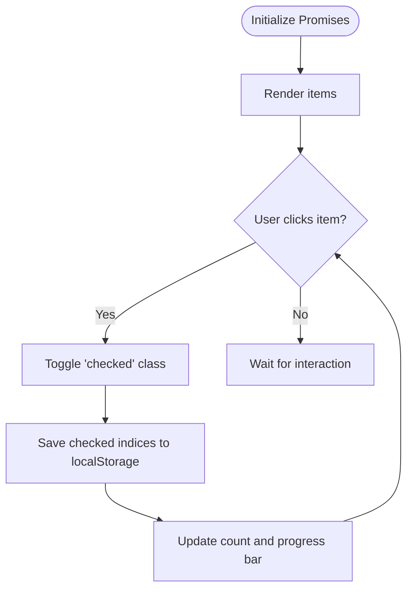
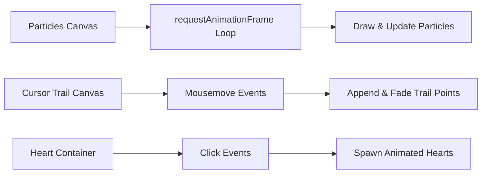
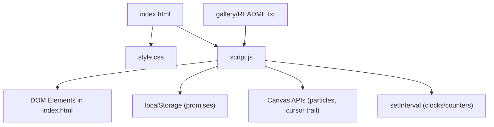

# Project Overview

<cite>
**Referenced Files in This Document**
- [index.html](file://index.html)
- [style.css](file://style.css)
- [script.js](file://script.js)
- [README.txt](file://gallery/README.txt)
</cite>

## Table of Contents
1. Introduction
2. Project Structure
3. Core Components
4. Architecture Overview
5. Detailed Component Analysis
6. Dependency Analysis
7. Performance Considerations
8. Troubleshooting Guide
9. Conclusion
10. Appendices

## Introduction
Bellisima is a romantic personal website template designed as a digital love letter and interactive romantic gesture creator. It helps people express love through web experiences by combining heartfelt messaging with engaging, real-time features such as live counters, an interactive photo gallery, rotating love messages, a promises tracker, and visual effects like particles and cursor trails. The site is built as a single-page application using vanilla HTML, CSS, and JavaScript—no frameworks required—making it simple to customize and deploy anywhere static hosting is supported.

The experience centers around a warm, responsive layout with glassmorphism cards, smooth animations, and accessible interactions. It includes:
- Real-time counters for life elapsed since a special date and a birthday countdown
- Rotating love messages with dot navigation
- A reasons grid celebrating the person’s qualities
- An interactive gallery with placeholder support and a lightbox viewer
- A playlist section for meaningful songs
- A promises/bucket list that persists checked items in the browser
- Visual effects including floating particles, heart bursts on click, and a sparkling cursor trail

This overview explains both the conceptual experience and the technical structure so you can personalize Bellisima for your own story.

## Project Structure
Bellisima follows a minimal, flat structure optimized for clarity and ease of customization:
- index.html: Single-page markup containing all sections (hero, counters, gallery, letter, playlist, promises, footer) and embedded UI elements (lightbox, compliment popup, heart container).
- style.css: Complete styling with variables, responsive design, glassmorphism, animations, and component styles.
- script.js: All interactivity and logic, including timers, galleries, promises persistence, and visual effects.
- gallery/README.txt: Instructions for adding photos and mapping them into the gallery.

**Diagram sources**
- [index.html:18-182](file://index.html#L18-L182)
- [style.css:82-768](file://style.css#L82-L768)
- [script.js:563-658](file://script.js#L563-L658)

**Section sources**
- [index.html:1-210](file://index.html#L1-L210)
- [style.css:1-800](file://style.css#L1-L800)
- [script.js:1-694](file://script.js#L1-L694)
- [README.txt:1-13](file://gallery/README.txt#L1-L13)

## Core Components
- Hero and Live Clock: Displays a time-based greeting, date, and a live clock.
- Love Counter: Shows years/months/days/hours/minutes/seconds since a special date.
- Birthday Countdown: Counts down to a configured birthday with celebratory messages on the day.
- Rotating Love Messages: Auto-rotates curated messages with dot indicators and manual navigation.
- Reasons Grid: Dynamically renders reason cards with icons and text.
- Photo Gallery and Lightbox: Placeholder-based gallery with optional real images; supports keyboard navigation and backdrop close.
- Playlist Section: Renders a list of meaningful songs with titles, artists, and reasons.
- Promises Tracker: Interactive checklist persisted via localStorage with progress bar.
- Visual Effects: Floating particles canvas, heart burst on click, and cursor sparkle trail.

These components work together to create a cohesive, romantic, and interactive experience without any external dependencies.

**Section sources**
- [index.html:18-182](file://index.html#L18-L182)
- [script.js:40-151](file://script.js#L40-L151)
- [script.js:153-208](file://script.js#L153-L208)
- [script.js:210-281](file://script.js#L210-L281)
- [script.js:283-297](file://script.js#L283-L297)
- [script.js:299-382](file://script.js#L299-L382)
- [script.js:384-415](file://script.js#L384-L415)
- [script.js:417-499](file://script.js#L417-L499)
- [script.js:501-561](file://script.js#L501-L561)
- [script.js:563-658](file://script.js#L563-L658)

## Architecture Overview
Bellisima is a client-side single-page application. The HTML defines the page sections and UI containers. CSS provides the visual theme, animations, and responsive behavior. JavaScript initializes all interactive features on DOMContentLoaded and sets up periodic updates for time-sensitive elements.

**Diagram sources**
- [index.html:207-207](file://index.html#L207-L207)
- [script.js:660-694](file://script.js#L660-L694)

**Section sources**
- [index.html:1-210](file://index.html#L1-L210)
- [script.js:660-694](file://script.js#L660-L694)

## Detailed Component Analysis

### Real-Time Counters and Birthday Countdown
- Life Counter: Computes elapsed time since a configured date and updates seconds every second.
- Birthday Countdown: Calculates days/hours/minutes/seconds until the next birthday; displays emojis and a celebratory message on the actual birthday.

**Diagram sources**
- [script.js:86-151](file://script.js#L86-L151)

**Section sources**
- [script.js:86-151](file://script.js#L86-L151)

### Rotating Love Messages
- Manages an array of messages, auto-rotates with a timer, and provides dot navigation for manual selection.

**Diagram sources**
- [script.js:153-193](file://script.js#L153-L193)

**Section sources**
- [script.js:153-193](file://script.js#L153-L193)

### Photo Gallery and Lightbox
- Gallery: Renders placeholders or real images based on configuration; supports hover captions and click-to-open lightbox.
- Lightbox: Fullscreen overlay with image display, placeholder fallback, caption, navigation arrows, keyboard controls, and backdrop close.

**Diagram sources**
- [script.js:563-658](file://script.js#L563-L658)
- [index.html:75-145](file://index.html#L75-L145)

**Section sources**
- [script.js:563-658](file://script.js#L563-L658)
- [index.html:75-145](file://index.html#L75-L145)

### Promises Tracker with Persistence
- Renders a list of promises with icons and text.
- Toggling a promise marks it checked/unchecked and saves state to localStorage.
- Updates a progress bar showing completed vs total promises.

**Diagram sources**
- [script.js:417-499](file://script.js#L417-L499)

**Section sources**
- [script.js:417-499](file://script.js#L417-L499)

### Visual Effects
- Particles: Canvas-based floating particles with glow and twinkle.
- Cursor Trail: Sparkle trail following mouse movement.
- Heart Bursts: Emojis animate outward on click events.

**Diagram sources**
- [script.js:210-281](file://script.js#L210-L281)
- [script.js:501-561](file://script.js#L501-L561)
- [script.js:350-382](file://script.js#L350-L382)

**Section sources**
- [script.js:210-281](file://script.js#L210-L281)
- [script.js:501-561](file://script.js#L501-L561)
- [script.js:350-382](file://script.js#L350-L382)

## Dependency Analysis
- index.html depends on style.css for presentation and script.js for interactivity.
- script.js orchestrates all features and references DOM nodes defined in index.html.
- gallery/README.txt guides users to add images and update script.js gallery data.

**Diagram sources**
- [index.html:207-207](file://index.html#L207-L207)
- [script.js:660-694](file://script.js#L660-L694)
- [script.js:435-443](file://script.js#L435-L443)
- [script.js:210-281](file://script.js#L210-L281)
- [script.js:501-561](file://script.js#L501-L561)
- [README.txt:1-13](file://gallery/README.txt#L1-L13)

**Section sources**
- [index.html:1-210](file://index.html#L1-L210)
- [script.js:1-694](file://script.js#L1-L694)
- [README.txt:1-13](file://gallery/README.txt#L1-L13)

## Performance Considerations
- Use requestAnimationFrame for animations (particles, cursor trail) to maintain smooth performance.
- Limit particle counts based on viewport size to balance visuals and performance.
- Debounce or throttle heavy operations if expanding functionality.
- Lazy-load images in the gallery to reduce initial load time.
- Avoid excessive DOM manipulation inside tight loops; batch updates where possible.

[No sources needed since this section provides general guidance]

## Troubleshooting Guide
- Gallery images not showing: Ensure images are placed in the gallery folder and referenced correctly in script.js gallery data. Follow instructions in gallery/README.txt.
- Lightbox not closing: Verify event listeners for escape key and backdrop click are attached; check for conflicting overlays.
- Promises not persisting: Confirm localStorage is enabled in the browser; clear storage if corrupted.
- Counters not updating: Ensure setInterval calls are running; verify IDs of target elements exist in the DOM.
- Visual effects lagging: Reduce particle count or disable effects on low-power devices.

**Section sources**
- [script.js:563-658](file://script.js#L563-L658)
- [script.js:435-443](file://script.js#L435-L443)
- [script.js:660-694](file://script.js#L660-L694)
- [README.txt:1-13](file://gallery/README.txt#L1-L13)

## Conclusion
Bellisima offers a heartfelt, interactive way to express love through a beautifully crafted single-page experience. Its architecture is intentionally simple—vanilla HTML, CSS, and JavaScript—so anyone can personalize it with their own names, dates, messages, photos, and playlists. With real-time counters, rotating messages, an interactive gallery, a promises tracker, and enchanting visual effects, Bellisima turns a webpage into a living love letter.

[No sources needed since this section summarizes without analyzing specific files]

## Appendices

### Customization Examples
- Personalize names and dates:
  - Update the configuration object in script.js with the recipient’s name, nickname, and birthday details.
  - Adjust the hero greeting and subtitle logic to reflect different times of day.
- Add real photos:
  - Place images in the gallery folder and follow naming suggestions in gallery/README.txt.
  - Update the galleryData entries in script.js to include src paths and captions.
- Customize messages and reasons:
  - Edit the arrays for love messages and reasons in script.js to reflect your unique sentiments.
- Modify playlist:
  - Replace song entries in script.js with your meaningful tracks and reasons.
- Adjust visual theme:
  - Change color variables and fonts in style.css to match your aesthetic while keeping accessibility in mind.

**Section sources**
- [script.js:2-8](file://script.js#L2-L8)
- [script.js:11-27](file://script.js#L11-L27)
- [script.js:29-37](file://script.js#L29-L37)
- [script.js:384-394](file://script.js#L384-L394)
- [script.js:563-579](file://script.js#L563-L579)
- [README.txt:1-13](file://gallery/README.txt#L1-L13)
- [style.css:8-24](file://style.css#L8-L24)