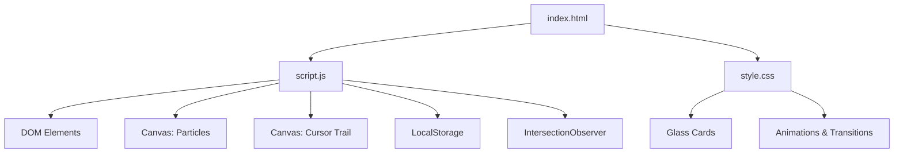
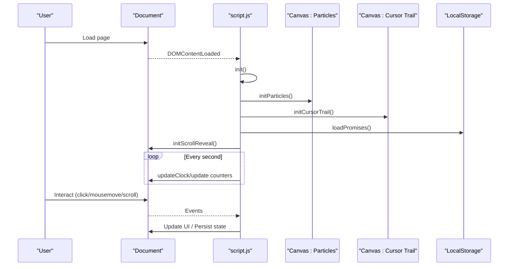
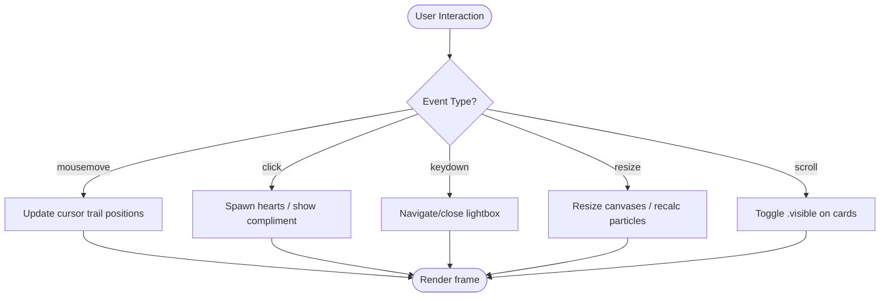
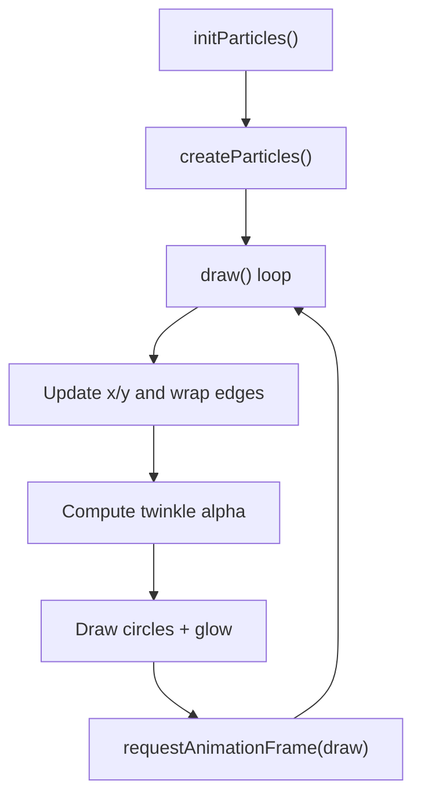
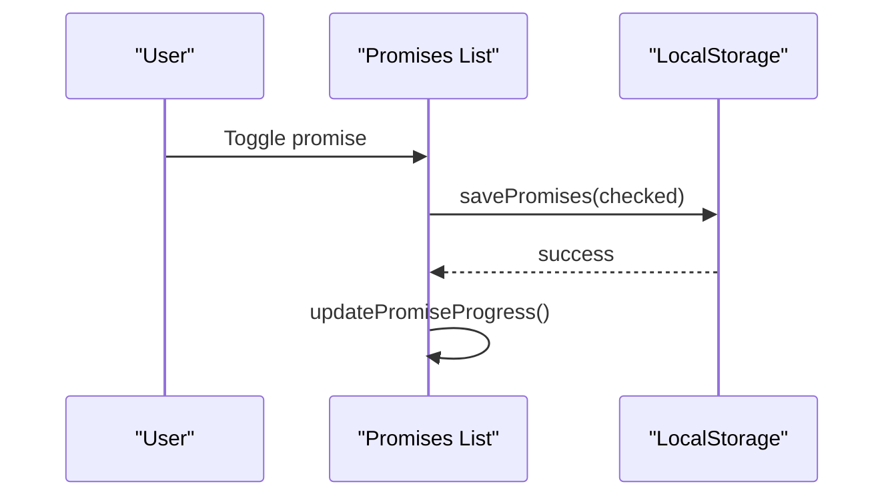
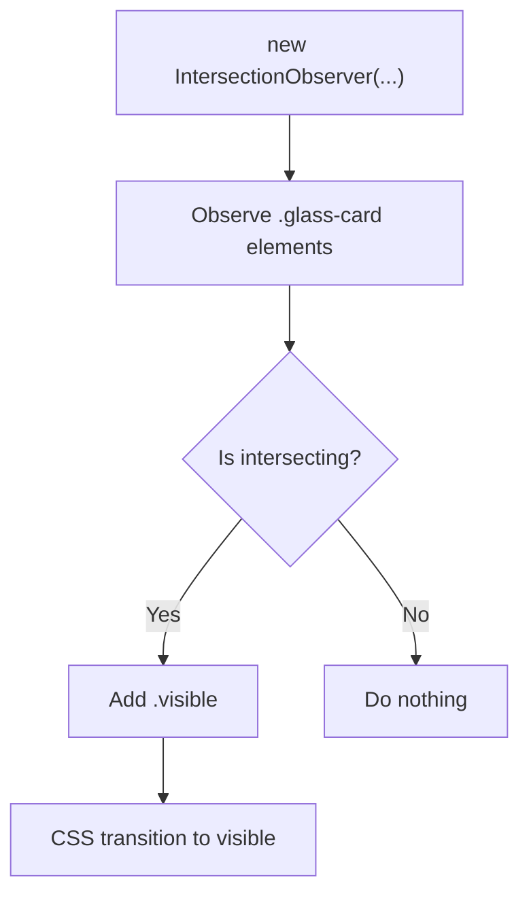
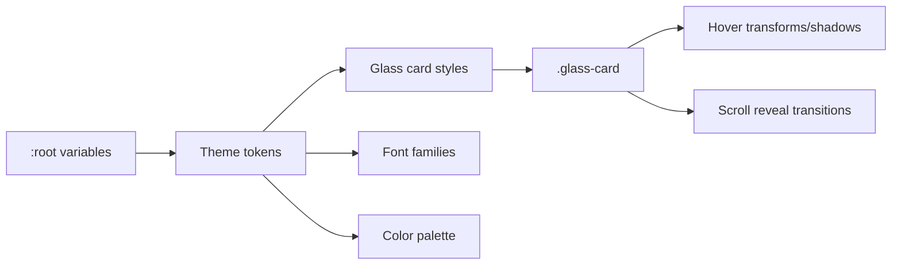
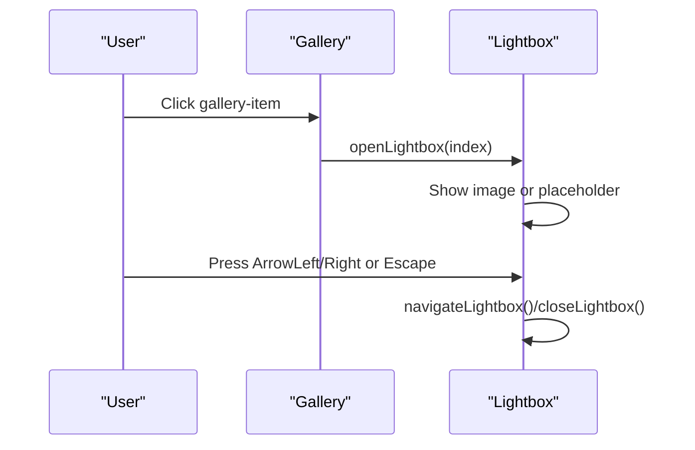
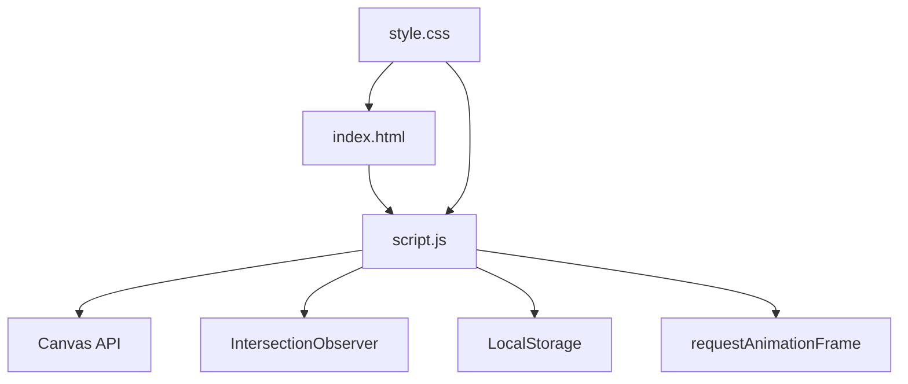

# Technical Implementation

<cite>
**Referenced Files in This Document**
- [index.html](file://index.html)
- [script.js](file://script.js)
- [style.css](file://style.css)
</cite>

## Table of Contents
1. [Introduction](#introduction)
2. [Project Structure](#project-structure)
3. [Core Components](#core-components)
4. [Architecture Overview](#architecture-overview)
5. [Detailed Component Analysis](#detailed-component-analysis)
6. [Dependency Analysis](#dependency-analysis)
7. [Performance Considerations](#performance-considerations)
8. [Troubleshooting Guide](#troubleshooting-guide)
9. [Conclusion](#conclusion)

## Introduction
This document explains the technical implementation of Bellisima, a vanilla JavaScript single-page experience that combines interactive UI elements with modern browser APIs. It focuses on:
- Modular pattern and event-driven programming in script.js
- DOM manipulation strategies for dynamic content
- Canvas API usage for particle effects and cursor trails
- LocalStorage integration for persistent state (promises checklist)
- Intersection Observer API for scroll animations
- CSS techniques including glassmorphism, custom properties, modern layout methods, and animations
- Performance considerations, browser compatibility approaches, and optimization strategies

## Project Structure
The project is a minimal static site composed of three core files:
- index.html: Defines semantic sections, canvas layers, and UI containers
- script.js: Implements all runtime behavior using a modular function pattern
- style.css: Provides theming via CSS custom properties, glassmorphism, responsive layouts, and animations

**Diagram sources**
- [index.html:12-207](file://index.html#L12-L207)
- [script.js:211-281](file://script.js#L211-L281)
- [script.js:502-561](file://script.js#L502-L561)
- [script.js:435-443](file://script.js#L435-L443)
- [script.js:284-297](file://script.js#L284-L297)
- [style.css:165-191](file://style.css#L165-L191)
- [style.css:395-431](file://style.css#L395-L431)

**Section sources**
- [index.html:1-210](file://index.html#L1-L210)
- [script.js:1-694](file://script.js#L1-L694)
- [style.css:1-1113](file://style.css#L1-L1113)

## Core Components
- Configuration and data modules: Centralized constants for personalization, messages, reasons, playlist, and promises
- Real-time updates: Clock, date, life counter, birthday countdown, greeting rotation
- Interactive features: Love message carousel, compliments popup, heart burst on click, gallery lightbox
- Visual effects: Particle background, cursor sparkle trail, scroll reveal animations
- Persistence: Promises checklist saved to LocalStorage with progress tracking

Key responsibilities are encapsulated in functions within script.js, invoked from a central init() routine on DOMContentLoaded.

**Section sources**
- [script.js:1-10](file://script.js#L1-L10)
- [script.js:10-37](file://script.js#L10-L37)
- [script.js:39-84](file://script.js#L39-L84)
- [script.js:86-151](file://script.js#L86-L151)
- [script.js:153-193](file://script.js#L153-L193)
- [script.js:195-208](file://script.js#L195-L208)
- [script.js:211-281](file://script.js#L211-L281)
- [script.js:284-297](file://script.js#L284-L297)
- [script.js:299-382](file://script.js#L299-L382)
- [script.js:384-415](file://script.js#L384-L415)
- [script.js:417-499](file://script.js#L417-L499)
- [script.js:502-561](file://script.js#L502-L561)
- [script.js:563-658](file://script.js#L563-L658)
- [script.js:660-694](file://script.js#L660-L694)

## Architecture Overview
Bellisima follows a simple yet effective architecture:
- Single entry point: DOMContentLoaded triggers init(), which wires up all subsystems
- Event-driven interactions: Clicks, mouse movements, keyboard events drive UI changes
- Layered rendering: Two full-screen canvases render independent visual effects without blocking interaction
- State persistence: LocalStorage stores user interactions (checked promises) across sessions
- Scroll-aware reveals: IntersectionObserver adds visibility classes to animate cards into view

**Diagram sources**
- [script.js:660-694](file://script.js#L660-L694)
- [script.js:211-281](file://script.js#L211-L281)
- [script.js:502-561](file://script.js#L502-L561)
- [script.js:435-443](file://script.js#L435-L443)
- [script.js:284-297](file://script.js#L284-L297)

## Detailed Component Analysis

### Vanilla JavaScript Architecture and Modular Pattern
- The code uses a functional module pattern: configuration objects and feature-specific initialization functions grouped by responsibility
- A central init() orchestrates setup and sets up recurring timers for real-time updates
- Event listeners are attached declaratively to specific elements or global targets (document/window), keeping concerns separated

Best practices demonstrated:
- Encapsulation of logic per feature (e.g., initGallery, initPromises, initCursorTrail)
- Safe DOM access via getElementById/querySelector
- Avoiding inline scripts; behavior is driven from a single script file

**Section sources**
- [script.js:660-694](file://script.js#L660-L694)
- [script.js:211-281](file://script.js#L211-L281)
- [script.js:502-561](file://script.js#L502-L561)
- [script.js:563-658](file://script.js#L563-L658)

### Event-Driven Programming Approach
- Mouse move drives cursor trail particles
- Clicks trigger heart bursts and compliment popups
- Keyboard navigation supports lightbox controls
- Resize events adjust canvas dimensions and particle counts
- IntersectionObserver reacts to scroll position to reveal cards

**Diagram sources**
- [script.js:516-522](file://script.js#L516-L522)
- [script.js:340-348](file://script.js#L340-L348)
- [script.js:376-382](file://script.js#L376-L382)
- [script.js:614-621](file://script.js#L614-L621)
- [script.js:277-280](file://script.js#L277-L280)
- [script.js:284-297](file://script.js#L284-L297)

**Section sources**
- [script.js:516-522](file://script.js#L516-L522)
- [script.js:340-348](file://script.js#L340-L348)
- [script.js:376-382](file://script.js#L376-L382)
- [script.js:614-621](file://script.js#L614-L621)
- [script.js:277-280](file://script.js#L277-L280)
- [script.js:284-297](file://script.js#L284-L297)

### DOM Manipulation Strategies
- Dynamic creation of elements for rotating messages, reasons grid, playlist items, and promises list
- Safe text insertion via textContent to avoid XSS risks
- Class toggling for stateful UI (e.g., checked promises, visible cards)
- Efficient updates by targeting specific IDs rather than re-rendering entire sections

Examples of patterns:
- Rotating love messages with fade transitions and dot indicators
- Building lists from arrays and attaching event listeners per item
- Toggling classes to reflect state and persist via LocalStorage

**Section sources**
- [script.js:153-193](file://script.js#L153-L193)
- [script.js:195-208](file://script.js#L195-L208)
- [script.js:396-415](file://script.js#L396-L415)
- [script.js:445-499](file://script.js#L445-L499)

### Canvas API Usage: Particle Effects and Cursor Trails
- Background particles:
  - Creates a configurable number of particles based on viewport size
  - Uses requestAnimationFrame for smooth animation
  - Applies twinkle effect via sine-based opacity modulation and radial gradients for glow
- Cursor trail:
  - Tracks mouse coordinates and appends trail points with randomized sizes and colors
  - Caps trail length to control memory usage
  - Fades out particles over time and renders glow halos

**Diagram sources**
- [script.js:211-281](file://script.js#L211-L281)

**Section sources**
- [script.js:211-281](file://script.js#L211-L281)
- [script.js:502-561](file://script.js#L502-L561)

### LocalStorage Integration for Promise Persistence
- Stores an array of checked promise indices under a dedicated key
- Loads persisted state on init and updates UI accordingly
- Updates progress bar and count dynamically after each toggle
- Graceful error handling for malformed storage entries

**Diagram sources**
- [script.js:435-443](file://script.js#L435-L443)
- [script.js:472-484](file://script.js#L472-L484)
- [script.js:492-499](file://script.js#L492-L499)

**Section sources**
- [script.js:435-443](file://script.js#L435-L443)
- [script.js:472-484](file://script.js#L472-L484)
- [script.js:492-499](file://script.js#L492-L499)

### Intersection Observer API for Scroll Animations
- Observes all glass cards and adds a visible class when they enter the viewport
- Uses a threshold to trigger early enough for smooth reveal
- Combined with CSS transitions for opacity and transform

**Diagram sources**
- [script.js:284-297](file://script.js#L284-L297)
- [style.css:421-431](file://style.css#L421-L431)

**Section sources**
- [script.js:284-297](file://script.js#L284-L297)
- [style.css:421-431](file://style.css#L421-L431)

### CSS Techniques: Glassmorphism, Custom Properties, Layouts, Animations
- Glassmorphism:
  - Semi-transparent backgrounds with backdrop-filter blur and subtle borders
  - Applied to cards, clock widget, lightbox, and floating button
- CSS Custom Properties:
  - Centralized color palette, fonts, and glass tokens in :root
  - Enables consistent theming and easy customization
- Modern Layout Methods:
  - Flexbox for counters, playlists, and alignment
  - CSS Grid for responsive galleries and reason cards
  - clamp() for fluid typography
- Animations:
  - Keyframes for glow pulse, fade-in-up, spin, pulse, and heart float
  - Smooth transitions for hover states and lightbox activation

**Diagram sources**
- [style.css:8-24](file://style.css#L8-L24)
- [style.css:165-191](file://style.css#L165-L191)
- [style.css:395-431](file://style.css#L395-L431)
- [style.css:474-599](file://style.css#L474-L599)
- [style.css:608-760](file://style.css#L608-L760)
- [style.css:770-908](file://style.css#L770-L908)
- [style.css:910-1113](file://style.css#L910-L1113)

**Section sources**
- [style.css:8-24](file://style.css#L8-L24)
- [style.css:165-191](file://style.css#L165-L191)
- [style.css:395-431](file://style.css#L395-L431)
- [style.css:474-599](file://style.css#L474-L599)
- [style.css:608-760](file://style.css#L608-L760)
- [style.css:770-908](file://style.css#L770-L908)
- [style.css:910-1113](file://style.css#L910-L1113)

### Gallery and Lightbox Workflow
- Gallery items can display either placeholders or real images
- Clicking opens a lightbox with navigation and keyboard support
- Placeholder vs image paths are controlled via a data array

**Diagram sources**
- [script.js:583-658](file://script.js#L583-L658)
- [index.html:75-145](file://index.html#L75-L145)

**Section sources**
- [script.js:583-658](file://script.js#L583-L658)
- [index.html:75-145](file://index.html#L75-L145)

## Dependency Analysis
- script.js depends on DOM elements defined in index.html
- style.css provides visual styling referenced by both HTML structure and JS class toggles
- No external libraries; dependencies are native browser APIs:
  - Canvas API for rendering
  - IntersectionObserver for scroll detection
  - LocalStorage for persistence
  - requestAnimationFrame for smooth animations

**Diagram sources**
- [script.js:211-281](file://script.js#L211-L281)
- [script.js:284-297](file://script.js#L284-L297)
- [script.js:435-443](file://script.js#L435-L443)
- [script.js:660-694](file://script.js#L660-L694)
- [index.html:12-207](file://index.html#L12-L207)
- [style.css:165-191](file://style.css#L165-L191)

**Section sources**
- [script.js:211-281](file://script.js#L211-L281)
- [script.js:284-297](file://script.js#L284-L297)
- [script.js:435-443](file://script.js#L435-L443)
- [script.js:660-694](file://script.js#L660-L694)
- [index.html:12-207](file://index.html#L12-L207)
- [style.css:165-191](file://style.css#L165-L191)

## Performance Considerations
- Canvas rendering:
  - Particle count scales with viewport area to maintain performance on smaller screens
  - requestAnimationFrame ensures efficient draw loops
  - Trail length capped to prevent unbounded memory growth
- DOM updates:
  - Use of textContent avoids unnecessary reflows and mitigates XSS risk
  - Class toggling leverages CSS transitions for smooth visuals without heavy JS animation
- Timers:
  - setInterval used sparingly for clock and counters; intervals are reasonable (1s)
  - Intervals cleared where appropriate (message rotation reset)
- Images:
  - Lazy loading attribute on dynamically created images for performance
- Accessibility:
  - Keyboard navigation for lightbox (Escape, arrows)
  - Semantic HTML structure with sections and headings

Optimization recommendations:
- Debounce resize handlers if additional heavy work is added
- Consider offloading complex calculations to Web Workers if needed
- Preload critical fonts and consider font-display strategy for faster perceived load

[No sources needed since this section provides general guidance]

## Troubleshooting Guide
Common issues and resolutions:
- Canvases not visible:
  - Ensure canvases exist in HTML and have proper z-index and pointer-events set
  - Verify window resize handler resizes canvases correctly
- Scroll reveal not triggering:
  - Confirm elements have the observed class and that IntersectionObserver is initialized
  - Check CSS transitions for .visible class application
- LocalStorage errors:
  - Wrap parsing in try/catch to handle corrupted data
  - Validate stored values before use
- Lightbox not closing:
  - Ensure backdrop click listener closes overlay
  - Verify Escape key handler runs when lightbox is active

**Section sources**
- [script.js:277-280](file://script.js#L277-L280)
- [script.js:284-297](file://script.js#L284-L297)
- [script.js:435-443](file://script.js#L435-L443)
- [script.js:609-621](file://script.js#L609-L621)

## Conclusion
Bellisima demonstrates a clean, modular vanilla JavaScript architecture combined with modern CSS techniques to deliver an engaging, performant experience. The codebase effectively uses:
- Event-driven interactions and DOM manipulation
- Canvas API for rich visual effects
- IntersectionObserver for scroll-triggered animations
- LocalStorage for persistent user state
- Glassmorphism and custom properties for cohesive theming

These patterns provide a solid foundation for extending functionality while maintaining readability and performance.

[No sources needed since this section summarizes without analyzing specific files]